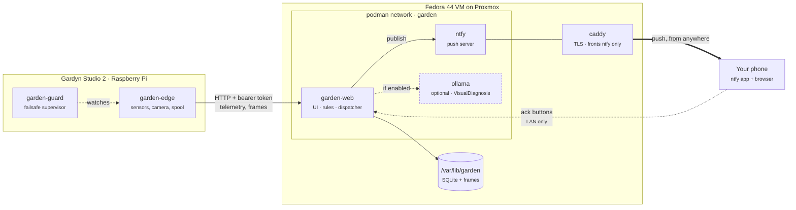
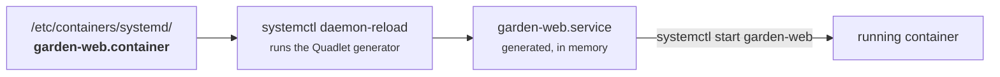

# Deploying the brain

Building the Proxmox VM and every container on it, from an empty hypervisor to a
running system that pushes to your phone.

**This assumes you have never used Podman or Quadlet.** Every command is here, and
[Part 3](#part-3--podman-and-quadlet-from-zero) explains the container tooling before
using it. If you already know Podman, run [`deploy/install.sh`](deploy/install.sh) and
skip to [Part 8](#part-8--first-run).

For the Raspberry Pi side — getting into the Gardyn itself, wiring the water probe,
firmware takeover — see [HARDWARE.md](HARDWARE.md). This document is only the server.

---

## What you are building



Four things worth noticing before you start:

- **The Pi talks to the brain over plain HTTP with a bearer token.** There is no MQTT
  broker, despite what older drafts of DESIGN.md said. One less container.
- **Nothing here reaches a third party.** ntfy is yours; the phone app is pointed at
  your server, not `ntfy.sh`. Ollama, if you enable it, is local.
- **The brain is not in the control loop.** If this whole VM dies, the Gardyn keeps
  running on the schedule already resident on the Pi. That is a deliberate design
  constraint, and it means a botched deployment costs you notifications, not plants.
- **Only Caddy faces the internet, and it fronts only ntfy.** Notifications reach you
  anywhere; the brain stays on the LAN, so the Done and Snooze buttons resolve at home
  and not away from it. The asymmetry is deliberate — ntfy holds topic names, the brain
  holds everything else. See DESIGN.md §10.

### Sizing

| | | |
|---|---|---|
| vCPU | **2** | 4 if you enable Ollama |
| RAM | **4 GB** | **12 GB** if you enable Ollama |
| Disk | **40 GB** | ~10 GB a year per garden of camera frames |
| OS | **Fedora Server 44** | |

The database itself stays small — a year of minute-resolution telemetry for one
garden is tens of megabytes. The disk is sized for photographs.

---

## Part 1 — the Proxmox VM

### 1.0 Four things to check first

`qm create` fails on any of these, and the error names the flag rather than the reason.
Thirty seconds now:

```sh
qm list | awk '$1==200'          # empty, or pick a different VM id
pvesm status                     # is your storage called local-lvm?
ip -br link show type bridge     # is your bridge called vmbr0?
ls /var/lib/vz/template/iso/     # the ISO, once you have downloaded it
```

**Storage** is the one that catches people, and there are *two* of them. `local-lvm` is
the default for VM disks on an LVM-thin install; a ZFS install calls it `local-zfs`, and
plenty of people name theirs something else entirely. ISOs usually live somewhere else
again — `local`, a directory store — because block storage cannot hold a file.

```sh
pvesm status --content images    # where the VM disk goes
pvesm status --content iso       # where the installer goes
```

Substitute both below. The disk store appears twice in the create command and the ISO
store once.

**Check the disk store supports snapshots** before you rely on step 1.6. LVM-thin, ZFS
and directory-with-qcow2 all do. Plain LVM does not, and you will find out at the moment
you wanted a rollback point.

`--cpu host` passes the physical CPU through, which roughly halves Rust build times
inside the VM. It also prevents live migration to a host with a different CPU. On a
single-node Proxmox that costs nothing; on a cluster, use `x86-64-v3` instead.

### 1.1 Get the ISO onto Proxmox

Fastest route is to have Proxmox download it directly. On the Proxmox host:

```sh
cd /var/lib/vz/template/iso
wget https://download.fedoraproject.org/pub/fedora/linux/releases/44/Server/x86_64/iso/Fedora-Server-dvd-x86_64-44-1.4.iso
```

> Check [getfedora.org](https://fedoraproject.org/server/download/) for the exact
> filename — the trailing build number changes with each respin.

Or in the web UI: **Datacenter → your node → local → ISO Images → Download from URL**.

### 1.2 Create the VM

Either the GUI or the command line; both produce the same thing.

**Command line**, on the Proxmox host — the whole VM in one call:

```sh
qm create 200 \
  --name garden-brain \
  --memory 4096 \
  --balloon 0 \
  --cores 2 \
  --cpu host \
  --machine q35 \
  --bios ovmf \
  --efidisk0 local-lvm:1,efitype=4m,pre-enrolled-keys=1 \
  --scsihw virtio-scsi-single \
  --scsi0 local-lvm:40,discard=on,ssd=1,iothread=1 \
  --ide2 local:iso/Fedora-Server-dvd-x86_64-44-1.4.iso,media=cdrom \
  --net0 virtio,bridge=vmbr0 \
  --agent enabled=1 \
  --onboot 1 \
  --ostype l26 \
  --boot order='scsi0;ide2'
```

Four of those flags matter more than the rest:

| Flag | Why |
|---|---|
| `--onboot 1` | The VM comes back after a host reboot. Without it your garden goes quiet after the next Proxmox update and you find out days later. |
| `--balloon 0` | Ballooning off. SQLite's page cache is the difference between a snappy dashboard and a slow one; do not let the hypervisor reclaim it. |
| `--agent enabled=1` | Lets Proxmox quiesce and shut down the guest cleanly. Needs `qemu-guest-agent` inside, installed in 1.4. |
| `--cpu host` | Passes through CPU features. Roughly doubles Rust build speed inside the VM, and matters a lot if you run Ollama. |

**GUI equivalent:** Create VM → *General*: name `garden-brain`, tick **Start at boot** →
*OS*: the Fedora ISO, type Linux 6.x → *System*: Machine `q35`, BIOS `OVMF (UEFI)`, tick
**Qemu Agent**, SCSI Controller `VirtIO SCSI single` → *Disks*: 40 GB, **Discard** on,
**SSD emulation** on → *CPU*: 2 cores, Type `host` → *Memory*: 4096, **Ballooning off**
→ *Network*: `vmbr0`, VirtIO.

### 1.3 Install Fedora

```sh
qm start 200
```

Open the console (**>_ Console** in the GUI) and work through the installer:

- **Software Selection** → **Fedora Custom Operating System**, and under Add-Ons pick
  nothing. The Server default installs Cockpit and a handful of services you will not
  use. Minimal is easier to reason about.
- **Installation Destination** → accept the automatic 40 GB layout.
- **Network & Host Name** → set the hostname to `garden-brain`, and turn the interface
  **on** — the installer leaves it off by default, which is the single most common way
  to finish an install with no network.
- **Root Account** → leave root locked.
- **User Creation** → create your user and tick **Make this user administrator**.

Reboot, then remove the ISO so it does not boot the installer again:

```sh
qm set 200 --ide2 none,media=cdrom
```

### 1.4 First boot

**In the Proxmox console**, because SSH may not be running yet and the address is about
to change. "Fedora Custom Operating System" is minimal enough that `openssh-server` is
not guaranteed:

```sh
ip -br a                                  # note the current address
sudo dnf install -y openssh-server
sudo systemctl enable --now sshd
sudo firewall-cmd --permanent --add-service=ssh && sudo firewall-cmd --reload
systemctl is-active sshd                  # active
```

Now from your workstation:

```sh
ssh-copy-id you@<the address from ip -br a>
ssh you@<that address>
```

Then, on the VM:

```sh
sudo dnf upgrade -y
sudo dnf install -y qemu-guest-agent sqlite git
sudo systemctl enable --now qemu-guest-agent
sudo hostnamectl set-hostname garden-brain

# Timestamps in this system are stored UTC and rendered per person, so the host
# zone only affects log readability. Set it anyway; reading journalctl in UTC at
# 2 a.m. is its own small punishment.
sudo timedatectl set-timezone America/New_York
```

### 1.5 Give it a fixed address

DHCP is fine if your router reserves the lease. If not, pin it — the Pi is configured
with the brain's address, and a changed IP means silent telemetry loss.

```sh
# Find the connection name.
nmcli connection show

sudo nmcli connection modify "enp6s18" \
  ipv4.method manual \
  ipv4.addresses 192.168.1.20/24 \
  ipv4.gateway 192.168.1.1 \
  ipv4.dns "192.168.1.1 9.9.9.9"
sudo nmcli connection up "enp6s18"
```

### 1.6 Take a snapshot now

Before installing anything else. This is the point you want to come back to.

On the Proxmox host:

```sh
qm snapshot 200 clean-fedora --description "Fedora 44 installed and updated, nothing else"
```

---

## Part 2 — get the code onto the VM

```sh
sudo dnf install -y git
git clone https://github.com/aero530/garden_monitor.git ~/garden
cd ~/garden
```

You do **not** need Rust on the VM. The container image builds the code inside itself,
so the toolchain lives in a build layer and is thrown away. (You *would* want Rust here
to cross-compile `garden-edge` for the Pi — see HARDWARE.md.)

---

## Part 3 — Podman and Quadlet from zero

Read this part even if you are impatient. It is four concepts, and knowing them turns
every later error message from mysterious into obvious.

### What Podman is

A drop-in replacement for Docker with no background daemon. `podman run`, `podman ps`,
`podman logs`, `podman build` all behave the way the Docker equivalents do. The
difference that matters: because there is no daemon, containers are just processes, and
**systemd can supervise them directly**.

```sh
sudo dnf install -y podman
podman --version        # need 4.4 or newer for Quadlet
```

### What Quadlet is

The old way to run a container under systemd was `podman generate systemd`, which spat
out a fragile unit file you then had to maintain by hand. Quadlet replaces that.

You write a short **`.container`** file describing the container. Quadlet is a systemd
*generator*: at every `daemon-reload` it reads those files and generates real `.service`
units in memory.



Three consequences that will save you time:

1. **The unit is named after the file.** `garden-web.container` becomes
   `garden-web.service`, which you manage as `systemctl start garden-web`.
2. **You never edit the generated unit.** Edit the `.container` file and
   `daemon-reload`.
3. **`daemon-reload` is not optional.** Adding a `.container` file does nothing until
   you reload. This is the number one reason a new container "does not exist".

Check what Quadlet made of your file *without* starting anything:

```sh
/usr/libexec/podman/quadlet -dryrun
```

That prints the generated units, or the parse error, and it is the first thing to run
when a container will not start.

### Root or rootless?

Podman can run containers as an unprivileged user. That is genuinely better isolation,
and it is what you should use on a shared machine.

**This guide uses root containers,** because on a single-purpose VM the isolation gain
is small and rootless adds three failure modes that are miserable to debug the first
time: `loginctl enable-linger` (or your containers stop when you log out), user unit
paths, and the inability to bind ports below 1024. The difference in practice:

| | Root | Rootless |
|---|---|---|
| Unit files | `/etc/containers/systemd/` | `~/.config/containers/systemd/` |
| Manage with | `sudo systemctl …` | `systemctl --user …` |
| Survives logout | yes | only with `loginctl enable-linger $USER` |

To switch later, move the files and re-run `daemon-reload`; nothing else in this guide
changes.

### SELinux, in one paragraph

Fedora ships SELinux enforcing. A container cannot read a host directory unless that
directory carries a label saying containers may. Adding **`:Z`** to a volume mount tells
Podman to apply that label. Miss it and you get permission errors on files whose Unix
permissions are visibly fine — which sends you off chasing the wrong problem for an
hour. Every volume mount in this guide has `:Z`.

Never turn SELinux off to make this work. If a mount is denied:

```sh
sudo ausearch -m AVC -ts recent
```

---

## Part 4 — directories and configuration

```sh
sudo install -d -o 1000:1000 -m 0750 \
  /var/lib/garden /var/lib/garden/db /var/lib/garden/frames /var/lib/garden/backups
sudo install -d -o 1000:1000 -m 0750 /var/lib/garden-ntfy /var/cache/garden-ntfy
sudo install -d -m 0750 /etc/garden
```

`1000:1000` is deliberate. The containers run as uid 1000 rather than root, and with
root Podman the container's uid 1000 *is* the host's uid 1000. If these directories are
owned by root the containers start and then fail to write, which surfaces as a database
error rather than a permissions one.

### The layout

| Path | Holds | Backed up |
|---|---|---|
| `/var/lib/garden/db/` | `garden.db` and its WAL | yes, nightly |
| `/var/lib/garden/frames/` | camera images, one file each | **no** — see [Part 9](#part-9--backups) |

| `/var/lib/garden/backups/` | nightly `.db.gz` snapshots | it *is* the backup |
| `/var/lib/garden-ntfy/` | ntfy's user and token database | worth copying |
| `/etc/garden/` | `web.env`, `ntfy-server.yml` | **yes — copy these somewhere safe** |

### Configuration files

```sh
cd ~/garden
sudo install -m 0600 deploy/web.env.example /etc/garden/web.env
sudo install -m 0600 -o 1000:1000 deploy/ntfy-server.yml /etc/garden/ntfy-server.yml
```

Both are commented in full. Leave them for now — you cannot finish `web.env` until
ntfy has issued a token, which happens in Part 6.

---

## Part 5 — build the brain image

```sh
cd ~/garden
sudo podman build -t localhost/garden-web:latest -f deploy/Containerfile .
```

Five to fifteen minutes the first time, depending on the VM's cores; afterwards Podman
caches the dependency layers and a rebuild is quick.

```sh
sudo podman images | grep garden
# localhost/garden-web  latest  a1b2c3d4  2 minutes ago  118 MB
```

The [Containerfile](deploy/Containerfile) is two stages: a Rust toolchain that compiles
the binary, and a Debian slim runtime that receives only the binary. That is why the
result is ~120 MB rather than ~1.6 GB.

Sanity-check the image before wiring anything up. The server takes no arguments — it
is configured entirely from the environment — so the check is that the binary is there
and runnable:

```sh
sudo podman run --rm --entrypoint /bin/sh localhost/garden-web:latest \
  -c 'ls -l /usr/local/bin/garden-web && id'
# -rwxr-xr-x 1 root root 24000000 ... /usr/local/bin/garden-web
# uid=1000(garden) gid=1000(garden) groups=1000(garden)
```

If `id` reports uid 0, the `USER` line in the Containerfile did not apply and the
container will write files root-owned into your volume.

---

## Part 6 — the containers

### 6.1 The network

Containers need to reach each other by name. A Podman network provides DNS for exactly
that.

```sh
cd ~/garden
sudo install -d -m 0755 /etc/containers/systemd
sudo install -m 0644 deploy/quadlet/garden.network /etc/containers/systemd/
sudo systemctl daemon-reload
```

Quadlet turns `garden.network` into `garden-network.service`, which starts on demand —
you do not start it yourself.

### 6.2 ntfy

```sh
sudo install -m 0644 deploy/quadlet/garden-ntfy.container /etc/containers/systemd/
```

**Edit `/etc/garden/ntfy-server.yml` before starting it.** One line matters:

```yaml
base-url: "https://ntfy.example.com"
```

That is how your **phone** reaches ntfy, not how the brain does. ntfy stamps it into
the action buttons on every notification. Get it wrong and push arrives perfectly while
every Done button does nothing. It is the public name Caddy holds a certificate for
(Part 7), so it has to resolve from mobile data rather than only from the house.

```sh
sudo systemctl daemon-reload
sudo systemctl enable --now garden-ntfy
curl -s localhost:8090/v1/health       # {"healthy":true}
```

Now create the accounts. The config denies everything by default, so nothing works
until you do.

```sh
# The publisher: this is the brain.
sudo podman exec -it systemd-garden-ntfy ntfy user add --role=admin garden
sudo podman exec -it systemd-garden-ntfy ntfy token add garden
# tk_xxxxxxxxxxxxxxxxxxxxxxxxxxxx   <- copy this
```

> The container is named `systemd-garden-ntfy`. Quadlet prefixes `systemd-` to
> everything it creates. `sudo podman ps` if you ever lose track.

Then a read-only account for the phone, so a stolen or compromised phone can read
notifications but cannot send them:

```sh
sudo podman exec -it systemd-garden-ntfy ntfy user add phone
sudo podman exec -it systemd-garden-ntfy ntfy access phone 'garden-*' read-only
```

### 6.3 The brain

Fill in `/etc/garden/web.env` now:

```sh
openssl rand -hex 32        # this is GARDEN_AGENT_TOKEN
sudo nano /etc/garden/web.env
```

Three values to set:

| | |
|---|---|
| `GARDEN_BASE_URL` | how your **phone** reaches the brain |
| `GARDEN_AGENT_TOKEN` | the `openssl` output above; the Pi gets the same value |
| `GARDEN_NTFY_TOKEN` | the `tk_…` from 6.2 |

Then:

```sh
cd ~/garden
sudo install -m 0644 deploy/quadlet/garden-web.container /etc/containers/systemd/
sudo systemctl daemon-reload
sudo systemctl enable --now garden-web
journalctl -u garden-web -f
```

You are looking for:

```
INFO garden_web: camera frames stored under /var/lib/garden/frames
INFO garden_web: no accounts yet — the first to register becomes administrator
INFO garden_web: listening on 0.0.0.0:8080 (base url http://192.168.1.20:8080)
```

A `no notification channel configured` warning here means `GARDEN_NTFY_URL` is unset or
empty. The server runs fine; nothing reaches your phone.

### 6.4 Ollama — optional, skip it for now

Only needed for `VisualDiagnosis`, the capability that writes plain-language notes about
what a plant looks like. It wants 8 GB of RAM to itself and everything else works
without it.

```sh
sudo install -m 0644 deploy/quadlet/garden-ollama.container /etc/containers/systemd/
sudo systemctl daemon-reload
sudo systemctl enable --now garden-ollama
sudo podman exec -it systemd-garden-ollama ollama pull qwen2.5vl:7b
```

Then point the brain at it, in `/etc/garden/web.env`:

```sh
GARDEN_OLLAMA_URL=http://garden-ollama:11434
GARDEN_OLLAMA_MODEL=qwen2.5vl:7b
```

```sh
sudo systemctl restart garden-web
```

Unset means off, and the brain says so at startup. Once on, a daily pass looks at
**only the slots the deterministic rules have already flagged** — stalled or yellowing —
and at most four per garden. Running a model over sixteen healthy plants a day would be
waste, and the framing matters: this is a second opinion on a plant something else
suspected, not a survey.

It reads only frames taken in photo mode. An ambient frame was shot at whatever
brightness the room happened to be, so asking whether the leaves look pale would be
asking about the lighting.

Advisory only — deterministic rules own anything that touches dosing, water, or an
actuator, so a model that invents a nutrient deficiency cannot act on it. That is
enforced by a test asserting no rule reads the field, not by discipline.

---

## Part 7 — Caddy, so notifications arrive when you are out

**ntfy goes on the internet. The brain does not.** ntfy is one upstream server holding
topic names and an auth database; the brain holds every reading, frame and account you
have, including photographs of the inside of your home. Exposing the first buys timely
notifications anywhere. Exposing the second buys a working button — a much worse trade,
and DESIGN.md §10 has the full reasoning.

You need a DNS name pointing at your home address (dynamic DNS is fine — only the phone
resolves it) and **port 443 forwarded at the router, and nothing else**.

### If your address is dynamic

`deploy/garden-ddns` keeps a DreamHost A record pointing here. Worth having even if your
IP looks stable: when it does move, nothing on this end fails — the brain keeps
publishing, ntfy keeps accepting, and the notifications simply stop arriving.

```sh
sudo install -m0755 deploy/garden-ddns /usr/local/bin/garden-ddns
sudo install -m0644 deploy/systemd/garden-ddns.{service,timer} /etc/systemd/system/
sudo tee /etc/garden/ddns.env >/dev/null <<'EOF'
DREAMHOST_KEY=your-api-key
DDNS_RECORD=ntfy.yourdomain.com
EOF
sudo chmod 600 /etc/garden/ddns.env

sudo /usr/local/bin/garden-ddns          # run it once by hand first
sudo systemctl enable --now garden-ddns.timer
```

Generate the key in the DreamHost panel with **only the `dns-*` permissions**. A key
that can also touch billing is not one to leave in a cron job.

Run it by hand before trusting the timer. DreamHost has no update command, so the script
removes and re-adds — there is a brief window with no record, and a failure halfway
leaves the name pointing nowhere. It checks the result rather than assuming, but you
want to see that work once.

```sh
sudo mkdir -p /var/lib/garden-caddy /var/log/garden-caddy
sudo install -m644 deploy/Caddyfile /etc/garden/Caddyfile
sudo $EDITOR /etc/garden/Caddyfile          # hostname and email
sudo install -m644 deploy/quadlet/garden-caddy.container /etc/containers/systemd/
sudo systemctl daemon-reload
sudo systemctl start garden-caddy
journalctl -u garden-caddy | grep -i certificate
```

Caddy obtains and renews the certificate itself — no certbot, no cron job to forget in
ninety days. Port 80 needs to be reachable during issue for the ACME challenge; after
that only 443 matters.

Then point ntfy's `base-url` at the public name and restart it:

```sh
# /etc/garden/ntfy-server.yml
base-url: "https://ntfy.example.com"

sudo systemctl restart garden-ntfy
```

`GARDEN_BASE_URL` stays a **LAN** address, and `GARDEN_INSECURE_COOKIES` stays set. The
brain is plain HTTP on the LAN, and a `__Host-` cookie over plain HTTP fails in a way
that looks like a wrong password rather than a misconfiguration.

### Firewall

```sh
# Public: Caddy only.
sudo firewall-cmd --permanent --zone=public --add-service=https
sudo firewall-cmd --permanent --zone=public --add-service=http   # ACME challenge
# Internal: the brain, for the Pi and your browser.
sudo firewall-cmd --permanent --zone=internal --add-port=8080/tcp
sudo firewall-cmd --permanent --zone=internal --add-source=192.168.1.0/24
sudo firewall-cmd --reload
sudo firewall-cmd --list-all --zone=public
```

**8090 needs no rule.** ntfy is not published to the host at all — Caddy reaches it by
container name over the shared Podman network. If you catch yourself opening 8090, or
forwarding 8080 at the router, stop: that is the arrangement this part exists to avoid.

---

## Part 7b — bringing an existing database with you

Skip this on a fresh install. Do it if you have been running the brain on a workstation
and want to keep the accounts, gardens, telemetry and camera frames you already have —
which you probably do, because **frames are not spooled**. Telemetry the Pi could not
deliver is replayed from its spool; an hourly photograph missed while the brain was down
is gone, and those frames are what the growth curves are eventually fitted from.

**Do not copy `garden.db` on its own.** In WAL mode the recent writes live in
`garden.db-wal`, which can be larger than the database itself. Copying just the one file
silently loses everything since the last checkpoint. `garden-cli backup` does
`VACUUM INTO`, which writes a single coherent file:

```sh
# On the workstation, with the brain STOPPED.
cargo run --release -p garden-cli -- --database sqlite://garden.db backup --out garden-migrate.db
```

Then move both halves of the state — the database and the frame files:

```sh
scp garden-migrate.db you@garden-brain.local:/tmp/
rsync -av garden-data/frames/ you@garden-brain.local:/tmp/frames/
```

On the VM, with `garden-web` **not yet started**:

```sh
sudo install -o 1000 -g 1000 -m 0640 /tmp/garden-migrate.db /var/lib/garden/db/garden.db
sudo rsync -a /tmp/frames/ /var/lib/garden/frames/
sudo chown -R 1000:1000 /var/lib/garden/frames
sudo systemctl start garden-web
```

Then check it arrived rather than assuming:

```sh
sudo podman exec -it systemd-garden-web garden-cli gardens
ls /var/lib/garden/frames/*/ | wc -l
```

You should see your garden id and your frame count. **The garden id must not change** —
the Pi has it baked into `/etc/garden/edge.env`, and a new one means telemetry arriving
for a garden that does not exist.

Registration will be closed on the migrated database, because it already has an owner.
Sign in with the account you created on the workstation; if that password has become
vague, change it afterwards at **Account → Change password**.

---

## Part 8 — first run

Open `http://192.168.1.20:8080` from a machine on the LAN.

1. **Register.** The first account becomes the server administrator. Registration then
   closes; everyone after joins by invitation.
2. **Add a garden.** Model **Simulated** to explore with no hardware, or your real model
   to start collecting data.
3. **Note the garden id** from the URL — the Pi needs it.
4. **Account → Notification settings.** Set your ntfy topic to something unguessable
   (`garden-phil-8f3a2c`, not `garden`; anyone who knows a topic can publish to it) and
   set your **UTC offset**, or quiet hours will be computed in UTC and stay silent at
   the wrong times.
5. **Subscribe on the phone.** ntfy app → Settings → Default server →
   `https://ntfy.example.com` → sign in as `phone` → subscribe to that topic.

Test the whole chain:

```sh
curl -H "Authorization: Bearer tk_xxxxxxxx" \
  -d '{"topic":"garden-phil-8f3a2c","title":"Test","message":"Push works.","priority":4}' \
  http://localhost:8090
```

If that arrives on your phone but real notifications do not, the problem is in
`web.env`, not in ntfy.

Then point the Pi at it — [HARDWARE.md §1.2](HARDWARE.md) — using the same
`GARDEN_AGENT_TOKEN` and the garden id from step 3.

### Snapshot again

qm snapshot 200 working --description "brain + ntfy + caddy running"
qm snapshot 200 working --description "brain + ntfy + caddy running"
```

---

## Part 9 — backups

```sh
cd ~/garden
sudo install -m 0755 deploy/garden-backup /usr/local/bin/
sudo install -m 0644 deploy/systemd/garden-backup.{service,timer} /etc/systemd/system/
sudo systemctl daemon-reload
sudo systemctl enable --now garden-backup.timer
sudo systemctl start garden-backup      # run once now
ls -lh /var/lib/garden/backups/
```

**Why not just snapshot the VM?** The database runs in WAL mode, so at any instant its
real state is spread across `garden.db`, `garden.db-wal` and `garden.db-shm`. A
filesystem snapshot — or a Proxmox snapshot of a live VM — can catch those three files
mid-write. The result restores without complaining and is quietly missing recent data,
which is the worst kind of broken backup. `VACUUM INTO` asks SQLite for a consistent
single-file copy while the server keeps running.

Proxmox snapshots are still worth taking; take them of a stopped VM, or treat the
nightly `.db.gz` as the real backup and the snapshot as a convenience.

**Camera frames are not backed up.** One frame an hour per garden is ~8,700 files a
year, and they are the least valuable thing on the disk. If you want them, `rsync
/var/lib/garden/frames/` somewhere on your own schedule.

**Copy `/etc/garden/` off the machine.** It is not in any backup here and it holds your
tokens.

### Restoring

```sh
sudo systemctl stop garden-web
sudo gunzip -c /var/lib/garden/backups/garden-20260726T033000Z.db.gz \
  | sudo tee /var/lib/garden/db/garden.db >/dev/null
sudo rm -f /var/lib/garden/db/garden.db-wal /var/lib/garden/db/garden.db-shm
sudo chown 1000:1000 /var/lib/garden/db/garden.db
sudo systemctl start garden-web
```

Deleting the stale `-wal` and `-shm` matters: leaving them next to a restored database
lets SQLite replay a journal belonging to a different file.

---

## Part 10 — updating

### The brain

```sh
cd ~/garden
git pull
sudo podman build -t localhost/garden-web:latest -f deploy/Containerfile .
sudo systemctl restart garden-web
```

Schema migrations run at startup and are idempotent. Take a backup first anyway:
`sudo systemctl start garden-backup`.

### ntfy

`garden-ntfy.container` sets `AutoUpdate=registry`, so:

```sh
sudo systemctl enable --now podman-auto-update.timer
```

...pulls new `v2.x` releases weekly and restarts the container. `garden-web` is
deliberately **not** auto-updated — it is built locally from a commit you chose.

### Fedora

```sh
sudo dnf upgrade -y && sudo reboot
```

Snapshot before a major release upgrade. `--onboot 1` brings everything back by itself.

---

## Reference

### Services

| Unit | Container | Port | Purpose |
|---|---|---|---|
| `garden-web` | `systemd-garden-web` | 8080 | UI, rules, agent API, dispatcher |
| `garden-ntfy` | `systemd-garden-ntfy` | 8090 | push |
| `garden-ollama` | `systemd-garden-ollama` | — | optional, network-internal only |
| `garden-backup.timer` | — | — | nightly 03:30 |
| `garden-caddy` | `systemd-garden-caddy` | 443, 80 | the only internet-facing service |

### Commands you will actually use

```sh
sudo systemctl status garden-web           # is it up
journalctl -u garden-web -f                # follow the log
journalctl -u garden-web --since "1 hour ago" -p warning
sudo systemctl restart garden-web          # after editing web.env
sudo systemctl daemon-reload               # after editing a .container file
sudo podman ps                             # what is running
sudo podman exec -it systemd-garden-web sh # a shell inside the brain
/usr/libexec/podman/quadlet -dryrun        # what Quadlet made of your files
```

### Everything the installer does

[`deploy/install.sh`](deploy/install.sh) performs Parts 4, 5, 6 and 9 in one pass, and
will not overwrite `/etc/garden/web.env` or `ntfy-server.yml` if they already exist.

```sh
cd ~/garden && sudo ./deploy/install.sh
```

---

## Troubleshooting

**`Unit garden-web.service not found`.** The `.container` file is not where Quadlet
looks, or you have not reloaded. Check `ls /etc/containers/systemd/`, then
`sudo systemctl daemon-reload`, then `/usr/libexec/podman/quadlet -dryrun` to see the
parse result.

**Container starts, then exits immediately.** `journalctl -u garden-web -n 50`. The
usual cause is `/etc/garden/web.env` missing or unreadable — systemd treats a missing
`EnvironmentFile` as fatal.

**Permission denied on `/var/lib/garden` with correct-looking permissions.** SELinux.
Confirm with `sudo ausearch -m AVC -ts recent`; the fix is the `:Z` on the volume line,
not `chmod 777`.

**Database is locked.** Two things have the database open — usually a manual
`podman run` still lurking. `sudo podman ps -a` and remove the stray one.

**Web UI loads but sign-in bounces back to the login page.** Session cookies use the
`__Host-` prefix, which browsers refuse over plain HTTP. The brain is deliberately plain
HTTP on the LAN, so `GARDEN_INSECURE_COOKIES=1` is the expected setting here rather than
a workaround.

**Push works from `curl` but not from the brain.** The brain cannot reach ntfy:

```sh
sudo podman exec -it systemd-garden-web sh -c 'wget -qO- http://garden-ntfy:8090/v1/health'
```

If that fails, the two containers are not on the same network. Check both `.container`
files have `Network=garden.network`.

**Notifications arrive; the buttons do nothing.** If you are at home, `GARDEN_BASE_URL`
is `localhost` rather than the LAN address — it is stamped into the links at send time,
so it must be a name the *phone* resolves. If you are out, this is the design working as
chosen: the brain is not exposed (DESIGN.md §10), and doing the work will complete the
task when the sensor moves.

**The Pi gets 401.** `GARDEN_AGENT_TOKEN` differs between `/etc/garden/web.env` and the
Pi's `/etc/garden/edge.env`.

**The Pi gets 404.** Wrong garden id, or the garden was deleted.

**Only three notifications arrive, then nothing.** Working as intended — three
interrupting notifications per garden per sweep. The rest come on the next sweep or in
the morning brief. See [NOTIFICATIONS.md](NOTIFICATIONS.md).

**Disk filling up.** Almost certainly camera frames. Open **Storage** on the garden —
it shows how many are held, what they weigh, and the database size beside them — and
shorten the retention window. Shortening it deletes the frames outside the new window,
so the page asks you to confirm and tells you the count first.

The nightly sweep applies each garden's setting automatically; this page is for when
you do not want to wait for it, or want a different answer for one garden.

Lowering the capture rate on the Pi with `GARDEN_FRAME_SECONDS` also works, and is the
better lever if you want the same history over a longer period.

---

## What this does not do

Stated plainly so you do not go looking:

- **No off-site backups.** `/var/lib/garden/backups` is on the same disk as the
  database. Copy it somewhere else.
- **No disk-free reporting.** The Storage page shows what the garden is *using*, which
  is the number the retention decision needs. It does not know how much room is left on
  the volume — `df -h /var/lib/garden` still does.
- **No HA, no clustering.** One VM. If it is down you get no notifications — but the
  garden keeps running on the Pi's resident schedule.
- **No metrics stack.** Grafana and VictoriaMetrics would be a reasonable addition; the
  built-in dashboard covers the operational view and nothing scrapes Prometheus.
- **TLS covers ntfy only.** Caddy holds one certificate for the push endpoint; the brain
  has none, because it is not on the public internet and is not meant to be.
