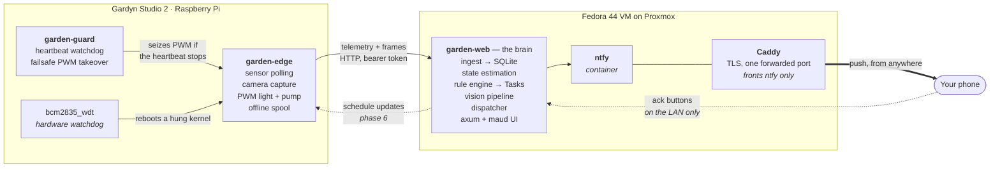
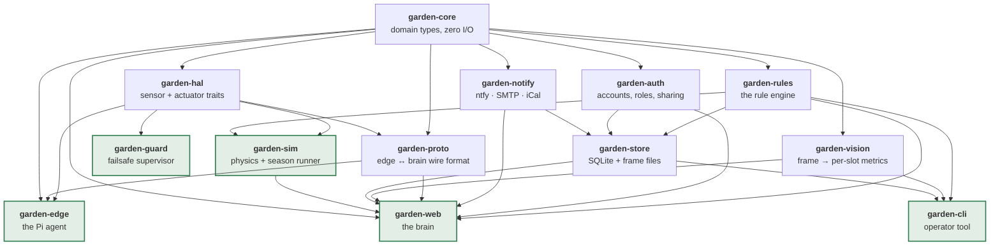

# Gardyn Studio 2 Autonomous Management System — Design

**Status:** Draft for review · **Date:** 2026-07-26

A Rust system that owns a Gardyn Studio 2 end to end: reads its sensors and camera,
controls its lights and pump, models what is growing in each of the 16 slots, and
tells the operator what to do and when — via push, email, and calendar — without
the operator having to remember to check anything.

---

## 1. Locked decisions

| Decision | Choice |
|---|---|
| Device | Gardyn Studio 2 (Gen 2, launched Oct 2025) |
| Hardware scope | **Full firmware takeover** — we own lights, pump, camera, sensors |
| Brain host | Fedora 44 VM on Proxmox |
| Notification channels | ntfy push, email (SMTP), iCal feed. **No SMS.** |
| Hosting constraint | **Everything self-hosted.** No third-party SaaS in the runtime path. |
| Language | Rust throughout |

### Self-hosting consequences

- **ntfy** runs as our own container, not `ntfy.sh`. The phone app points at our server.
- **Vision Phase C** cannot use the Claude API. It uses a **local VLM** (Ollama serving
  Qwen2.5-VL or similar) on the Fedora VM, behind a trait so the backend is swappable.
- **Email** is the awkward case: outbound SMTP from a residential IP is widely rejected
  on reputation. The SMTP endpoint is pure configuration, so it works with a
  self-hosted Postfix/mailcow. **ntfy is the reliable channel; email is best-effort.**

Because SMS is out, the top escalation tier becomes **ntfy priority 5 (`max`)**, which
bypasses Do Not Disturb on both iOS and Android. That covers the "tank is dry in 12
hours" case without a Twilio bill.

---

## 2. What we know about the hardware

Confirmed for Gardyn Home 3.0/4.0 via the community project
[`iot-root/garden-of-eden`](https://github.com/iot-root/garden-of-eden). Gardyn devices
run **Raspberry Pi OS on a Pi Zero–class board**, uplinked to Azure IoT Hub.

| Peripheral | Part | Interface |
|---|---|---|
| Air temp / humidity | AM2320 | I²C `0x38` |
| Pump current | INA219 | I²C `0x40` |
| PCB temp | PCT2075 | I²C `0x48` |
| Water level | DYP-A01-V2.0 ultrasonic | **GPIO26 trigger / GPIO19 echo** — the reverse of the Home map, per `config.py` |
| Grow lights | LED full spectrum | PWM GPIO18 @ 8 kHz — ⚠ **20 kHz** on Studio 2, duty = percent × 10,000 |
| Pump | — | PWM GPIO24 @ 50 Hz, **30% max duty** — ⚠ neither is true on Studio 2: a plain digital output, run full on (§5) |
| Cameras | USB UVC | `/dev/video0`, `/dev/video1` |

### Studio 2 deltas (from product documentation)

- **One** ultra-wide HD camera on the light bar, not two.
- 16 slots, 4+ gal tank, 1.4 sq ft footprint.
- Sunrise/Sunset lighting mode. ⚠ **Not a gradual dawn.** It is an hour at 50% either
  side of a thirteen-hour block at 100%, plus a 1.5-second fade on each transition.
  Confirmed, and recorded in [`baseline/factory-schedule.md`](baseline/factory-schedule.md).
- "No-Clean Columns" — sealed silicone modules that suppress buildup and
  crystallization. Reduces cleaning frequency; the cleaning rules should weight
  measured signals over the calendar accordingly.

### ✅ Verified on the unit — 2026-08-30, completed 08-31

Shell recon (§6) answered the board question. It came back as the **weakest** of the
options this section speculated about:

| | Found |
|---|---|
| Board | **Raspberry Pi Zero W rev 1.1** (`19000c1`) — BCM2835, one ARM1176 core, **ARMv6**, **512 MB**, no NEON |
| Storage | Removable SD card, already imaged — rollback is the card swap §5 assumes, not a reflash |
| OS | **Raspbian 9 "stretch"**, kernel `4.14.98+` — glibc 2.24, end-of-life, repos moved to `archive.raspbian.org` |
| Model | Profile **`hw_gm20`** (GM2.0), image `master.634`, services `waterlevel,iot` |
| Camera | **One** USB UVC on `/dev/video0`; MJPEG to 3264×2448 @ 15 fps. The profile sets `rotatePhotos` — frames need rotating (§6) |
| Lights | GPIO18 `alt5`, hardware PWM at **20 kHz**, duty = percent × 10,000 of a 1,000,000 range |
| Light schedule | 07:00 on (50%), 08:00 boost (100%), 21:00 on, 22:00 off. Identical all seven days |
| Pump | GPIO24 a plain output, written high or low — **not modulated at all** (§6) |
| Pump schedule | Four five-minute runs: 07:00, 12:30, 17:30, 22:55. **20 minutes a day** |
| Ultrasonic | GPIO19 `input` = echo, GPIO26 `output` = trigger, matching `CHANNEL_WATER_LVL_IN/OUT`. Also in use: GPIO13 button, GPIO25 PCB over-temp interrupt |
| GPIO access | `pigpiod -l`, FIFOs world-writable. The vendor is on the **socket** (`pigpio.pi().connected` is true), so the FIFOs are ours alone |
| I²C | `0x38`, `0x40`, `0x48` all answered — the Home map holds exactly. INA219 shunt is **0.08 Ω** per the factory source |
| 1-Wire | Not enabled — `/sys/bus/w1/devices` does not exist |
| Vendor stack | `gy_events`, `gy_wl`, `gy_iot`, `iot-controller`, `conn-string`, `wifi-pairing`, `network-checker`, all `User=root`. `iot-controller` is readable Python; the rest are compiled |
| Memory | 481 MB usable, ~300 MB available, **1.1 GB of swap on the SD card** |
| Firmware | `master.634` — past the `master.627` that patched CVE-2025-29629/29631 |
| Our access | **Unprivileged**, but user `hybriponics148` is already in `sudo`, `gpio`, `i2c`, `video` — only the password is missing (§6) |

Four consequences, each of which settles a decision left open elsewhere:

- **ARMv6 on a 2019 glibc** decides the build target — see §11. The aarch64 path is dead.
- **512 MB and one 1 GHz ARMv6 core** means nothing but sampling and uploading runs on
  the Pi. §9 already puts the whole vision pipeline on the VM; that is now mandatory
  rather than tidy. The camera's MJPEG mode helps: frames arrive already compressed, so
  the Pi copies bytes rather than encoding them.
- **One camera** confirms the Studio 2 delta below. Calibration is single-view.
- **No RTC.** `systemd-timesyncd` sets the clock only once the network is up, so samples
  spooled during a post-power-cut boot carry 1970 timestamps unless the edge agent marks
  them unsynced. The spool needs a monotonic sequence number, not just a wall clock.
- **No root.** This turns out not to block Phase 1 — see §6 — but it is a hard gate on
  Phase 5 (the `w1-gpio` overlay needs `/boot/config.txt`) and on all of Phase 6.

**The I²C map carries over exactly.** `garden-edge probe`, run on the device
2026-08-31, found `0x38`, `0x40` and `0x48` answering and nothing missing — the Home
3.0/4.0 addresses hold on Studio 2. The report is committed as `recon-report.json`, and
it is the "before" snapshot to diff against after any vendor firmware update.

**`0x38` is an AHT20, not an AM2320.** A bus scan proves something answers, not what, and
the suspicion was right: `garden-edge read` returned nothing for air temperature while
the factory's own status files read **25.3387451171875 °C** and **54.88100051879883 %**.
Those are not AM2320 numbers — that part reports tenths of a degree in sixteen bits and
would have said 25.3. They are exactly **394992** and **575469** over **2²⁰**, which is
the AHT conversion, and `0x38` is the AHT family's address while an AM2320 lives at
`0x5C`. The driver has been rewritten accordingly, with the arithmetic tested against
those two readings.

Worth noting how close this came to being invisible. Had the AM2320 sequence happened to
return *something*, it would have been plausible-looking nonsense flowing into the rules
rather than an obvious failure — and the cross-check that caught it cost nothing, because
the vendor writes its own readings to `/usr/local/etc/sensors/`.

### Security background

Gardyn patched default-SSH-credentials (CVE-2025-29629) and command injection
(CVE-2025-29631) in firmware ≥ `master.627`, with a further round in 2026
(CVE-2026-13768 et al.). **We do not use these.** On hardware you own, the clean
path is physical: pull the storage, image it, add your own key. This unit is on
`master.634`, so it is past that first round.

Two things seen while reading the factory source, neither of which we act on:

- **`config.py` carries a hard-coded Azure Storage SAS token**, write-scoped to the
  blob containers and valid into 2027. It is presumably shared across the fleet.
  **Do not commit `config.py` verbatim into this repo** — reference it by path, quote
  the constants that matter, and leave the credential on the device.
- **`/tmp/app_main.sock` is an unauthenticated local control channel** into the factory
  firmware (§6). Filesystem permissions are the only thing in front of it.

Both stop mattering after Phase 6, which is one more argument for it.

---

## 3. What's missing, and why it matters

The stock sensor set has no **EC/TDS**, no **pH**, and no **water temperature**.
Without EC, "add plant food" can only ever be a calendar estimate. These three
probes are what convert this project from a reminder app into a control system.

| Probe | Part | Interface | Cost | Status |
|---|---|---|---|---|
| Water temperature | DS18B20 waterproof | 1-Wire | ~$5 | **Committed** |
| EC / TDS | DFRobot Gravity EC or Atlas EZO-EC | ADS1115 ADC / I²C | $70–170 | Deferred |
| pH | DFRobot Gravity pH or Atlas EZO-pH | ADS1115 ADC / I²C | $50–170 | Deferred |

Water temperature ships in the base build — it drives dissolved oxygen and root-rot
risk, and it costs five dollars.

**EC and pH are deferred hardware.** The software treats them as optional
capabilities that light up when the probes appear (see §7.1). Nothing needs
rewriting to enable them — the rules that depend on EC are simply inert until an EC
reading exists, and the calendar-estimate fallbacks stand down automatically when it
does.

**I²C address collision, for when they are added:** the ADS1115 defaults to `0x48`,
already taken by the PCT2075. Strap `ADDR` to VDD for `0x49`.

### The pump is already a sensor

The INA219 on the pump is underrated. Its current draw profile is a **flow
restriction proxy**: rising steady-state current or a changed startup transient means
clogged roots or biofilm. That converts "prune roots" and "clean" from monthly
calendar entries into measured triggers.

---

## 4. Architecture



Two dashed arrows. Schedule push arrives with firmware takeover in phase 6. The ack
buttons exist but only resolve on the LAN, which is the deliberate asymmetry described
in §10: ntfy is reachable from anywhere so notifications are timely, and the brain is
not, so nothing holding your data faces the internet. Note also that there is **no message broker**. An earlier
draft of this design routed telemetry over MQTT via mosquitto; the implementation uses
plain HTTP with a bearer token, which removed a container, a protocol, and a class of
delivery-semantics questions that a device sending one sample a minute did not need.
`garden-proto` still declares MQTT topic names against a future in which the traffic
justifies a broker.

### The load-bearing rule

**The brain is never in the water or light control loop.** The Pi holds a resident
schedule and executes it autonomously. The brain pushes *schedule updates* and
*reads telemetry* — it never issues per-cycle commands. If the LAN dies, the VM
dies, or Proxmox reboots for a kernel update, the garden keeps growing on its
last-known-good schedule. This is non-negotiable given full takeover.

---

## 5. Safety model for full takeover

Owning the firmware means owning the failure modes. Four layers:

1. **Physical rollback.** Work on a *cloned* SD card. The original stays in a drawer,
   untouched. Rollback is a two-minute card swap, not a reflash.
2. **Boot-time safe defaults.** `garden-failsafe.service` runs before `garden-edge`
   and applies a conservative schedule (14h light / 10h dark, pump 15 min on /
   45 min off at 25% duty). Even if the main agent never starts, plants get light
   and water.
3. **Heartbeat supervisor.** `garden-guard` is a tiny separate process with minimal
   dependencies watching a heartbeat file. If `garden-edge` stops beating for N
   minutes, guard seizes the PWM lines and applies the safe schedule. Two processes
   means a panic in the complex one can't take out the simple one.
4. **Hardware watchdog.** `bcm2835_wdt` plus systemd `RuntimeWatchdogSec` reboots a
   hung kernel, which lands back in layer 2.

Never exceed **30% pump duty** — garden-of-eden notes full-on likely exceeds the
supply's current budget.

> **Retired on 2026-09-01.** The Studio 2's pump is not modulated: `sensors/Pump.py`
> writes GPIO24 high or low, the factory runs it flat out four times a day for five
> minutes, and thirteen hours of capture never once saw pigpio report a duty cycle for
> that pin — including through two runs with the pump going.
>
> So the drivers now **switch** the pump rather than modulating it. That is a safety
> change as much as a fidelity one: nothing tells us what sits between GPIO24 and the
> motor, and driving 500 Hz software PWM into a stage that may be a relay is somewhere
> between "does not pump" and "destroys the relay". A fractional ceiling on a binary
> output was not protection, it was the appearance of protection — and it would have had
> us watering at 30% of stock flow.
>
> **The bound that replaces it is on-time, which is what Gardyn themselves enforce:** a
> guardian thread forces the pump off after `MAX_WATER_TIME`, fifteen minutes, three
> times the scheduled run. `garden_hal::PumpGuard` is our copy, and it is now layer 5 of
> this model — the one that does not care what it was asked for.
>
> It sits below the schedule on purpose. `Schedule::validate` will accept
> `pump_on_minutes: 360`, and a schedule arrives over the network from a machine that
> could be wrong, compromised, or mid-deploy. Once a run passes fifteen minutes the pump
> goes off and *stays* off until something asks for off, so a bad schedule cannot make
> the guard chatter at a fifteen-minute duty cycle.
>
> **The agent and the failsafe each hold their own timer.** That duplication is the
> point: the premise of a separate guard process is that it keeps working when the
> complicated one has failed, and a guard reading the agent's bookkeeping would inherit
> whatever went wrong there. It is monotonic rather than wall-clock, because the Pi has
> no RTC and `timesyncd` steps the clock once the network is up — a backwards step
> measured against wall time would extend a run rather than end it.

### Cutting the cloud is now a feature

Full takeover means dropping the Azure IoT Hub uplink. That loses Kelby and app
support, but it also stops OTA firmware pushes from clobbering our work. Given the
CVE history, removing the cloud attack surface is a security improvement.

---

## 6. Phase 0 — recon (blocking)

Nothing gets built against Studio 2 hardware until this is answered.

## ✅ Status: complete, 2026-08-31

Every line of the inventory below is answered, and the two artefacts this phase existed
to produce are committed: `recon-report.json` — the device as it was before we touched
it, to diff against after any vendor firmware update — and
[`baseline/factory-schedule.md`](baseline/factory-schedule.md), the stock light and pump
programmes, read out of the firmware rather than sampled over a fortnight.

| | |
|---|---|
| Board, OS | Pi Zero W rev 1.1, ARMv6, 512 MB; Raspbian 9, kernel 4.14.98 |
| Model | `hw_gm20` (GM2.0) on image `master.634`, services `waterlevel,iot` |
| I²C | `0x38` (AHT20, **not** the AM2320 the map claimed), `0x40`, `0x48` — nothing missing |
| GPIO | full 28-pin map, ultrasonic trigger/echo **reversed** from the Home line |
| Camera | one, `/dev/video0`, MJPEG to 3264×2448; frames arrive 90° out |
| PWM | lights 20 kHz hardware PWM; pump a plain digital output, not modulated |
| Schedule | light and pump programmes, all seven days, exactly |
| 1-Wire | absent; GPIO4 is free for the DS18B20 |
| Toolchain | `arm-unknown-linux-musleabihf`, static, built and running on the device |

Nothing below is blocking any longer. What remains are Phase 4 and Phase 5 items that
happened to surface during recon, plus two decisions.

Two things it turned up need a decision rather than more recon:

Two things it turned up need a decision rather than more recon:

1. **The 30% pump duty cap (§5).** The factory drives the pump as a digital output at
   100%, four times a day for five minutes, bounded by a 15-minute guardian. Our cap
   would water at 30% of that.
2. **`Schedule::DEFAULT` pumps for six hours a day** — 15 minutes in every hour — against
   the factory's twenty minutes. `FAILSAFE` has been corrected to the factory programme;
   `DEFAULT` is our own proposal for doing better than stock, so it is left alone, but a
   gap that size is more likely a modelling slip than an intention.

**The recon is finished.** `garden-edge probe` ran on the device on 2026-08-31 and the
report is committed as `recon-report.json`. It found no I²C addresses missing, no pin
whose function contradicts its documented role, and pigpio reachable over its FIFOs. Its
only warning is the 1-Wire bus that Phase 5 will enable. The full pin map:

| GPIO | Mode | |
|---|---|---|
| 2, 3 | `alt0` | I²C SDA/SCL |
| 13 | input | light button |
| 18 | `alt5` | grow lights, hardware PWM |
| 19 | input | ultrasonic **echo** |
| 24 | output | pump |
| 25 | input | PCB over-temperature interrupt |
| 26 | output | ultrasonic **trigger** |
| 0, 1 | input | HAT ID EEPROM — reserved, not free |
| all others | input | unused; **GPIO4 is where the DS18B20 goes** |

**Carried forward — none of these block Phase 0:**

| Item | Belongs to | Why it matters | How to close it |
|---|---|---|---|
| Tank geometry, to the litre | Phase 2 | `TankGeometry::STUDIO_2` now uses the factory's own 3–25 cm band read as a distance, which is right in shape and checks out physically — but it assumes the tank is a prism, and a moulded base rarely is. Good enough for "the tank is dropping"; not for "you have 4.2 litres left". | `garden-cli tank calibrate --capacity 15.14 <mm>:<litres> …` |
| ~~Photo rotation~~ | Phase 4 | ✅ **done.** Frames came off the sensor 90° out — towers horizontal, tank at image-right. `DeviceModel::camera_rotation()` now reports a quarter turn clockwise for the Studio line and none for the Home line, matching the vendor's own per-profile `rotatePhotos` flag, and `garden-vision::orient` applies it at ingest so the stored file, its recorded dimensions, the ROI map and the dashboard share one coordinate space. The Pi never touches it. | — |
| Root on the device | Phase 5 | `/boot/config.txt` for the `w1-gpio` overlay, and everything in Phase 6. The account is already in `sudo`; only the password is unknown. | a sudoers drop-in via the card, as §6 describes |

### The tank sensor needs a decision

`InputPin::set_interrupt` returns `Invalid argument (os error 22)` on this device.
Not permissions — rppal 0.19 uses the `GPIO_V2_*` character-device ioctls exclusively,
that uAPI landed in **Linux 5.10**, and Raspbian 9 ships **4.14**, where an unrecognised
ioctl number is `EINVAL`. Basic GPIO still works, because that goes through
`/dev/gpiomem`; only the interrupt path is affected. Three ways out:

| | |
|---|---|
| **Read the vendor's value** | `gy_wl` measures every 10 s and writes `/usr/local/etc/sensors/water_lvl_status`. Costs nothing, contends with nothing, works today. Gives their computed centimetres rather than our own distance, and inherits the `WL_DATAPOINTS_CLAMP` ambiguity |
| **Poll the echo pin** | A 30–250 mm echo is 175–1460 µs; a tight `/dev/gpiomem` read loop on a 1 GHz core resolves that to a couple of millimetres. Burns a core for up to 60 ms per ping, and jitters under load |
| **Downgrade rppal** | Older versions used sysfs edge detection, which 4.14 has. Pins a dependency to work around an OS we may reimage anyway |

**The first is right for Phase 1 and the argument is not really about kernels.** `gy_wl`
owns that trigger pin until Phase 6 and pulses it every ten seconds; us pulsing it too
would be two processes driving one output, which is the exact thing Phase 1 exists to
avoid. The `EINVAL` prevented a conflict we had already written down as a risk. Polling
becomes the answer at takeover, when the pin is ours — or stops being needed, if the
takeover comes with a reimage onto a kernel from this decade.

`garden-edge`'s `vendor` module does this now. It reads the file, refuses a value outside
the factory's own 3–25 cm band, and falls in behind our own sensor rather than in front
of it, so at Phase 6 it simply stops contributing. The whole module is written to be
deleted.

**Liveness is asked of the process, not the timestamp**, and the first attempt got that
wrong. `gy_wl` writes when the tank *moves* — `-n 20 -t 10` matches
`WL_DATAPOINTS_SIZE = 20`, and the `DELTA_CHANGE` thresholds are 2–3 cm — so a steady
tank goes hours without a write, and the first real reading off the device was a
perfectly good 28 minutes old that a two-minute freshness rule threw away. Age alone
cannot separate a quiet tank from a dead writer, so `pgrep gy_wl` answers that and the
age bound applies only once the answer is no. The residual gap is a writer that is
running but wedged; the age is printed on every read so a human can see it.

**Direction confirmed, 2026-08-31.** Whether the factory's centimetres were a distance
down to the surface or a depth of water was not settled by their source — `config.py`
calls it a "water level", and the two places in `main.py` that map a change onto "up" or
"down" use opposite signs. So it was left as one named constant and one measurement:
water went in, the reading fell from 67.34 mm to 56.0 mm. A depth would have risen. It is
a distance, which is what `garden-core` means by `water_level_mm`.

That also fixes the tank geometry. `TankGeometry::STUDIO_2` had placeholders of 60 mm
full and **330 mm empty**, and 330 mm is unreachable: the factory clamps at 25 cm. An
empty tank computed as 30% full — about 4.5 litres that are not there, and the "tank is
dry in N hours" escalation firing late or never. It now uses the factory's band, 30 mm to
250 mm, which checks out physically: 15.14 L over 220 mm wants a 688 cm² cross-section,
0.74 sq ft, about half the Studio 2's 1.4 sq ft footprint. It still assumes a prism,
which a moulded base is not, so `garden-cli tank calibrate` remains worth an afternoon
before anyone trusts a figure to the litre.

### The socket is shut, and it does not matter

`ExecStart=/usr/bin/pigpiod -l`. That is **Raspbian's stock unit**, not something Gardyn
did: `-l` disables the socket interface, which is why `pigs` answers `socket connect
failed` from a daemon that is plainly running. The FIFO pair is unaffected, and the
permissions are the good news:

```
prw-rw--w-  /dev/pigpio    # 0662 — world writable
prw-rw-r--  /dev/pigout    # 0664 — world readable
```

pigpio creates them that way deliberately, so **the FIFO interface needs no root** —
which matters, because we do not have any. `pwm_watch` now speaks it directly and
prefers it over `pigs`: one write and one read per sample rather than two `fork`/`exec`s,
which is not nothing at 1 Hz on a single ARMv6 core.

**And pigpiod is the driver.** `gdc 18` returns 1,000,000 of a range of 1,000,000 at
20 kHz, with `mg 18` reading `alt5`. pigpio only reports hardware PWM it set itself —
`gpioGetPWMdutycycle` reads its own bookkeeping, not the SoC register — so something is
commanding this daemon, and the parity capture will see real numbers. The lights were at
100% when read.

The pump is less settled: GPIO24 is a plain output and `gdc 24` answers `-92`
(`PI_NOT_PWM_GPIO`), with `prg`/`pfg` at pigpio's untouched defaults of 255 and 800 Hz.
That is consistent with a pump between cycles, and only watching across a full cycle
distinguishes it from a pump driven some other way. `watch-pwm` records the difference:
a pin pigpio is not modulating is sampled for its **level** and logged under source
`pigpio-level`, so an idle pump is a fact rather than a gap.

### Do we share the FIFO?

Something commands pigpiod, and if it reaches it over the same FIFOs we use, we have a
problem: `/dev/pigout` is a single queue, and two readers draining it share out each
other's replies. Reading `main.py` narrowed this but did not close it.

- **`gy_wl` is not the one.** Its strings are pure wiringPi — `wiringPiSetupGpio`,
  `/dev/gpiomem`, `echo_isr` — so the water-level daemon bangs the registers directly
  and never touches pigpiod.
- **`main.py` is not the one either.** It delegates every actuator call to
  `sensors/LED.py` and `sensors/Pump.py`, which are where any pigpio client lives.
- **`LED.py` and `Pump.py` both use `pigpio.pi()`** — the Python client, which is a
  *socket* client. So the vendor is on the socket and the FIFOs should be ours alone.

Except that the socket does not appear to exist: `PIGPIO_ADDR=127.0.0.1 pigs hwver`
still fails and `/proc/net/tcp` has no listener on `0x22B8`. Both cannot be true while
the lights visibly work, so one of the two observations is incomplete. The likeliest
reconciliation is **IPv6**: pigpiod bound to `::1`, which puts it in `/proc/net/tcp6`
rather than `tcp`, and which `pigs` — connecting to the first `getaddrinfo` result —
misses, while Python's `socket.create_connection` tries every address and succeeds.

```sh
grep -i 22B8 /proc/net/tcp6
PIGPIO_ADDR=::1 pigs hwver
python3 -c "import pigpio; print(pigpio.pi().connected)"
```

The third line is decisive on its own: if the vendor's own client reports `connected`,
the socket exists and nothing contends with us on the FIFOs. Until then, `pwm_watch`
reads exactly one reply per command, and the drain at startup is its only unbounded
read.

### The schedule is a file, not a curve

The largest finding in `main.py`, and it shortens Phase 1 considerably. Lighting is not
a ramp the firmware computes — `BaseScheduler` reads `LIGHT_SCHEDULE_FILE`, a JSON array
indexed by day of week whose entries are `{"schedule_hour": "HH:mm:ss", "sig": ...}`,
and emits one of three discrete signals:

| `sig` | Call | |
|---|---|---|
| `on` | `led.turn_on()` | |
| `off` | `led.turn_off()` | |
| `boost` | `led.boost()` | a brighter tier, so at least two non-zero levels exist |

The pump runs on the same machinery against `PUMP_SCHEDULE_FILE`, with `pumper.pump()`
and `pumper.stop()` — binary, not modulated, which is why pigpio reports
`PI_NOT_PWM_GPIO` on GPIO24. A guardian thread forces it off after `MAX_WATER_TIME`
(logged as 15 minutes).

**So the schedule can be read rather than inferred.** `LIGHT_SCHEDULE_FILE` is
`/usr/local/etc/schedules/light_schedule.json` and `PUMP_SCHEDULE_FILE` is
`pump_schedule.json` beside it. Copy those two and the stock schedule is captured, for
all seven days, exactly.

### The light curve, in full

`sensors/LED.py` closes the rest of it, and there is nothing left to reconstruct.
Brightness is a **percentage**, held in a file, and mapped linearly onto the PWM:

```python
value = percent * 10_000                      # 0–100 % onto a 0–1,000,000 range
pwm.hardware_PWM(18, 20_000, value)           # 20 kHz, which is what pfg 18 reported
```

| Signal | Target |
|---|---|
| `off` | 0 % |
| `on` | **whatever `prev_light_status` holds** — the level last set from the app, falling back to 50 % |
| `boost` | 100 % |

`on` is therefore not a fixed brightness, which is why the pin read 100 % rather than
some stock daytime level. Two files carry the whole state: `light_status` (current) and
`prev_light_status` (the level `on` restores).

And the "sunrise/sunset ramp" is **1.5 seconds long**, not a dawn simulation. It is
gated on the hardware profile (`withSunsetSunrise`); when off, transitions are a single
instantaneous write. When on, 100 steps over 1.5 s along a gamma curve:

```
alpha  = x / 100                                    # 0 → 1 ramping up, 1 → 0 down
value  = start + (end - start) · 0.3·alpha / (1.3 - alpha)
```

That is an ease-in shape — slow to leave the starting level, quick to arrive. Replicating
it is a dozen lines, and it means **the fortnight of parity capture is no longer buying
the light curve.** Keep a short run as a cross-check that the schedule file matches
observed behaviour, then move on.

### The pump is not modulated at all

`sensors/Pump.py` is unambiguous: `set_mode(24, OUTPUT)` then `write(24, 1)` or
`write(24, 0)`. **The factory runs the pump full on.** No PWM, no duty cycle.

This contradicts two things we have written down. §2's table says "PWM GPIO24 @ 50 Hz",
and §5 says *never exceed 30% pump duty* — a figure inherited from garden-of-eden's note
about the Home supply's current budget. On this device the stock firmware runs 100%,
`garden-guard` currently drives software PWM at 500 Hz, and `garden-hal` would cap us at
30% — a third of factory flow, which is an under-watering bug dressed as a safety
feature. **This needs a decision before Phase 6, not a quiet edit.** Left as-is meanwhile.

The vendor also spawns a thread on every pump run that samples the INA219 once a second
and reports the median power and its standard deviation — independent confirmation that
§3's "the pump is already a sensor" is the right read. Their shunt is **0.08 Ω**, which
`hardware.rs` had guessed at 0.1 Ω.

### Two more channels we did not know about

- **`/tmp/app_main.sock`**, a Unix socket `main.py` listens on, taking `status`,
  `waterlevel`, and `iotdmcall <method> <base64 json>` — a full local control path into
  the factory firmware, unauthenticated beyond filesystem permissions.
- **`LIGHT_STATUS` and `PUMP_STATUS` are files on disk** that the vendor keeps current.
  Reading them costs nothing, contends with nothing, and reports the firmware's own view
  of its state — a better parity source for *what state it is in* than inferring it from
  a pin, though not a substitute for the duty behind it.

### Root

SSH works; the password does not exist as far as we are concerned. Phase 1 does not
need it — the FIFO is world-writable, `/dev/i2c-1` is group-readable, `/dev/video0` is
group `video`, and a capture can be made to survive reboots with a user `@reboot`
crontab entry instead of a systemd unit. Phase 5 needs it (`/boot/config.txt` for the
`w1-gpio` overlay) and Phase 6 needs it throughout.

The route is the one already used to enable SSH: pull the card, mount its root
partition, drop a `NOPASSWD` file into `/etc/sudoers.d/`, mode 0440. Same physical
access, same reversibility, and no need to guess or crack anything.

**The SD image is the other half of this phase.** It is a full copy of the factory
software, so loop-mounting it on the Fedora box gets at the vendor's own light and pump
schedule without touching the live device. The units point at `/usr/local/bin/gy_*`,
which are compiled binaries rather than the Python that garden-of-eden found on the
Home line — so this is `strings` and `ldd`, not reading source. `ldd` alone answers the
question above: a `gy_*` binary linked against `libpigpio` is going through the daemon.
Do this *as well as* the parity capture, not instead of it — the binary says what was
intended, the capture says what the hardware actually did.

**Access:** power down, remove storage, image it on the Fedora box
(`dd` → keep the `.img`), then on a *fresh card* enable SSH by touching `ssh` in the
boot partition and adding a pubkey to the user's `authorized_keys`.
*Done — SSH is up and `sdbackup.img` is captured. eMMC and `rpiboot` never came into it.*

**Inventory to capture:**

```sh
cat /proc/device-tree/model; cat /proc/cpuinfo      # SoC and board
cat /etc/os-release; uname -a                        # OS and kernel
systemctl list-units --type=service --state=running  # factory services
i2cdetect -y 1                                       # confirm 0x38 / 0x40 / 0x48
raspi-gpio funcs                                     # GPIO allocation, free pins
v4l2-ctl --list-devices; v4l2-ctl --list-formats-ext # camera capability
ls /sys/bus/w1/devices 2>/dev/null                   # 1-Wire for DS18B20
pigs gdc 18; pigs gdc 24                             # live PWM duty, if pigpiod
```

**Parity capture — do not skip this.** Before disabling anything, run a
**read-only** `garden-edge` alongside the factory firmware for 1–2 weeks, sampling
PWM duty on GPIO18/24 at 1 Hz. That gives ground truth for the stock light curve
(including the sunrise/sunset ramp) and pump duty cycle. Replicate that baseline
first, then improve on it. Full takeover *requires* the read-only phase rather than
skipping it.

If the factory code uses pigpiod, `pigs gdc <pin>` reads duty directly. Otherwise
try `/sys/class/pwm/pwmchip0/pwm0/{duty_cycle,period}`, or jumper a spare GPIO
input to the PWM line and sample it.

---

## 7. Domain model

```rust
Device   { tank_geometry, slots: [Slot; 16] }
Slot     { position, row, column }        // row matters: light and flow vary by height
Planting { slot, variety, planted_at, germinated_at, thinned_at,
           stage, last_root_check, last_harvest, expected_eol }
Variety  { germination_days, days_to_harvest, productive_life, canopy_class,
           needs_pruning, needs_pollination, ec_target, ph_target }
TankEvent{ TopOff { liters }, Refresh, FoodDose { ml }, HydroBoost, DeepClean }
Observation { ts, kind, value }
Task     { kind, slot, due_window, severity, rationale, state }
```

Rules are **pure functions** `fn(&GardenState) -> Vec<Task>`. That makes them
unit-testable, and it lets you replay months of recorded history against a modified
rule to see what it *would* have said. Every `Task` carries a `rationale` string, so
"why am I being told this?" always has an answer: *"water at 22%, consuming 0.5 L/day,
empty in 1.8 days."*

### 7.1 Capability model — the spine of optional features

Every optional thing in this system — deferred probes, each vision phase, actuator
ownership — is modelled as a `Capability`. This is one mechanism, not three.

```rust
enum Capability {
    // base sensors
    AirTemperature, AirHumidity, WaterLevel, PumpCurrent, PcbTemperature,
    WaterTemperature,        // committed: DS18B20
    // deferred hardware
    Conductivity, PotentialHydrogen,
    // vision, independently switchable
    CanopyMetrics,           // phase A — HSV masking, no ML
    PlantSegmentation,       // phase B — ONNX
    VisualDiagnosis,         // phase C — local VLM
    // actuators, arrive at takeover
    LightControl, PumpControl,
}
```

Each rule declares what it needs and how authoritative it is:

```rust
trait Rule {
    fn requires(&self) -> &'static [Capability];
    fn produces(&self)  -> &'static [TaskKind];
    fn precedence(&self) -> u8;
    fn evaluate(&self, state: &GardenState) -> Vec<Task>;
}
```

The engine keeps only rules whose requirements are satisfied, then — for each
`TaskKind` — runs only the **highest-precedence surviving rule**. That gives graceful
degradation for free:

| TaskKind | High precedence (needs `Conductivity`) | Fallback (base sensors only) |
|---|---|---|
| `AddPlantFood` | dose from measured EC vs variety target | dose ∝ litres added since last dose |
| `PruneRoots` | pump-current restriction trend | fixed 2–4 week cadence |
| `Harvest` | canopy area vs variety threshold | days-to-harvest from the variety book |

Plug in an EC probe and the estimate-based rule stands down silently, replaced by the
measured one. No code changes, no config migration. The same holds for each vision
phase — enable `CanopyMetrics` and the harvest rule upgrades from calendar to
measurement.

**Capabilities are runtime state, not compile-time features.** A probe that fails
mid-season drops its capability, and the fallback rule resumes on the next tick. This
is why they are not Cargo features.

---

## 8. Rules catalog

From the documented Gardyn care cycle — top off weekly, refresh the tank at least
every 4 weeks, HydroBoost with every top-off and refresh, root check every 2–4 weeks,
thin during weeks 2–6 — plus sensor-derived triggers.

Gardyn publishes **no** cleaning interval: a deep clean is driven by conditions
(algae, root pieces, salt deposits, pests, or a planned break from growing), so the
measured signal leads there and the annual entry below is only a backstop for a garden
with no pump sensor fitted. Both procedures are quoted verbatim in
`garden-core/data/maintenance-guides.json` and served at `/guides`, so a reminder can
link to the steps rather than assuming they are remembered.

| Task | Calendar trigger | Measured trigger |
|---|---|---|
| Add water | — | level + consumption rate → forecast; computes *how much* |
| Add plant food | dose ∝ liters added; half-strength pre-germination | EC below variety target |
| Add conditioner | every top-off / refresh | algae pixels, pump current drift |
| Prune roots | every 2–4 weeks per planting | pump current ↑, consumption ↓ |
| Prune plants | variety flag + age | canopy area threshold, neighbor shading |
| Harvest | days-to-harvest, cut-and-come-again cadence | canopy area, bolting risk from heat |
| Tank refresh | every 4 weeks, 7 days' notice | widespread measured chlorosis pulls it forward |
| Deep clean | *none published*; annual backstop | pump restriction profile (weighted down for No-Clean Columns) |
| Thin | weeks 2–6 → 1/yCube, 3 for herbs | seedling count from vision |
| Pollinate | fruiting varieties in flower | flower detection |
| Replant | end of productive life | growth curve plateau |

**Daily water consumption is a whole-garden health proxy.** It is aggregate
transpiration. A sudden drop means something is wrong before any plant looks wrong.

### Succession planner

Reactive rules keep plants alive; they don't optimize production. A planner assigns
varieties to slots over time so harvests stagger and no slot sits idle, respecting
slot position (light and flow vary by row), variety lifespan, and stated
preferences. Greedy heuristic first; treat as an optimization problem later.

---

## 9. Vision pipeline

One ultra-wide camera, 16 slots, one frame → 16 ROIs.

**Undistort first.** An ultra-wide lens has significant barrel distortion — edge
slots will measure smaller than center slots if you skip this. Calibrate once with a
checkerboard, store the camera matrix and distortion coefficients, undistort before
extracting ROIs.

**Photo mode — the payoff for full takeover.** Because we own the light PWM, we can
briefly set the lights to a known fixed duty, let them settle, capture, then restore.
Every frame is then photometrically comparable. Under the stock sunrise/sunset ramp
this is impossible, and color-based diagnosis (yellowing → nitrogen) is invalid.
This alone justifies the takeover.

### Three independent, individually switchable features

Each stage is a separate `Capability` and a separate module. They are **not** a
dependency chain you must climb — any subset can run. Undistortion and ROI extraction
are shared plumbing that sits below all three.

| Capability | Method | Cost to run | Adds |
|---|---|---|---|
| `CanopyMetrics` | HSV green masking per ROI, no ML | negligible | canopy area, colour stats, growth curves, chlorosis, stalled growth |
| `PlantSegmentation` | ONNX model via `ort` | moderate CPU | per-plant masks, seedling counts for thinning, flower/fruit detection |
| `VisualDiagnosis` | **local VLM** (Ollama, Qwen2.5-VL) | heavy, run sparingly | qualitative "what's wrong with this plant", plain-language daily brief |

`CanopyMetrics` alone is roughly 80% of the value and is the default. The other two
can be toggled on independently at any time, and each one silently upgrades the rules
that declare it (see §7.1).

**Self-hosted constraint:** `VisualDiagnosis` runs against a local Ollama endpoint,
not a hosted API. It sits behind a `DiagnosisBackend` trait, so the backend is
swappable without touching the rules.

**The VLM is strictly advisory.** Deterministic rules own anything touching dosing,
water, or actuators. A model that hallucinates a nutrient deficiency must never be
able to dose the tank.

---

## 10. Notifications

The "I don't want to have to remember" requirement is doing most of the work here.

1. **Escalation ladder** — silent → ntfy default → ntfy + email → ntfy priority 5
   (`max`, bypasses DND). Escalates on overdue and on severity.
2. **One-tap acknowledgment** — every notification carries signed Done / Snooze /
   Not-Applicable links requiring no login. Completion feeds state, because "when did
   I last dose HydroBoost" must be *known*, not remembered.
3. **Auto-verification** — you tap "added water"; if the level sensor doesn't move
   within minutes, the task silently un-completes and re-fires. This is the mechanism
   that makes the system trustworthy rather than merely noisy.
4. **Batching and quiet hours** — one morning brief with the day's actions;
   interrupts reserved for urgent items. The iCal feed carries scheduled work (tank
   refresh Saturday) into your existing calendar.

### Reachability — decided 2026-09-01

Two requirements that look like one and are not: **the notification arriving** needs
ntfy reachable, and **its buttons working** needs the brain reachable. An earlier draft
of this section conflated them and concluded Tailscale.

**ntfy is exposed; the brain stays on the LAN.**

| | |
|---|---|
| ntfy | Behind Caddy with a real certificate, one forwarded port. Notifications arrive **anywhere, immediately** |
| Brain | LAN only. `GARDEN_BASE_URL` is a LAN address, so ack buttons work at home and fail away from it |

The asymmetry is the point. ntfy is a single-purpose upstream server with `deny-all`
auth and no knowledge of the garden; the brain holds every reading, frame and account.
Exposing the first to get timely alerts is a much smaller bet than exposing the second,
and it needs no VPN client on the phone — the ntfy app is required either way.

**Tailscale was the previous answer and is retired**, because it means a second
always-on app on the phone purely so that buttons work. Cloudflare Tunnel is rejected
outright: it terminates TLS and would put a third-party SaaS in the runtime path,
against §1.

**Android specifically.** The ntfy app holds a foreground connection and catches up on
reconnect, so this works properly. iOS restricts background sockets to self-hosted
servers and would need rethinking.

### What the buttons failing off-LAN actually costs

Less than it sounds, because §10.3's auto-verification runs **both ways**:

- Tap Done and the sensor does not move → the task un-completes and re-fires.
- **Do the work and the sensor moves → the task completes itself, with no tap.**

The second direction is the one that makes this decision cheap. Nearly every task here
needs you physically at the garden — top off, prune roots, thin, harvest, deep clean —
so a button you can only press at home is a button you could only usefully press at
home anyway. Doing the work *is* the acknowledgement, and the tap is a convenience for
the few things no sensor can see.

**Consequence for the escalation ladder.** ntfy caches for 72 hours and the app catches
up on reconnect, so nothing is lost while you are away — but everything arrives at once.
Two days out means the original notification plus every overdue escalation landing
together, and ntfy cannot tell the publisher whether anyone is subscribed. Escalations
must therefore **collapse into a digest** rather than accumulate as a chain.

---

## 11. Deployment — Fedora 44 on Proxmox

Step by step, with every command: **[DEPLOYMENT.md](DEPLOYMENT.md)**. The units
themselves live in [`deploy/`](deploy/). This section is the shape of it.

**VM:** 2 vCPU / 4 GB RAM / 40 GB disk is ample — 4 vCPU and 12 GB if Ollama is
enabled. The disk is sized for camera frames, not for the database.

**Podman + Quadlet**, not Docker Compose. It is the Fedora-native path and gives real
systemd units: a `.container` file in `/etc/containers/systemd/` becomes a `.service`
at `daemon-reload`.

**Two containers**, plus one optional:

| | |
|---|---|
| `garden-web` | the brain — built locally from this repo |
| `garden-ntfy` | self-hosted push |
| `garden-ollama` | only if `VisualDiagnosis` is enabled |

There is **no broker.** An earlier version of this section listed `mosquitto` on 1883;
the transport is HTTP with a bearer token, and the container was removed along with the
protocol. Grafana and VictoriaMetrics remain a worthwhile later addition for
time-series exploration; the built-in dashboard covers the operational view.

All of these are self-hosted by design — no third-party service sits in the runtime
path. The phone's ntfy app is pointed at our server rather than `ntfy.sh`.

- **SELinux** is enforcing — volume mounts need `:Z`, or the container is denied reads
  whose Unix permissions are visibly fine.
- **firewalld** — **8080 (the brain) on the internal zone only.** 8090 is not published
  either: ntfy is reached through Caddy, which owns 443 in the public zone and is the
  only thing forwarded at the router. That is the whole of the internet-facing surface,
  and it fronts one upstream server that knows nothing about the garden (§10).
- **SQLite in WAL mode.** A Proxmox snapshot of a live SQLite file is not guaranteed
  consistent — the real state is spread across `.db`, `-wal` and `-shm`. A nightly
  `VACUUM INTO` produces a coherent single file; snapshot that.

**Cross-compiling for the Pi:** the target is **`arm-unknown-linux-musleabihf`** —
ARMv6, hard float, statically linked. Settled by §2: the board is an original Pi Zero W,
so aarch64 is out, and the OS is stretch, so glibc is a trap — a `cross` build against
its Ubuntu image links to a glibc far newer than the device's 2.24 and dies at startup
with `GLIBC_2.28 not found`.

Static musl does better than answer that question; it removes it. And because every
dependency `garden-edge` and `garden-guard` pull in is pure Rust — no TLS, no C — the
only thing missing is a linker, and **rustup already ships one**. `.cargo/config.toml`
points the target at `rust-lld` from the toolchain's own sysroot with
`link-self-contained`, so the build is:

```sh
rustup target add arm-unknown-linux-musleabihf
cargo build --release -p garden-edge -p garden-guard --target arm-unknown-linux-musleabihf
```

No zig, no `cross`, no container, no C cross-compiler, identical on every host. Verified
2026-08-30: EABI5 hard-float, `+v6,+vfp2`, statically linked, 3.6 MB stripped.

The ARMv6-specific link failure to watch for is `undefined reference to
__atomic_load_8` — ARM1176 has no 64-bit atomic instruction, so LLVM emits libatomic
calls. It does not happen on the current dependency set; `-C link-arg=-latomic` is the
fix if a future one brings it back.

---

## 12. Crate layout

Thirteen crates. Every arrow is a real dependency in `Cargo.toml`; `garden-core` is at the
bottom of everything and depends on nothing.



Green outlines are the four binaries; the rest are libraries.

| Crate | What it is | Runs on |
|---|---|---|
| `garden-core` | Domain types and the variety book. No I/O at all. | everywhere |
| `garden-hal` | Traits for sensors and actuators, plus the duty-cycle failsafes | Pi, simulator |
| `garden-rules` | 22 rules and the capability/precedence engine | brain, simulator |
| `garden-auth` | Accounts, roles, garden sharing, sessions, signed action links | brain |
| `garden-proto` | Wire format shared by the agent and the brain | Pi, brain |
| `garden-notify` | ntfy, SMTP and iCal adapters, plus the delivery policy | brain |
| `garden-store` | SQLite persistence and on-disk camera frames | brain |
| `garden-vision` | Camera frame → canopy area, chlorosis, seedling counts | brain, CLI |
| `garden-sim` | Physics model and season runner — **binary** | dev box |
| `garden-cli` | Calibration, event logging, rule replay — **binary** | Fedora VM |
| `garden-web` | The brain: UI, agent API, dispatcher — **binary** | Fedora VM |
| `garden-edge` | Recon, telemetry, camera — **binary** | Raspberry Pi |
| `garden-guard` | Heartbeat supervisor and failsafe — **binary** | Raspberry Pi |

`garden-vision` turns a camera frame into per-slot measurements, and `garden-cli` is
the operator tool that calibrates the hardware those measurements depend on. Note that
`garden-edge` keeps its own `probe`, `read` and `watch-pwm` subcommands: they run on a
device you have just opened, before the brain or its database exist.

```
crates/garden-core/data/varieties.json          the catalogue
crates/garden-core/data/variety-details.json    Gardyn's own care text
deploy/                                         Containerfile, Quadlet units, installer
```

### Multi-tenancy

The system is multi-user from the storage layer up: one account holds many gardens,
and any garden can be shared with other accounts at a role (viewer, caretaker,
steward, owner). See `garden-auth` for the policy and `garden-store/tests/tenancy.rs`
for the isolation guarantees exercised against a real database.

Two decisions worth recording:

- **`Actor` is the only authorization decision point.** Handlers never compare roles;
  they call `Actor::require`. One place to audit beats a check per handler.
- **Server administration and garden access are disjoint.** An admin sees fleet health
  and account counts, never garden contents. This is why `require_admin` does not fall
  through to `require`, and why the fleet page carries no per-garden data.

**Key crates.** Edge: `tokio`, `rppal` (GPIO/PWM/I²C, hardware PWM on GPIO18),
`ina219`, `am2320`, `nokhwa` (V4L2), `rumqttc`, `redb`.
Brain: `axum`, `sqlx`/SQLite, `maud` + HTMX (no JS build step), `image`, `ort`,
`lettre`, `icalendar`, `reqwest`, `tokio-cron-scheduler`.

Because `garden-hal` is trait-based, a `SimulatedGarden` backend runs the entire
brain, rules engine, vision pipeline, and UI **on a Windows dev box with no Pi in the
loop**. Most of the work in this project isn't hardware work, and it shouldn't be
gated on hardware.

---

## 13. Roadmap

| Phase | Deliverable | Gate |
|---|---|---|
| **0** | Recon: shell access, SD image backup, peripheral inventory | ✅ **complete** — `hw_gm20` on `master.634`, `recon-report.json` committed, I²C map confirmed unchanged from the Home line |
| **1** | `garden-edge` read-only + parity capture of factory PWM | ✅ **complete** — five of six base capabilities reporting to the brain, and the factory schedule confirmed by observation over 40 121 samples with no gaps ([`baseline/factory-schedule.md`](baseline/factory-schedule.md)). Every transition landed within seconds of its scheduled time |
| **2** | `garden-brain`: ingest, SQLite, state estimation, dashboard, slot/planting model | Water forecasting accurate |
| **3** | `garden-rules` + notifications (ntfy/email/iCal) + ack loop + auto-verify | Useful without vision |
| **4** | `garden-vision` `CanopyMetrics`: undistortion, ROI calibration, canopy tracking | ✅ built, and frames now arrive upright. Needs a calibrated garden: **size the ROI map to the rotated frame** — `garden-cli vision init --width 1080 --height 1920` for a Studio 2, not the 1920×1080 the camera reports |
| **5** | DS18B20 water temperature → root-zone rules | Probe reading reliably |
| **6** | **Takeover**: `garden-guard`, failsafe, cut cloud, own lights + pump, photo mode | Parity proven, rollback tested |
| **7** | Succession planner | ✅ first cut — greedy, per slot and tower-wide |
| *opt* | `PlantSegmentation` | ✅ built — connected components, no model needed |
| *opt* | `VisualDiagnosis` (local Ollama VLM) | ✅ built — set `GARDEN_OLLAMA_URL` |
| *opt* | EC + pH probes → measured dosing supersedes estimates | hardware purchased |

The three `opt` rows are deliberately unordered and unblocked. Because they are
capabilities rather than build stages (§7.1), each can be switched on independently
whenever the hardware or appetite appears.

Phase 6 is deliberately late. Everything valuable is reachable read-only; takeover is
what unlocks photometric consistency and custom light curves, and it should happen
once the rest is proven and a rollback has been rehearsed.

---

## 14. Risks

- ~~**Studio 2 internals may differ materially** from the documented Home 3.0/4.0 map.~~
  Partly retired: the board is the same Pi Zero W class garden-of-eden documented, which
  makes the I²C map likelier to carry over. The map itself is still unscanned (§6).
- ~~**eMMC instead of SD**~~ — retired. Removable SD, imaged.
- **The parity capture could silently record a row of zeros.** The `unavailable` case is
  handled — `watch-pwm` reads the FIFO and warns loudly if it cannot. The subtler one is
  pigpiod answering `0.0000` for a pin it does not drive (§6). Confirm a non-zero duty
  against lit lights *before* leaving the capture to run, and check the CSV again after
  the first day.
- **No root on the device.** Phase 1 works without it; Phases 5 and 6 do not. The fix is
  physical and already rehearsed, but it is a card-pull, so it is a scheduling
  constraint rather than a command.
- **We share pigpio's FIFOs with the factory firmware** (§6). Reading a reply meant for
  the vendor's controller could, in the worst case, make it mis-set the pump — during a
  phase whose whole premise is being read-only. Bounded by reading exactly one reply per
  command; resolved for certain by reading `main.py`.
- **The ultrasonic trigger and echo may be swapped** (§6). Driving an echo line as an
  output is an electrical fault, not a logic bug, so `ultrasonic.rs` stays on the
  documented pins until something confirms the swap — and `garden-edge probe` now
  reports the contradiction rather than leaving it in a design document.
- **Raspbian 9 is four years past end-of-life.** No security updates, and `apt` needs
  redirecting at `archive.raspbian.org` before it can install anything. Static musl
  binaries mean we do not depend on that; do not build the takeover on a plan that
  requires installing packages onto this OS.
- **OTA firmware push** could clobber pre-takeover work — and this is worse than it
  looked. `main.py` runs `/usr/local/bin/g_ota -x` on **every start**, and
  `iot-controller.service` is `Restart=always`. Worse still, it calls `os._exit(1)` when
  the Azure client has been unreachable for about thirty minutes, so an offline device
  restarts on a loop and checks for updates each time round. Cutting the LAN does not
  buy safety here; only Phase 6 does. Keep the install script idempotent and keep
  anything of ours out of the paths under `/usr/local/etc/gardyn/`.
- **A local control channel exists that we did not design.** `/tmp/app_main.sock`
  accepts `iotdmcall` and will drive the lights and pump for anything that can open it
  (§6). It is not a remote hole, but it does mean "the factory firmware is idle" is never
  a safe assumption during Phase 1.
- **`gy_wl` bangs the GPIO registers directly** through wiringPi and `/dev/gpiomem`,
  polling every 10 seconds. If `garden-edge` also pulses the ultrasonic trigger, two
  processes are driving that pin. Reading the vendor's own water-level state is the
  contention-free path until takeover.
- **Warranty** is almost certainly void once the storage is modified.
- **Agent failure kills plants.** Mitigated by the four-layer safety model — but the
  failsafe must be tested by deliberately killing `garden-edge` and confirming guard
  takes over, before Phase 6 goes live.
- **Pump over-duty** risks the power supply. Enforce the 30% cap in `garden-hal`, not
  in calling code.

---

## Sources

- [iot-root/garden-of-eden](https://github.com/iot-root/garden-of-eden) — peripheral map, GPIO/I²C details
- [CISA ICSA-26-055-03 — Gardyn Home Kit](https://www.cisa.gov/news-events/ics-advisories/icsa-26-055-03)
- [SecurityWeek — Critical Flaws Exposed Gardyn Smart Gardens](https://www.securityweek.com/critical-flaws-exposed-gardyn-smart-gardens-to-remote-hacking/)
- [Gardyn — Getting to Know Your Gardyn's Care Cycle](https://help.mygardyn.com/en/articles/1772865)
- [Gardyn — Tank Refresh Guide](https://help.mygardyn.com/en/articles/1788097) — cadence, dosing table, and the refresh procedure quoted in `maintenance-guides.json`
- [Gardyn — How to Deep Clean Your Gardyn](https://help.mygardyn.com/en/articles/6166337) — the cleaning procedure, and the conditions that call for one
- [Gardyn — How the Gardyn's Cameras Work](https://help.mygardyn.com/en/articles/1773313)
- [Gardyn Studio 2 product page](https://mygardyn.com/product/gardyn-studio-gen2/)
- [Gardyn — Security update](https://mygardyn.com/blog/security-update/)
