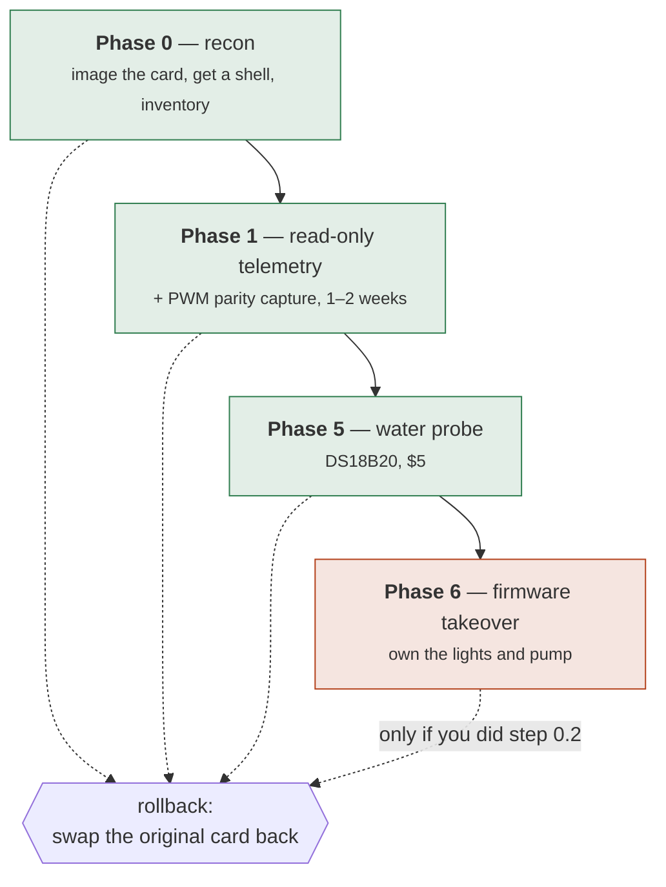

# Running on the actual Gardyn

Everything you need to do to the device, in order, with the reasoning for each step.

**Read the whole of Phase 0 before you start.** The first two steps are the ones that
determine whether a mistake later is a two-minute recovery or a dead Studio.

---

## What you are signing up for

| | |
|---|---|
| **Reversible?** | Yes, through Phase 5 — provided you do step 0.2 |
| **Warranty** | Almost certainly void once you modify the storage |
| **Cloud** | Stays on until Phase 6. Kelby and the app keep working |
| **Plants at risk?** | No, until Phase 6. Phases 0–5 never touch an actuator |
| **Time to first data** | An afternoon |

Phases 0 through 5 run the agent **alongside** the factory firmware, read-only. The
Gardyn keeps watering and lighting itself exactly as before, and the worst case is
that our agent crashes and you get no telemetry.



Green phases never touch an actuator. Phase 6 is the one that can kill plants, and it
is deliberately last.

---

## Phase 0 — recon

### 0.1 What you need

- A **second SD card** (16 GB+) — do not reuse the one in the device
- A USB SD reader
- A way into the Pi: keyboard + HDMI, a USB-TTL serial cable, or a network with SSH

### 0.2 Image the original card first

This is the step that makes everything else reversible. **Do it before anything.**

```sh
# Linux/macOS. Identify the card carefully — dd will happily overwrite the wrong disk.
lsblk
sudo dd if=/dev/sdX of=gardyn-original.img bs=4M status=progress conv=fsync
```

On Windows, use Win32DiskImager or `Raspberry Pi Imager`'s read function.

Then **put the original card in a drawer and never touch it again.** All later work
happens on a clone. Rollback is a two-minute card swap, not a reflash.

```sh
# Write the clone onto the new card.
sudo dd if=gardyn-original.img of=/dev/sdY bs=4M status=progress conv=fsync
```

> **If the Studio 2 uses eMMC rather than a removable card**, stop and reconsider. You
> lose the swap-back rollback, and recovery needs `rpiboot` over USB or a serial
> console. That materially changes the risk of Phase 6 and is worth knowing before you
> start rather than after.

### 0.3 Get a shell

On the **clone**, mount the boot partition and:

```sh
# Enable SSH.
touch /boot/ssh          # or /boot/firmware/ssh on newer images

# Add your key. Adjust the user — check /etc/passwd on the root partition for who exists.
mkdir -p /mnt/root/home/pi/.ssh
cat ~/.ssh/id_ed25519.pub >> /mnt/root/home/pi/.ssh/authorized_keys
chown -R 1000:1000 /mnt/root/home/pi/.ssh
chmod 700 /mnt/root/home/pi/.ssh && chmod 600 /mnt/root/home/pi/.ssh/authorized_keys
```

This is the clean route on hardware you own. **Do not** use the default-credential or
command-injection CVEs — they are patched on current firmware, and you do not need
them when you have physical access to the storage.

Boot the clone in the Gardyn and find it:

```sh
ping gardyn.local || nmap -sn 192.168.1.0/24
ssh pi@gardyn.local
```

### 0.4 Enable the interfaces

```sh
sudo raspi-config nonint do_i2c 0      # I²C on
sudo raspi-config nonint do_camera 0   # legacy camera, harmless if unused
sudo apt update && sudo apt install -y i2c-tools v4l-utils
sudo reboot
```

For a DS18B20 water probe later, add to `/boot/firmware/config.txt`:

```
dtoverlay=w1-gpio,gpiopin=4
```

### 0.5 Run the probe

Build on your workstation and copy it over (see [Building](#building-for-the-pi)):

```sh
scp target/aarch64-unknown-linux-gnu/release/gardyn-edge pi@gardyn.local:~/
ssh pi@gardyn.local './gardyn-edge probe --out recon-report.json'
```

You get something like:

```
Gardyn edge recon — agent 0.1.0

  board    Raspberry Pi Zero 2 W Rev 1.0
  arch     aarch64
  os       Debian GNU/Linux 12 (bookworm)
  kernel   6.6.51+rpt-rpi-v8

  I²C devices:
    0x38  AM2320 air temp/humidity
    0x40  INA219 pump current
    0x48  PCT2075 board temp
  cameras: 1
    /dev/video0
  water probe: none

  vendor services still running:
    gardyn-agent.service

  verdict: peripheral map matches DESIGN.md
```

**Copy `recon-report.json` back and commit it next to DESIGN.md.** It is the only
record of what the device looked like before you touched it, and it is what you diff
against after a vendor firmware update.

### 0.6 What the verdict means

| Verdict | What to do |
|---|---|
| *matches DESIGN.md* | Carry on to Phase 1 |
| *N expected device(s) missing* | Studio 2 differs from the Home line. Update DESIGN.md §2 from the report, then carry on — the agent reports whatever is actually there |
| *no I²C devices answered* | Almost always a disabled bus or an unseated ribbon, not different hardware. Re-check 0.4 before rewriting the design |

The peripheral map in DESIGN.md comes from community work on the **Home 3.0/4.0**.
Studio 2 is undocumented. A mismatch here is expected information, not a failure.

---

## Phase 1 — read-only telemetry

Still alongside the factory firmware. Nothing is written to any pin.

### 1.1 Create the garden and get its id

In the web UI: **Add a garden**, pick your model (not *Simulated*), save. The id is in
the URL:

```
http://brain.local:8080/gardens/6b964894-aaab-4ccd-b3bf-2a39b1ee8d5b
                                 ^^^^^^^^^^^^^^^^^^^^^^^^^^^^^^^^^^^^
```

### 1.2 Check the agent can reach the brain

```sh
export GARDYN_BRAIN_URL=http://brain.local:8080
export GARDYN_AGENT_TOKEN=<the same value as on the brain>
export GARDYN_GARDEN_ID=6b964894-aaab-4ccd-b3bf-2a39b1ee8d5b

./gardyn-edge read      # sensors only, no network
./gardyn-edge report    # sends one sample
```

`report` prints what the brain inferred:

```
accepted; brain sees: air temperature, air humidity, PCB temperature, pump current
```

**This line is the fastest way to catch a wired-but-silent probe.** If you fitted a
DS18B20 and "water temperature" is missing, the probe is not being read — fix that
before you start collecting a week of data without it.

### 1.3 Install the daemon

```sh
sudo install -m755 gardyn-edge /usr/local/bin/
sudo mkdir -p /var/lib/gardyn/spool /etc/gardyn
sudo tee /etc/gardyn/edge.env >/dev/null <<'EOF'
GARDYN_BRAIN_URL=http://brain.local:8080
GARDYN_AGENT_TOKEN=replace-me
GARDYN_GARDEN_ID=replace-me
GARDYN_SAMPLE_SECONDS=60
GARDYN_FRAME_SECONDS=3600
GARDYN_AGENT_NAME=studio-edge
EOF
sudo chmod 600 /etc/gardyn/edge.env    # it holds the token
```

`/etc/systemd/system/gardyn-edge.service`:

```ini
[Unit]
Description=Gardyn edge agent
After=network-online.target
Wants=network-online.target

[Service]
Type=simple
EnvironmentFile=/etc/gardyn/edge.env
ExecStart=/usr/local/bin/gardyn-edge run
Restart=always
RestartSec=10
User=pi
# Read-only phase: no need for root, and no reason to give it.
NoNewPrivileges=true
ProtectSystem=strict
ReadWritePaths=/var/lib/gardyn

[Install]
WantedBy=multi-user.target
```

```sh
sudo systemctl daemon-reload
sudo systemctl enable --now gardyn-edge
journalctl -u gardyn-edge -f
```

Within a minute the garden should stop saying "No sensors reporting", and the device
appears on `/system`.

### 1.4 What happens when the brain is down

The agent buffers to `/var/lib/gardyn/spool` and replays oldest-first on reconnect.
The brain upserts on `(garden, timestamp)`, so a double-send is harmless. Frames are
**not** buffered — they are large, and a missing hourly photo costs far less than a
full SD card.

Check a backlog with:

```sh
ls /var/lib/gardyn/spool | wc -l
```

### 1.5 Parity capture — do not skip this

**This is the only irreversible thing in Phase 1.** The stock light curve, including
the sunrise/sunset ramp, and the pump duty cycle exist only inside the vendor software.
The moment Phase 6 disables it, that record is gone forever.

```sh
./gardyn-edge watch-pwm --out pwm-parity.csv --interval-seconds 1
```

Leave it running **one to two weeks**, then commit the CSV. You want at least one full
light cycle and several pump cycles, ideally across a warm day and a cool one.

```csv
at,light_duty,light_source,pump_duty,pump_source
2026-07-26T06:00:00Z,0.0000,pigpio,0.2500,pigpio
2026-07-26T06:01:00Z,0.0420,pigpio,0.2500,pigpio
2026-07-26T06:02:00Z,0.0910,pigpio,0.0000,pigpio
```

A blank duty with source `unavailable` means **the pin could not be read**, which is a
very different thing from "the lights were off". If every row is `unavailable`:

1. Check `pgrep pigpiod` — the reader depends on it
2. If the vendor drives the pins some third way, jumper GPIO18 to a spare input and
   sample that instead

---

## Phase 5 — the water probe

The one piece of hardware worth fitting early. Five dollars, and it drives the
dissolved-oxygen and root-rot reasoning that nothing else can.

**DS18B20 waterproof, 3-wire:**

| Wire | Pi header pin | Signal |
|---|---|---|
| Red (VDD) | **1** | 3.3 V |
| Black (GND) | **6** | GND |
| Yellow (DATA) | **7** | GPIO4 |


The **4.7 kΩ resistor between DATA and 3.3 V is required, not optional.** 1-Wire is an
open-drain bus: with no pull-up the line never returns high and the kernel sees no
device at all. This is the single most common reason a DS18B20 "does not work", and the
symptom — nothing in `/sys/bus/w1/devices/` — looks identical to a wiring mistake.

```sh
echo "dtoverlay=w1-gpio,gpiopin=4" | sudo tee -a /boot/firmware/config.txt
sudo reboot
ls /sys/bus/w1/devices/          # expect a 28-xxxxxxxx entry
./gardyn-edge read               # water_temp_c should now be populated
```

The capability appears on its own — nothing to configure. The root-zone rules light up
on the next evaluation.

### Later: EC and pH

Deferred, and the software is already written for them. When you fit them:

- **ADS1115 defaults to I²C `0x48`, which collides with the PCT2075.** Strap `ADDR` to
  VDD for `0x49` or neither will read correctly.
- EC and pH probes need calibration solutions; budget for those too.

---

## Phase 6 — firmware takeover

**Do not start this until:**

- [ ] Phase 1 has run for weeks without dropping samples
- [ ] `pwm-parity.csv` covers at least one full light cycle, committed
- [ ] You have swapped back to the original SD card once, to prove rollback works
- [ ] `gardyn-guard` has been running in dry-run mode and logs sensible setpoints

Then, and only then:

```sh
sudo systemctl disable --now gardyn-agent.service   # whatever the probe found
```

`gardyn-guard` handles the failsafe. It is currently **dry-run by default** and logs
what it would drive without touching a pin, because until the takeover the factory
firmware owns them and a fight over PWM is how you lose a crop.

```sh
GARDYN_GUARD_DRY_RUN=1 gardyn-guard --heartbeat /run/gardyn/edge.heartbeat
```

Its schedule: 14 h light at 80%, pump 15 min in every 60 at 25% duty, **running
through the dark hours** — roots do not stop needing water when the lights go off.

**Actuator control is implemented, and off by default.** Clearing
`GARDYN_GUARD_DRY_RUN` lets the guard drive the pins; `gardyn-edge run
--own-actuators` lets the agent drive them from its resident schedule. Neither is a
default and neither should be turned on before the checklist above is complete.

The two processes hand over through a pair of files: the agent touches
`/run/gardyn/edge.heartbeat`, and the guard creates `/run/gardyn/guard.engaged` when it
seizes control. The agent watches for that marker and stands down. Claim happens before
the first write and the pump stops before release — either order reversed leaves a
window where both processes own a pin.

```sh
# What the agent thinks it is driving, without reading the log:
cat /run/gardyn/edge.heartbeat     # 0.1.0 light=85% pump=25%
ls /run/gardyn/guard.engaged       # present only while the failsafe is in charge
```

Also enable the hardware watchdog, so a hung kernel reboots into the safe defaults:

```sh
echo "dtparam=watchdog=on" | sudo tee -a /boot/firmware/config.txt
sudo sed -i 's/^#RuntimeWatchdogSec=.*/RuntimeWatchdogSec=15/' /etc/systemd/system.conf
```

---

## Building for the Pi

Check what the probe reported for `arch`.

### aarch64 — Pi Zero 2 W, Pi 3/4/5

Tier 1, already installed on your box:

```sh
rustup target add aarch64-unknown-linux-gnu
cargo build --release -p gardyn-edge --target aarch64-unknown-linux-gnu
```

You need a linker. Easiest is `cargo-zigbuild`, which needs no cross toolchain:

```sh
cargo install cargo-zigbuild
cargo zigbuild --release -p gardyn-edge --target aarch64-unknown-linux-gnu
```

### armv6 — Pi Zero (original), Pi 1

Tier 2, and the awkward case:

```sh
rustup target add arm-unknown-linux-gnueabihf
cargo install cross
CROSS_CONTAINER_ENGINE=podman cross build --release -p gardyn-edge \
  --target arm-unknown-linux-gnueabihf
```

**A Pi Zero 2 W is about $15 and turns this into the tier-1 case.** Swap it in, keep
the original board pristine, and everything downstream gets easier.

### On the Fedora brain VM

```sh
sudo dnf install -y zig            # for cargo-zigbuild
cargo zigbuild --release -p gardyn-edge --target aarch64-unknown-linux-gnu
```

---

## Command reference

| Command | Needs brain? | Needs token? | What it does |
|---|---|---|---|
| `gardyn-edge probe` | no | no | Phase 0 recon, writes JSON |
| `gardyn-edge read` | no | no | One sensor read, printed |
| `gardyn-edge report` | yes | yes | One sensor read, sent |
| `gardyn-edge capture` | yes | yes | One photo, uploaded |
| `gardyn-edge watch-pwm` | no | no | Parity capture to CSV |
| `gardyn-edge run` | yes | yes | The daemon |
| `gardyn-guard` | no | no | Failsafe supervisor (dry-run) |

`probe`, `read` and `watch-pwm` deliberately need nothing but the binary. They are what
you run on a device you have just opened, possibly before the brain exists.

### Environment

| Variable | Default | |
|---|---|---|
| `GARDYN_BRAIN_URL` | `http://localhost:8080` | |
| `GARDYN_AGENT_TOKEN` | *empty* | must match the brain |
| `GARDYN_GARDEN_ID` | — | from the garden's URL |
| `GARDYN_SPOOL_DIR` | `/var/lib/gardyn/spool` | offline buffer |
| `GARDYN_SAMPLE_SECONDS` | `60` | |
| `GARDYN_FRAME_SECONDS` | `3600` | `0` disables the camera |
| `GARDYN_AGENT_NAME` | `gardyn-edge` | shown on `/system` |

---

## Troubleshooting

**`probe` shows no I²C devices.** Bus disabled or ribbon unseated. `sudo raspi-config
nonint do_i2c 0`, reboot, then `i2cdetect -y 1` to confirm independently.

**`report` returns 401.** `GARDYN_AGENT_TOKEN` does not match the brain's. The brain
logs `GARDYN_AGENT_TOKEN is unset — the agent API is closed` at startup if it has none.

**`report` returns 404.** Wrong `GARDYN_GARDEN_ID`, or the garden was deleted.

**Capture fails with "no capture tool found".**
`sudo apt install -y rpicam-apps` or `sudo apt install -y fswebcam` for a USB camera.

**Water temperature never appears.** Missing 4.7 kΩ pull-up nine times out of ten.
Check `ls /sys/bus/w1/devices/` shows a `28-` entry first — no entry means wiring or
the missing overlay; an entry with no reading means the resistor.

**Dashboard still says "No sensors reporting".** The garden has no readings at all.
Check `journalctl -u gardyn-edge -n 50` and the spool depth.

**Every `watch-pwm` row says `unavailable`.** `pigpiod` is not running, or the vendor
drives the pins another way. See 1.5.

---

## What is not built yet

Honest list, so you do not go looking:

- **Nothing verified against real hardware.** Every peripheral address, the PWM
  channel assignment, and the tank geometry are all still working assumptions from the
  Home 3.0/4.0 community map. Phase 0 is what turns them into facts.
- **Tank calibration.** `TankGeometry::STUDIO_2` still holds placeholder distances, so
  water level reads wrong until they are measured. `gardyn-cli tank calibrate` fits them
  from a jug and a few sensor readings, and needs no database — you run it standing next
  to the device.
- **MQTT.** Topics are declared in `gardyn-proto`; the transport is HTTP.

`gardyn-notify` **is** built — push, email and the iCal feed all work. Setting them up
is [NOTIFICATIONS.md](NOTIFICATIONS.md); the server side is
[DEPLOYMENT.md](DEPLOYMENT.md).
