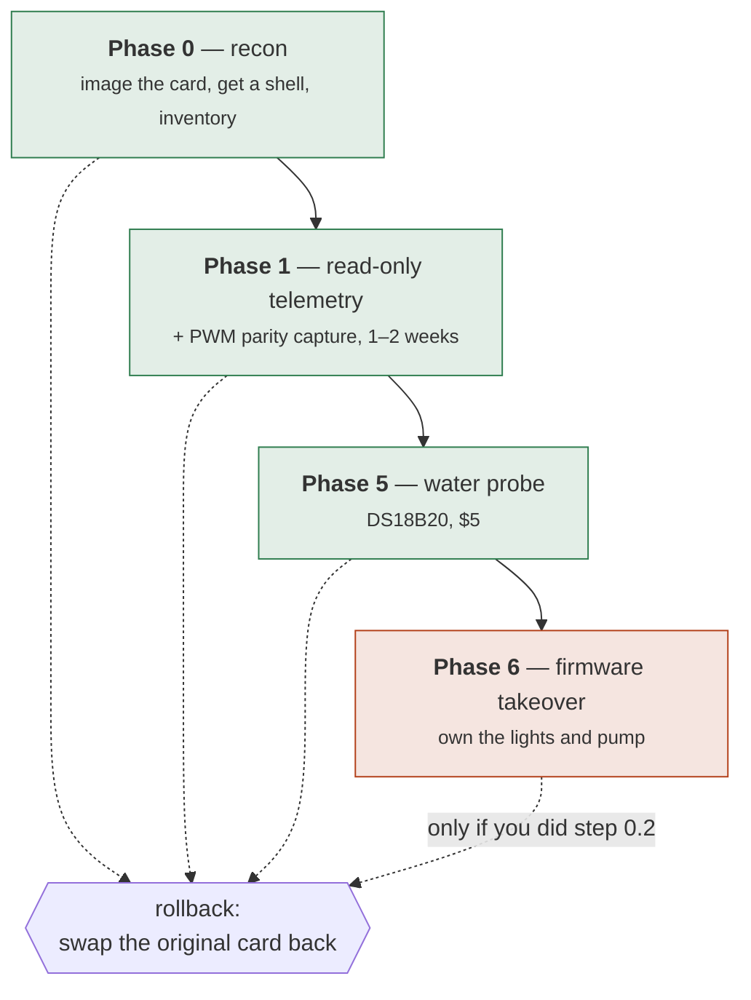
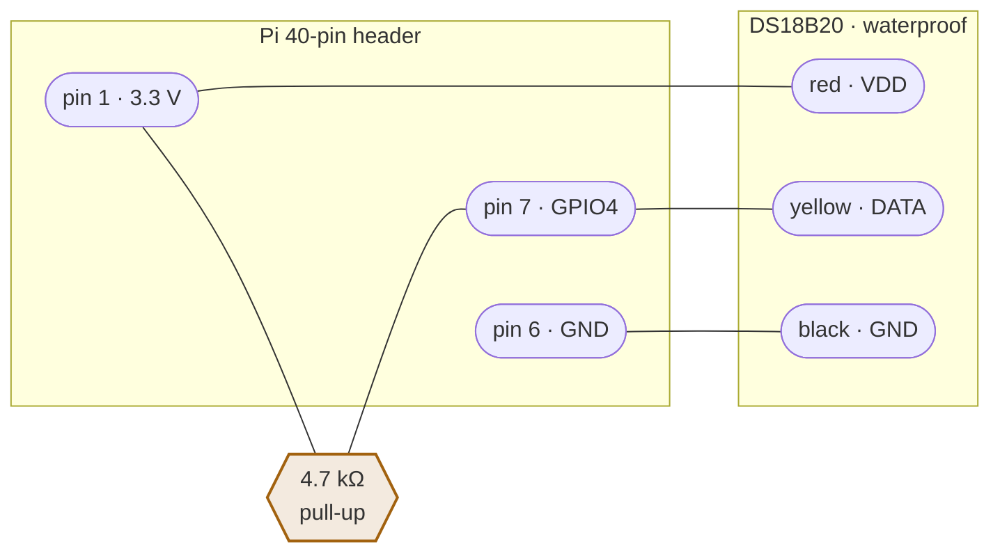

# Running on the actual Gardyn

Everything you need to do to the device, in order, with the reasoning for each step.

**Read the whole of Phase 0 before you start.** The first two steps are the ones that
determine whether a mistake later is a two-minute recovery or a dead Studio.

---

## What you are signing up for

| | |
|---|---|
| **Reversible?** | Yes, through Phase 5 — provided you do step 0.2 |
| **Warranty** | Almost certainly void once you modify the storage |
| **Cloud** | Stays on until Phase 6. Kelby and the app keep working |
| **Plants at risk?** | No, until Phase 6. Phases 0–5 never touch an actuator |
| **Time to first data** | An afternoon |

Phases 0 through 5 run the agent **alongside** the factory firmware, read-only. The
Gardyn keeps watering and lighting itself exactly as before, and the worst case is
that our agent crashes and you get no telemetry.



Green phases never touch an actuator. Phase 6 is the one that can kill plants, and it
is deliberately last.

---

## Phase 0 — recon

### 0.1 What you need

- A **second SD card** (16 GB+) — do not reuse the one in the device
- A USB SD reader
- A way into the Pi: keyboard + HDMI, a USB-TTL serial cable, or a network with SSH

### 0.2 Image the original card first

This is the step that makes everything else reversible. **Do it before anything.**

```sh
# Linux/macOS. Identify the card carefully — dd will happily overwrite the wrong disk.
lsblk
sudo dd if=/dev/sdX of=garden-original.img bs=4M status=progress conv=fsync
```

On Windows, use Win32DiskImager or `Raspberry Pi Imager`'s read function.

Then **put the original card in a drawer and never touch it again.** All later work
happens on a clone. Rollback is a two-minute card swap, not a reflash.

```sh
# Write the clone onto the new card.
sudo dd if=garden-original.img of=/dev/sdY bs=4M status=progress conv=fsync
```

> **If the Studio 2 uses eMMC rather than a removable card**, stop and reconsider. You
> lose the swap-back rollback, and recovery needs `rpiboot` over USB or a serial
> console. That materially changes the risk of Phase 6 and is worth knowing before you
> start rather than after.

### 0.3 Get a shell

On the **clone**, mount the boot partition and:

```sh
# Enable SSH.
touch /boot/ssh          # or /boot/firmware/ssh on newer images

# Add your key. Adjust the user — check /etc/passwd on the root partition for who exists.
mkdir -p /mnt/root/home/pi/.ssh
cat ~/.ssh/id_ed25519.pub >> /mnt/root/home/pi/.ssh/authorized_keys
chown -R 1000:1000 /mnt/root/home/pi/.ssh
chmod 700 /mnt/root/home/pi/.ssh && chmod 600 /mnt/root/home/pi/.ssh/authorized_keys
```

This is the clean route on hardware you own. **Do not** use the default-credential or
command-injection CVEs — they are patched on current firmware, and you do not need
them when you have physical access to the storage.

Boot the clone in the Gardyn and find it:

```sh
ping garden.local || nmap -sn 192.168.1.0/24
ssh pi@garden.local
```

### 0.4 Enable the interfaces

```sh
sudo raspi-config nonint do_i2c 0      # I²C on
sudo raspi-config nonint do_camera 0   # legacy camera, harmless if unused
sudo apt update && sudo apt install -y i2c-tools v4l-utils
sudo reboot
```

> **On this unit, skip the `apt` line.** `v4l-utils` is already there, and stretch is
> end-of-life — `apt update` fails until `sources.list` is repointed at
> `archive.raspbian.org`. `i2c-tools` is only ever a convenience here: `garden-edge
> probe` scans the bus itself through `rppal` and needs no packages installed. Getting
> a static binary onto the device is strictly less invasive than reviving `apt` on a
> dead distribution, and it leaves the factory image closer to how you found it.

For a DS18B20 water probe later, add to `/boot/config.txt` — this Pi runs stretch, where
the boot partition is `/boot`; Bookworm and later moved it to `/boot/firmware`:

```
dtoverlay=w1-gpio,gpiopin=4
```

### 0.5 Run the probe

Build on your workstation and copy it over (see [Building](#building-for-the-pi)):

```sh
scp target/arm-unknown-linux-musleabihf/release/garden-edge hybriponics148@gardyn.local:~/
ssh hybriponics148@gardyn.local 'chmod +x ./garden-edge && ./garden-edge --version'
```

**Run `--version` before anything else.** It is the cheapest possible test that the
binary matches the CPU: wrong architecture is an `Exec format error`, and ARMv7 code on
this ARMv6 chip is `Illegal instruction` on the first one executed. Either way you find
out in a second rather than halfway through a probe. Then:

```sh
ssh hybriponics148@gardyn.local './garden-edge probe --out recon-report.json'
```

No `sudo`. The scan needs group `i2c` for `/dev/i2c-1` and group `gpio` for
`/dev/gpiomem`, and the device user is already in both.

You get something like — the board, arch, OS and kernel lines below are what this
Gardyn actually reported on 2026-08-30; the I²C block is still the expected map, not a
measurement:

```
Garden edge recon — agent 0.1.0

  board    Raspberry Pi Zero W Rev 1.1
  arch     arm
  os       Raspbian GNU/Linux 9 (stretch)
  kernel   4.14.98+

  I²C devices:
    0x38  AM2320 air temp/humidity
    0x40  INA219 pump current
    0x48  PCT2075 board temp
  cameras: 1
    /dev/video0
  water probe: none

  vendor services still running:
    gy_events.service
    gy_wl.service
    gy_iot.service
    iot-controller.service
    conn-string.service

  verdict: peripheral map matches DESIGN.md
```

**Copy `recon-report.json` back and commit it next to DESIGN.md.** It is the only
record of what the device looked like before you touched it, and it is what you diff
against after a vendor firmware update.

### 0.6 What the verdict means

| Verdict | What to do |
|---|---|
| *matches DESIGN.md* | Carry on to Phase 1 |
| *N expected device(s) missing* | Studio 2 differs from the Home line. Update DESIGN.md §2 from the report, then carry on — the agent reports whatever is actually there |
| *no I²C devices answered* | Almost always a disabled bus or an unseated ribbon, not different hardware. Re-check 0.4 before rewriting the design |

The peripheral map in DESIGN.md comes from community work on the **Home 3.0/4.0**.
Studio 2 is undocumented. A mismatch here is expected information, not a failure.

---

## Phase 1 — read-only telemetry

Still alongside the factory firmware. Nothing is written to any pin.

### 1.1 Create the garden and get its id

In the web UI: **Add a garden**, pick your model (not *Simulated*), save. The id is in
the URL:

```
http://brain.local:8080/gardens/6b964894-aaab-4ccd-b3bf-2a39b1ee8d5b
                                 ^^^^^^^^^^^^^^^^^^^^^^^^^^^^^^^^^^^^
```

### 1.2 Check the agent can reach the brain

```sh
export GARDEN_BRAIN_URL=http://brain.local:8080
export GARDEN_AGENT_TOKEN=<the same value as on the brain>
export GARDEN_GARDEN_ID=6b964894-aaab-4ccd-b3bf-2a39b1ee8d5b

./garden-edge read      # sensors only, no network
./garden-edge report    # sends one sample
```

`report` prints what the brain inferred:

```
accepted; brain sees: air temperature, air humidity, PCB temperature, pump current
```

**This line is the fastest way to catch a wired-but-silent probe.** If you fitted a
DS18B20 and "water temperature" is missing, the probe is not being read — fix that
before you start collecting a week of data without it.

### 1.3 Install the daemon

> **Without root**, skip the systemd unit below. Everything Phase 1 touches is reachable
> unprivileged — pigpio's FIFOs are world-writable, `/dev/i2c-1` is group `i2c` and
> `/dev/video0` is group `video` (check with `id` that you are in both) — and a user
> crontab survives reboots just as well:
>
> ```sh
> cat > ~/garden-edge.sh <<'EOF'
> #!/bin/sh
> export GARDEN_BRAIN_URL=http://192.168.1.20:8080
> export GARDEN_AGENT_TOKEN=replace-me
> export GARDEN_GARDEN_ID=replace-me
> export GARDEN_AGENT_NAME=studio-edge
> export GARDEN_SPOOL_DIR=$HOME/garden-spool
> export GARDEN_HEARTBEAT=$HOME/garden.heartbeat
> # `Restart=always`, by hand. Without the loop, cron starts the agent once and a
> # crash means no telemetry until the next reboot — which reads as a dead sensor
> # rather than a dead process, and is how a month of history ends up mostly gaps.
> while true; do
>   /home/pi/garden-edge run
>   sleep 10
> done
> EOF
> chmod 700 ~/garden-edge.sh    # it holds the agent token
>
> crontab -e
> # @reboot /home/pi/garden-edge.sh >> /home/pi/garden-edge.log 2>&1
> ```
>
> Start it now rather than waiting for a reboot, and check it stays up:
>
> ```sh
> nohup ~/garden-edge.sh >> ~/garden-edge.log 2>&1 &
> sleep 90 && tail ~/garden-edge.log
> ```
>
> For the parity capture instead, the same wrapper with `watch-pwm --out
> ~/parity.csv` in place of `run`. They read the same pins and can run together.
>
> **Two paths default to places only root can write.** Both warn rather than fail, and
> both matter later rather than now:
>
> ```sh
> export GARDEN_SPOOL_DIR=$HOME/garden-spool      # /var/lib/garden/spool by default
> export GARDEN_HEARTBEAT=$HOME/garden.heartbeat  # /run/garden/edge.heartbeat by default
> ```
>
> The **spool** is only written when a send fails, so an unwritable one is invisible
> until the brain goes down — precisely when the samples it exists to save are lost
> instead.
>
> The **heartbeat** is what `garden-guard` watches. Nothing reads it in Phase 1, so an
> unwritable path is harmless; at Phase 6 it inverts, because a guard that cannot see a
> heartbeat concludes the agent is dead and seizes the pins. Get it working before you
> turn the guard on, and make sure the guard can read wherever you put it.
>
> To get root later, use the same physical route that got you SSH: pull the card, mount
> its root partition, and add a sudoers drop-in. Do not go hunting for the password.
>
> ```sh
> printf 'pi ALL=(ALL) NOPASSWD: ALL\n' | sudo tee /mnt/root/etc/sudoers.d/010_garden
> sudo chmod 0440 /mnt/root/etc/sudoers.d/010_garden
> sudo visudo -c -f /mnt/root/etc/sudoers.d/010_garden   # a bad file locks sudo out
> ```
>
> Phase 5 needs this (`/boot/config.txt`), and so does all of Phase 6.

```sh
sudo install -m755 garden-edge /usr/local/bin/
sudo mkdir -p /var/lib/garden/spool /etc/garden
sudo tee /etc/garden/edge.env >/dev/null <<'EOF'
GARDEN_BRAIN_URL=http://brain.local:8080
GARDEN_AGENT_TOKEN=replace-me
GARDEN_GARDEN_ID=replace-me
GARDEN_SAMPLE_SECONDS=60
GARDEN_FRAME_SECONDS=3600
GARDEN_AGENT_NAME=studio-edge
EOF
sudo chmod 600 /etc/garden/edge.env    # it holds the token
```

`/run/garden` has to exist and be writable, and neither service may own its
lifetime — the agent writes `edge.heartbeat` there and `garden-guard` writes
`guard.engaged`. `RuntimeDirectory=garden` would create it, then delete it when
whichever service stops first stops, taking the other's file with it, and
`RuntimeDirectoryPreserve=` needs systemd 235 while stretch has 232. So create it at
boot instead, independent of both:

```sh
sudo tee /etc/tmpfiles.d/garden.conf >/dev/null <<'EOF'
d /run/garden 0755 pi pi -
EOF
sudo systemd-tmpfiles --create /etc/tmpfiles.d/garden.conf
ls -ld /run/garden    # drwxr-xr-x pi pi
```

`/etc/systemd/system/garden-edge.service`:

```ini
[Unit]
Description=Garden edge agent
After=network-online.target
Wants=network-online.target

[Service]
Type=simple
EnvironmentFile=/etc/garden/edge.env
ExecStart=/usr/local/bin/garden-edge run
Restart=always
RestartSec=10
User=pi
# The ultrasonic water sensor needs the GPIO character device. This is the whole
# privilege the agent gains for it — no root, no capabilities.
SupplementaryGroups=gpio
# Read-only phase: no need for root, and no reason to give it.
NoNewPrivileges=true
ProtectSystem=strict
# Both, and the second is easy to leave out. `ProtectSystem=strict` mounts the whole
# hierarchy read-only bar /dev, /proc and /sys — /run included — so without this the
# agent's `create_dir_all("/run/garden")` fails with EROFS and the heartbeat is never
# written. It warns once and carries on, which is correct for Phase 1 because nothing
# reads it yet. At Phase 6 it inverts: a missing heartbeat counts as infinitely stale,
# so `garden-guard` concludes a perfectly healthy agent is dead and seizes the pins.
ReadWritePaths=/var/lib/garden /run/garden

[Install]
WantedBy=multi-user.target
```

One-time, so the agent's user can open the GPIO device:

```sh
sudo usermod -aG gpio pi
id -nG pi | tr ' ' '\n' | grep -qx gpio && echo "gpio group: ok"
```

```sh
sudo systemctl daemon-reload
sudo systemctl enable --now garden-edge
journalctl -u garden-edge -f
```

Within a minute the garden should stop saying "No sensors reporting", and the device
appears on `/system`.

### 1.4 What happens when the brain is down

The agent buffers to `/var/lib/garden/spool` and replays oldest-first on reconnect.
The brain upserts on `(garden, timestamp)`, so a double-send is harmless. Frames are
**not** buffered — they are large, and a missing hourly photo costs far less than a
full SD card.

Check a backlog with:

```sh
ls /var/lib/garden/spool | wc -l
```

### 1.5 Parity capture — do not skip this

**This is the only irreversible thing in Phase 1.** The stock light curve and the pump
cycle exist only inside the vendor software. The moment Phase 6 disables it, that record
is gone forever.

**Copy the schedule files first — it takes a second and it is most of the answer.** The
factory scheduler reads them at runtime rather than computing a curve, so they *are* the
stock schedule, for all seven days, exactly:

```sh
grep -E 'SCHEDULE_FILE|STATUS|MAX_WATER' /usr/local/etc/gardyn/device/config.py
# then copy the two JSON paths it names, plus:
cat /usr/local/etc/gardyn/version
```

Commit those next to the CSV. What they do not contain is the brightness behind `on` and
`boost`, which is what the capture below is actually for — a few days of confirmation
rather than a fortnight of reconstruction.

```sh
./garden-edge watch-pwm --out pwm-parity.csv --interval-seconds 1
```

Leave it running **one to two weeks**, then commit the CSV. You want at least one full
light cycle and several pump cycles, ideally across a warm day and a cool one.

**Read the first ten lines of log before you walk away.** Startup prints each pin's mode
next to its duty, and that is the only moment the difference between a good capture and
a fortnight of nothing is cheap to notice:

```
INFO reading duty over pigpio's FIFO interface, no root required
INFO   GPIO18 (light): mode alt5, duty 0.8200 at 20000 Hz
INFO   GPIO24 (pump): mode output, not modulated, sitting low
```

```csv
at,light_duty,light_source,pump_duty,pump_source
2026-07-26T06:00:00Z,0.0000,pigpio-fifo,0.0000,pigpio-level
2026-07-26T06:01:00Z,0.0420,pigpio-fifo,0.2500,pigpio-fifo
2026-07-26T06:02:00Z,0.0910,pigpio-fifo,0.0000,pigpio-level
```

Three things the source column is telling you:

- **`pigpio-fifo`** — pigpio is modulating the pin and this is the duty it was given.
  What you want.
- **`pigpio-level`** — pigpio answered `PI_NOT_PWM_GPIO`: nothing is modulating that
  pin, so the figure is its level. `0.0000` here means *sitting low*, which for the pump
  between cycles is a fact rather than a gap. A pump column that is `pigpio-level` for a
  whole day, though, means the vendor never drives it through pigpio at all.
- **`unavailable`, with a blank duty** — the pin could not be read, which is a very
  different thing from "the lights were off". Check `/dev/pigpio` and `/dev/pigout`
  exist. `pigs` failing proves nothing on its own: Raspbian starts the daemon as
  `pigpiod -l`, which shuts the socket `pigs` speaks while leaving the FIFOs open.

The dangerous case is a confident `0.0000` under `pigpio-fifo` on every row, because it
looks like data. `watch-pwm` warns when neither pin is modulated at startup, but only you
can check that against whether the lights are physically on. If they are lit and the duty
says zero, jumper GPIO18 to a spare input and sample that instead.

---

## The tank level sensor

Stock hardware, already fitted, and the one sensor the whole water story rests on.
Without it `water_level_mm` is absent, `Capability::WaterLevel` never appears, and the
rule behind "tell me when to add water" cannot run at all.

| Wire | Pi header pin | Signal |
|---|---|---|
| VCC | **2** | 5 V |
| Trig | **35** | GPIO19 |
| Echo | **37** | GPIO26 |
| GND | **39** | GND |

> **Check the echo line's voltage before trusting it.** An HC-SR04-style sensor running
> on 5 V drives its echo pin to 5 V, and the Pi's GPIO is **not** 5 V tolerant. The
> Studio's own harness presumably handles this, but if you are wiring a replacement,
> put a divider on the echo line — roughly 1 kΩ in series with 2 kΩ to ground. Feeding
> 5 V straight into GPIO26 is how you damage the SoC.

Check it reads:

```sh
./garden-edge read
```

`water_level_mm` should be a number in the low hundreds and should *fall* as you pour
water in — the sensor measures down to the surface, so a fuller tank is a nearer one.
If it is `null`, the command prints what to check.

### How it is measured, and why that matters

The sensor answers by holding the echo pin high for as long as the sound took to
return. At 0.343 mm/µs, a millisecond of scheduling delay would be 170 mm of error —
the entire tank. So the pulse is **not** timed by watching the pin from userspace. The
agent registers a kernel interrupt on both edges and subtracts the two kernel
timestamps, which are taken at interrupt time and are good to a few microseconds.

Two corrections on top of that:

- **Air temperature.** The speed of sound gains about 0.6 m/s per degree, so a cold
  room reads the water as further away than it is. The AM2320 reading already in hand
  feeds the calculation. This is a bias, not noise — uncorrected it would read the tank
  low all winter.
- **Median of five.** A rippling surface scatters the occasional ping. The median
  ignores an outlier that a mean would let move the answer by centimetres. Fewer than
  three valid samples reports nothing rather than a guess.

Then calibrate the distance-to-volume mapping, which is still placeholder constants:

```sh
# Fill and drain, recording what the sensor says at each level.
garden-cli tank calibrate --capacity 15.5 330:0 240:5 150:10 60:15
```

---

## Phase 5 — the water probe

The one piece of hardware worth fitting early. Five dollars, and it drives the
dissolved-oxygen and root-rot reasoning that nothing else can.

**DS18B20 waterproof, 3-wire:**

| Wire | Pi header pin | Signal |
|---|---|---|
| Red (VDD) | **1** | 3.3 V |
| Black (GND) | **6** | GND |
| Yellow (DATA) | **7** | GPIO4 |



The **4.7 kΩ resistor between DATA and 3.3 V is required, not optional.** 1-Wire is an
open-drain bus: with no pull-up the line never returns high and the kernel sees no
device at all. This is the single most common reason a DS18B20 "does not work", and the
symptom — nothing in `/sys/bus/w1/devices/` — looks identical to a wiring mistake.

```sh
echo "dtoverlay=w1-gpio,gpiopin=4" | sudo tee -a /boot/config.txt
sudo reboot
ls /sys/bus/w1/devices/          # expect a 28-xxxxxxxx entry
./garden-edge read               # water_temp_c should now be populated
```

The capability appears on its own — nothing to configure. The root-zone rules light up
on the next evaluation.

### Later: EC and pH

Deferred, and the software is already written for them. When you fit them:

- **ADS1115 defaults to I²C `0x48`, which collides with the PCT2075.** Strap `ADDR` to
  VDD for `0x49` or neither will read correctly.
- EC and pH probes need calibration solutions; budget for those too.

---

## Phase 6 — firmware takeover

**Do not start this until:**

- [ ] Phase 1 has run for weeks without dropping samples
- [ ] `pwm-parity.csv` covers at least one full light cycle, committed
- [ ] You have swapped back to the original SD card once, to prove rollback works
- [ ] `garden-guard` has been running in dry-run mode and logs sensible setpoints

Then, and only then:

```sh
sudo systemctl disable --now gardyn-agent.service   # whatever the probe found
```

`garden-guard` handles the failsafe. It is currently **dry-run by default** and logs
what it would drive without touching a pin, because until the takeover the factory
firmware owns them and a fight over PWM is how you lose a crop.

```sh
GARDEN_GUARD_DRY_RUN=1 garden-guard --heartbeat /run/garden/edge.heartbeat
```

Its schedule: 14 h light at 80%, pump 15 min in every 60 at 25% duty, **running
through the dark hours** — roots do not stop needing water when the lights go off.

**Actuator control is implemented, and off by default.** Clearing
`GARDEN_GUARD_DRY_RUN` lets the guard drive the pins; `garden-edge run
--own-actuators` lets the agent drive them from its resident schedule. Neither is a
default and neither should be turned on before the checklist above is complete.

The two processes hand over through a pair of files: the agent touches
`/run/garden/edge.heartbeat`, and the guard creates `/run/garden/guard.engaged` when it
seizes control. The agent watches for that marker and stands down. Claim happens before
the first write and the pump stops before release — either order reversed leaves a
window where both processes own a pin.

```sh
# What the agent thinks it is driving, without reading the log:
cat /run/garden/edge.heartbeat     # 0.1.0 light=85% pump=25%
ls /run/garden/guard.engaged       # present only while the failsafe is in charge
```

Also enable the hardware watchdog, so a hung kernel reboots into the safe defaults:

```sh
echo "dtparam=watchdog=on" | sudo tee -a /boot/config.txt
sudo sed -i 's/^#RuntimeWatchdogSec=.*/RuntimeWatchdogSec=15/' /etc/systemd/system.conf
```

---

## Building for the Pi

**This garden is an original Raspberry Pi Zero W — ARMv6, 512 MB, running Raspbian 9
"stretch" with glibc 2.24.** Recon settled that on 2026-08-30; the aarch64 path below is
kept only for a board swap.

### armv6 + musl — what this device needs

Two commands, and neither of them installs a toolchain:

```sh
rustup target add arm-unknown-linux-musleabihf
cargo build --release -p garden-edge -p garden-guard \
  --target arm-unknown-linux-musleabihf
```

That is the whole thing. `.cargo/config.toml` in this repo points the target at
**`rust-lld`**, which rustup already ships inside the toolchain's own sysroot, and turns
on `link-self-contained` so rustc supplies musl's crt objects and `libc.a` itself. No
zig, no `cross`, no container, no C cross-compiler. It works on Windows, Linux and macOS
identically, because nothing outside rustup is involved.

Static musl also removes the glibc question rather than answering it: nothing links
against the device's 2016-vintage glibc 2.24, and the same binary keeps working if the
Pi is ever reimaged onto a current Raspberry Pi OS.

**Name the two crates; do not build the workspace for the Pi.** `garden-web` and
`garden-store` pull in `libsqlite3-sys` and `ring`, which are C and *would* need a cross
compiler — for a target they never run on. `garden-edge` and `garden-guard` are pure
Rust all the way down, which is what makes the build above a single line.

#### Check what came out

```sh
file target/arm-unknown-linux-musleabihf/release/garden-edge
#  → ELF 32-bit LSB executable, ARM, EABI5 version 1 (SYSV), statically linked, stripped
```

`statically linked` is the one that matters. Two deeper checks, if you want them:

```sh
# e_flags at offset 36: 0x05000400 = EABI5 | ABI_FLOAT_HARD. The Pi Zero W has VFPv2,
# and a soft-float binary would run but every float would go through a call.
od -A d -t x1 -j 36 -N 4 target/arm-unknown-linux-musleabihf/release/garden-edge

# The target's own codegen features. "+v6" is the load-bearing one: ARMv7 instructions
# on an ARM1176 are a SIGILL on the first one executed, not a startup error.
rustc +nightly -Z unstable-options --print target-spec-json \
  --target arm-unknown-linux-musleabihf | grep features
#  → "+strict-align,+v6,+vfp2,-d32"
```

Verified 2026-08-30: EABI5 hard-float, ARMv6, VFPv2, 3.6 MB stripped.

#### If the link fails

`undefined reference to __atomic_load_8` and friends means ARMv6 has no 64-bit atomic
instruction and LLVM emitted libatomic calls. It did not happen on this workspace, but a
future dependency could bring it back; the fix is `-C link-arg=-latomic`.

**Why not `cross` or `cargo-zigbuild`?** Neither is needed here, and `cross`'s
`arm-unknown-linux-gnueabihf` image is built on a modern Ubuntu — its binaries pick up
glibc symbols stretch does not have and die with `version 'GLIBC_2.28' not found`. If
you ever do build against glibc, check before copying:

```sh
strings target/.../garden-edge | grep -o 'GLIBC_[0-9.]*' | sort -uV | tail -1
#  → anything above GLIBC_2.24 will not run on this Pi
```

### aarch64 — only if the board is swapped

A Pi Zero 2 W is about $15 and turns this into the tier-1 case — worth it if the ARMv6
toolchain becomes a running cost rather than a one-off. Keep the original board pristine
either way.

A swap would also cost you the self-contained build: `aarch64-unknown-linux-gnu` is a
glibc target, so it wants a real linker and a sysroot rather than `rust-lld` alone.
`aarch64-unknown-linux-musl` keeps the current arrangement, and would need the same
two lines in `.cargo/config.toml`.

### On the Fedora brain VM

Same two commands. Nothing to `dnf install` — that is the point of the musl target.

```sh
rustup target add arm-unknown-linux-musleabihf
cargo build --release -p garden-edge -p garden-guard \
  --target arm-unknown-linux-musleabihf
```

---

## Command reference

| Command | Needs brain? | Needs token? | What it does |
|---|---|---|---|
| `garden-edge probe` | no | no | Phase 0 recon, writes JSON |
| `garden-edge read` | no | no | One sensor read, printed |
| `garden-edge report` | yes | yes | One sensor read, sent |
| `garden-edge capture` | yes | yes | One photo, uploaded |
| `garden-edge watch-pwm` | no | no | Parity capture to CSV |
| `garden-edge run` | yes | yes | The daemon |
| `garden-guard` | no | no | Failsafe supervisor (dry-run) |

`probe`, `read` and `watch-pwm` deliberately need nothing but the binary. They are what
you run on a device you have just opened, possibly before the brain exists.

### Environment

| Variable | Default | |
|---|---|---|
| `GARDEN_BRAIN_URL` | `http://localhost:8080` | |
| `GARDEN_AGENT_TOKEN` | *empty* | must match the brain |
| `GARDEN_GARDEN_ID` | — | from the garden's URL |
| `GARDEN_SPOOL_DIR` | `/var/lib/garden/spool` | offline buffer |
| `GARDEN_SAMPLE_SECONDS` | `60` | |
| `GARDEN_FRAME_SECONDS` | `3600` | `0` disables the camera |
| `GARDEN_AGENT_NAME` | `garden-edge` | shown on `/system` |

---

## Troubleshooting

**`probe` shows no I²C devices.** Bus disabled or ribbon unseated. `sudo raspi-config
nonint do_i2c 0`, reboot, then `i2cdetect -y 1` to confirm independently.

**`report` returns 401.** `GARDEN_AGENT_TOKEN` does not match the brain's. The brain
logs `GARDEN_AGENT_TOKEN is unset — the agent API is closed` at startup if it has none.

**`report` returns 404.** Wrong `GARDEN_GARDEN_ID`, or the garden was deleted.

**Capture fails with "no capture tool found".**
`sudo apt install -y rpicam-apps` or `sudo apt install -y fswebcam` for a USB camera.

**Water temperature never appears.** Missing 4.7 kΩ pull-up nine times out of ten.
Check `ls /sys/bus/w1/devices/` shows a `28-` entry first — no entry means wiring or
the missing overlay; an entry with no reading means the resistor.

**Dashboard still says "No sensors reporting".** The garden has no readings at all.
Check `journalctl -u garden-edge -n 50` and the spool depth.

**Every `watch-pwm` row says `unavailable`.** pigpio answers on neither its FIFOs nor
its socket. `pigs` failing is not the symptom — Raspbian runs `pigpiod -l` and the
socket is shut by design. Check `/dev/pigpio` and `/dev/pigout` exist. See 1.5.

**Every `watch-pwm` row says `0.0000`.** Worse, because it looks like data. pigpiod
reports what it was asked for, so this is either a genuinely idle garden or a vendor
that drives the pins without going through the daemon. Check against the lights. See 1.5.

---

## What is not built yet

Honest list, so you do not go looking:

- **Nothing verified against real hardware.** Every peripheral address, the PWM
  channel assignment, and the tank geometry are all still working assumptions from the
  Home 3.0/4.0 community map. Phase 0 is what turns them into facts.
- **Tank calibration.** `TankGeometry::STUDIO_2` still holds placeholder distances, so
  water level reads wrong until they are measured. `garden-cli tank calibrate` fits them
  from a jug and a few sensor readings, and needs no database — you run it standing next
  to the device.
- **MQTT.** Topics are declared in `garden-proto`; the transport is HTTP.

`garden-notify` **is** built — push, email and the iCal feed all work. Setting them up
is [NOTIFICATIONS.md](NOTIFICATIONS.md); the server side is
[DEPLOYMENT.md](DEPLOYMENT.md).
