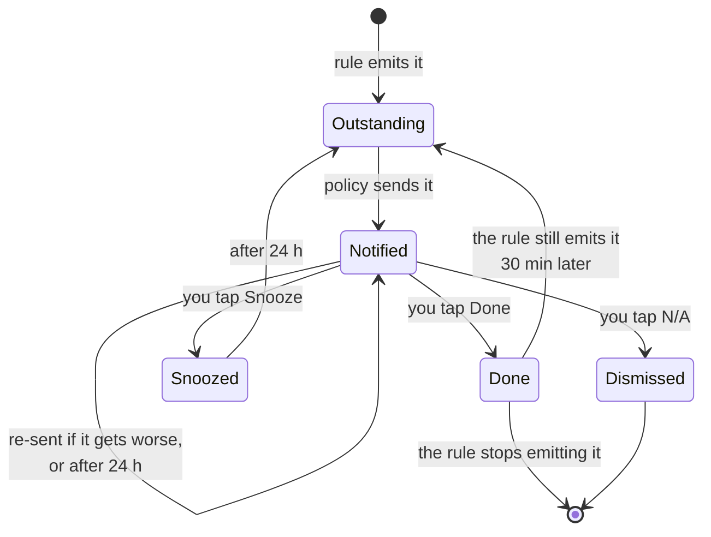

# Notifications

Getting a task onto your phone. Everything here is self-hosted — no third party sits
between the garden and you.

---

## The path a task takes


Everything to the left of `send` is about *not* telling you. That is most of the work:
the rules re-emit continuously, and a system that forwarded all of it would be muted
inside a week.

## What you get

| Channel | Carries | Reliability |
|---|---|---|
| **Push** (ntfy) | Title, the rule's own reasoning, Done / Snooze / N-A buttons | The one that works |
| **Email** | Same, links as plain text | Best effort — see [Email](#email-optional) |
| **Calendar** | Scheduled work as an iCal feed | Read-only, subscribe once |

**Tapping the notification body** opens the garden dashboard — except for a tank refresh
or a deep clean, which open the procedure at `/guides/…` instead. Those two are twenty
minutes of physical work rather than a stated dose, so "how do I do this" is the question
the notification actually raises, and the three buttons still complete the task without
opening anything. ntfy sends at most three action buttons, all of which are already
spoken for, so the body tap is the only slot left. The calendar feed has no buttons at
all, so it carries the same link in the entry description.

### When each one fires

| Severity | Push | Email | Interrupts? |
|---|---|---|---|
| Info | — | — | Daily brief only |
| Advisory | — | — | Daily brief only |
| Important | priority 3 | — | yes |
| Urgent | priority 4 | yes | yes |
| **Critical** | **priority 5** | yes | **bypasses Do Not Disturb** |

Priority 5 is the top of the ladder because SMS was ruled out. On both iOS and Android
it breaks through a silenced phone, which is what "the tank is dry in twelve hours"
needs and what nothing else does.

### What happens after it reaches you



The arrow from **Done** back to **Outstanding** is the one that matters. You tap "added
water"; if the level sensor has not moved half an hour later, the task quietly reopens.
Without it, "done" means "I pressed a button", and the whole system becomes a thing you
have to double-check — which is exactly what it was built to avoid.

Three more rules keep this from becoming noise:

- **Quiet hours** hold everything below Critical. A root check does not wake you; a
  tank about to run dry does.
- **Once per task.** The rules re-emit continuously; you are told once, again if it
  gets *worse*, and again after 24 hours if you have not done it.
- **At most three interrupting notifications per garden per sweep.** A neglected
  garden's first sweep produced seventeen in testing. Nobody reads seventeen — they
  mute the app, and then the one that mattered is lost too. The rest wait for the next
  sweep or the morning brief.

---

## The ntfy VM

One container on the Fedora VM alongside the brain. Podman + Quadlet, matching the
rest of the deployment.

### 1. Config

```sh
sudo mkdir -p /etc/garden-ntfy /var/lib/garden-ntfy/cache
sudo tee /etc/garden-ntfy/server.yml >/dev/null <<'EOF'
base-url: "https://ntfy.example.com"
listen-http: ":8090"
cache-file: "/var/cache/ntfy/cache.db"
cache-duration: "72h"

# Nobody publishes or subscribes without a token. The default is the opposite, and
# on a LAN that means anyone who can reach the port can push to your phone — or read
# what your garden is telling you.
auth-file: "/var/lib/ntfy/auth.db"
auth-default-access: "deny-all"

# The phone app polls; without this it burns battery reconnecting.
keepalive-interval: "45s"
EOF
```

> Set `base-url` to how the **phone** reaches the server, not how the brain does. Get
> this wrong and notifications arrive with broken action buttons.

### 2. Quadlet unit

`/etc/containers/systemd/garden-ntfy.container`:

```ini
[Unit]
Description=ntfy for the garden
After=network-online.target

[Container]
Image=docker.io/binwiederhier/ntfy:latest
Exec=serve
# Not published to the host: Caddy reaches it by name and owns the only forwarded port.
Volume=/etc/garden-ntfy/server.yml:/etc/ntfy/server.yml:Z,ro
Volume=/var/lib/garden-ntfy:/var/lib/ntfy:Z
Volume=/var/lib/garden-ntfy/cache:/var/cache/ntfy:Z
# The brain reaches it by name on a shared Podman network.
Network=garden.network

[Service]
Restart=always

[Install]
WantedBy=multi-user.target
```

`/etc/containers/systemd/garden.network`:

```ini
[Unit]
Description=Garden internal network

[Network]
NetworkName=garden
```

```sh
sudo systemctl daemon-reload
sudo systemctl start garden-ntfy
curl -s localhost:8090/v1/health      # {"healthy":true}
```

### 3. Create a user and a token

```sh
sudo podman exec -it systemd-garden-ntfy ntfy user add --role=admin garden
sudo podman exec -it systemd-garden-ntfy ntfy token add garden
# tk_xxxxxxxxxxxxxxxxxxxxxxxxxxxxxx  — this is GARDEN_NTFY_TOKEN
```

Then a read-only user for the phone, so a stolen phone cannot publish:

```sh
sudo podman exec -it systemd-garden-ntfy ntfy user add phone
sudo podman exec -it systemd-garden-ntfy ntfy access phone 'garden-*' read-only
```

### 4. Firewall

Caddy owns the only internet-facing port. ntfy is reached through it over the podman
network, so 8090 is published nowhere and needs no rule at all.

```sh
sudo firewall-cmd --permanent --add-service=https --zone=public
sudo firewall-cmd --permanent --add-service=http --zone=public   # ACME challenge only
sudo firewall-cmd --permanent --add-port=8080/tcp --zone=internal # the brain, LAN only
sudo firewall-cmd --reload
```

**Forward only 443 at the router.** If you find yourself forwarding 8080 you have
exposed the brain, which is the thing this arrangement exists to avoid.

---

## Brain configuration

Add to the brain's environment file:

```sh
GARDEN_NTFY_URL=http://garden-ntfy:8090     # container name on the shared network
GARDEN_NTFY_TOKEN=tk_xxxxxxxxxxxxxxxxxxxx
# Must be how your phone reaches the brain, since the action buttons point here.
GARDEN_BASE_URL=http://192.168.1.20:8080   # LAN only; the buttons resolve at home
```

```sh
sudo systemctl restart garden-web
journalctl -u garden-web | grep -i notif
```

With nothing configured the brain logs a warning at startup and the web UI says so on
the settings page. Tasks still appear in the app; nothing is sent.

---

## Caddy — so notifications arrive when you are out

**ntfy is exposed; the brain is not.** The reasoning is in DESIGN.md §10, and the short
version is that ntfy is one upstream server holding topic names and an auth database,
while the brain holds every reading, frame and account you have. Putting the first on
the internet buys timely notifications. Putting the second there buys a working button.

You need a DNS name pointing at your home address — a dynamic-DNS name is fine, since
only the phone ever resolves it — and port 443 forwarded to this VM.

```sh
sudo mkdir -p /var/lib/garden-caddy /var/log/garden-caddy
sudo install -m644 deploy/Caddyfile /etc/garden/Caddyfile
sudo $EDITOR /etc/garden/Caddyfile          # hostname and email
sudo install -m644 deploy/quadlet/garden-caddy.container /etc/containers/systemd/
sudo systemctl daemon-reload
sudo systemctl start garden-caddy
journalctl -u garden-caddy | grep -i certificate
```

Caddy obtains and renews the certificate itself. There is no certbot and no cron job to
forget in ninety days.

### What this deliberately does not fix

The Done / Snooze buttons are links back to the *brain*, so they resolve on your home
wifi and not anywhere else. That is the accepted cost, and it is smaller than it sounds
because auto-verification runs both ways: doing the work moves a sensor, and the task
completes itself without a tap. Nearly everything this system asks of you needs you
standing at the garden anyway.

`GARDEN_BASE_URL` therefore stays a LAN address, and `GARDEN_INSECURE_COOKIES` stays
set — the brain is plain HTTP on the LAN, and a `__Host-` cookie over plain HTTP fails
in a way that looks like a wrong password.

---

## Your phone

1. Install **ntfy** — [iOS](https://apps.apple.com/app/ntfy/id1625396347),
   [Android](https://play.google.com/store/apps/details?id=io.heckel.ntfy) or F-Droid.
2. Settings → **Default server** → `https://ntfy.example.com`, your public name.
3. Sign in as the read-only `phone` user.
4. **Subscribe to a topic.** Pick something unguessable — `garden-phil-8f3a2c`, not
   `garden`. Anyone who knows the topic can publish to it.
5. In the Garden web UI: **Account → Notification settings**, paste the same topic.
6. Set your **UTC offset** — quiet hours are meaningless without it, and it is *your*
   offset, not the garden's. You might not live where it does.

### Test it

```sh
curl -H "Authorization: Bearer $GARDEN_NTFY_TOKEN" \
  -d '{"topic":"garden-phil-8f3a2c","title":"Test","message":"If you can read this, push works.","priority":4}' \
  http://localhost:8090
```

If that arrives and real notifications do not, the problem is the brain's config, not
ntfy.

---

## Email (optional)

Be realistic about this one. Outbound SMTP from a residential IP is rejected on
reputation by most large receivers whatever the message says. Point it at a relay you
already have.

```sh
GARDEN_SMTP_HOST=smtp.example.com
GARDEN_SMTP_PORT=587
GARDEN_SMTP_USER=garden@example.com
GARDEN_SMTP_PASSWORD=...
GARDEN_SMTP_FROM=garden@example.com
# GARDEN_SMTP_PLAINTEXT=1     # only for a relay on localhost or the same Podman network
```

The envelope sender has to be something the relay will accept — that is the single
most common reason mail silently vanishes. Email only carries Urgent and Critical;
the daily brief is push-only, because a daily digest by email is how a mailbox learns
to filter you.

---

## Calendar feed

**Account → Notification settings → Create a link.** Shown once; only its digest is
stored, so losing it means replacing it — which is also how you revoke one.

- **Google Calendar** → Other calendars → **+** → From URL
- **Apple** → Calendar → File → New Calendar Subscription
- **Thunderbird** → New Calendar → On the Network → iCalendar (ICS)

The feed covers every garden you can act in, not just one. It is read-only, and it
carries the whole outstanding list — including advisories that never push.

---

## Reference

| Variable | Default | |
|---|---|---|
| `GARDEN_NTFY_URL` | *unset* | unset means no push |
| `GARDEN_NTFY_TOKEN` | *unset* | required if ntfy denies by default |
| `GARDEN_SMTP_HOST` | *unset* | unset means no email |
| `GARDEN_SMTP_PORT` | `587` | |
| `GARDEN_SMTP_USER` / `_PASSWORD` | *unset* | omit for an unauthenticated relay |
| `GARDEN_SMTP_FROM` | `garden@localhost` | must be acceptable to the relay |
| `GARDEN_SMTP_PLAINTEXT` | *unset* | set to disable STARTTLS |
| `GARDEN_BASE_URL` | `http://$GARDEN_BIND` | **must be reachable from your phone** |

The dispatcher sweeps every **5 minutes**. The daily brief goes out at **08:00 local**
to each recipient.

---

## Troubleshooting

**Nothing arrives at all.** Check the startup log for `no notification channel
configured`. Then check the settings page — it says plainly when the server has no
channels.

**The test curl works but real notifications do not.** The brain cannot reach ntfy.
From the brain's container: `curl -v http://garden-ntfy:8090/v1/health`. If that fails,
the two containers are not on the same Podman network.

**Notifications arrive but the buttons do nothing.** Two different causes, and the
second is not a fault. Either `GARDEN_BASE_URL` is `localhost` rather than the LAN
address — it is stamped into the links at send time, so it has to be a name the *phone*
resolves — or you are not on the home wifi, in which case this is the design working as
chosen. The brain is deliberately not exposed; see DESIGN.md §10. Do the work and the
task will complete itself when the sensor moves.

**"That link has already been used."** Working as intended — action links are
single-use, because they travel through push relays and sit on lock screens.

**Only three notifications, then nothing.** The burst cap. The rest come on the next
sweep or in the morning brief. Not a bug.

**Nothing overnight.** Quiet hours, which default to 21:00–07:00. Check your UTC
offset is set; at the default of 0 the window is in UTC, not where you live.

**A task keeps re-notifying every day.** It is genuinely still outstanding — mark it
done, snooze it, or dismiss it as not applicable.

---

## What is not built

- **No per-garden channel routing.** Preferences are per person, so two gardens
  notify the same way.
- **No snooze duration choice.** Snooze is always 24 hours.
- **The brief is push-only** and per garden, so three gardens means three briefs.
- **No web push.** The ntfy app is the only push path; there is no browser
  notification support.
