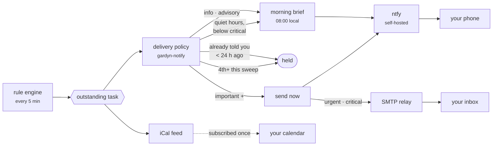
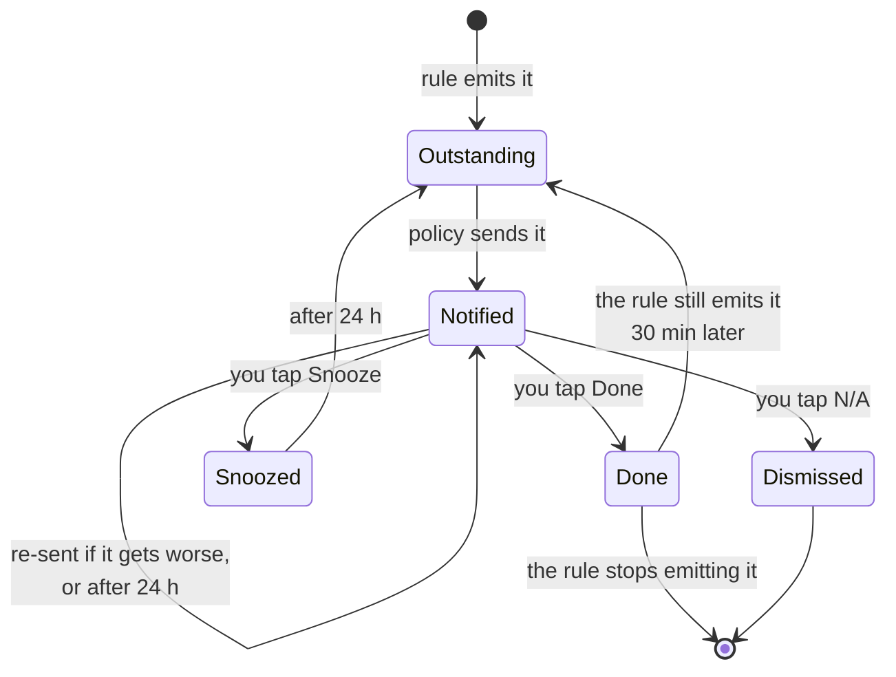

# Notifications

Getting a task onto your phone. Everything here is self-hosted — no third party sits
between the garden and you.

---

## The path a task takes



Everything to the left of `send` is about *not* telling you. That is most of the work:
the rules re-emit continuously, and a system that forwarded all of it would be muted
inside a week.

## What you get

| Channel | Carries | Reliability |
|---|---|---|
| **Push** (ntfy) | Title, the rule's own reasoning, Done / Snooze / N-A buttons | The one that works |
| **Email** | Same, links as plain text | Best effort — see [Email](#email-optional) |
| **Calendar** | Scheduled work as an iCal feed | Read-only, subscribe once |

### When each one fires

| Severity | Push | Email | Interrupts? |
|---|---|---|---|
| Info | — | — | Daily brief only |
| Advisory | — | — | Daily brief only |
| Important | priority 3 | — | yes |
| Urgent | priority 4 | yes | yes |
| **Critical** | **priority 5** | yes | **bypasses Do Not Disturb** |

Priority 5 is the top of the ladder because SMS was ruled out. On both iOS and Android
it breaks through a silenced phone, which is what "the tank is dry in twelve hours"
needs and what nothing else does.

### What happens after it reaches you



The arrow from **Done** back to **Outstanding** is the one that matters. You tap "added
water"; if the level sensor has not moved half an hour later, the task quietly reopens.
Without it, "done" means "I pressed a button", and the whole system becomes a thing you
have to double-check — which is exactly what it was built to avoid.

Three more rules keep this from becoming noise:

- **Quiet hours** hold everything below Critical. A root check does not wake you; a
  tank about to run dry does.
- **Once per task.** The rules re-emit continuously; you are told once, again if it
  gets *worse*, and again after 24 hours if you have not done it.
- **At most three interrupting notifications per garden per sweep.** A neglected
  garden's first sweep produced seventeen in testing. Nobody reads seventeen — they
  mute the app, and then the one that mattered is lost too. The rest wait for the next
  sweep or the morning brief.

---

## The ntfy VM

One container on the Fedora VM alongside the brain. Podman + Quadlet, matching the
rest of the deployment.

### 1. Config

```sh
sudo mkdir -p /etc/gardyn-ntfy /var/lib/gardyn-ntfy/cache
sudo tee /etc/gardyn-ntfy/server.yml >/dev/null <<'EOF'
base-url: "http://ntfy.your-tailnet.ts.net"
listen-http: ":8090"
cache-file: "/var/cache/ntfy/cache.db"
cache-duration: "72h"

# Nobody publishes or subscribes without a token. The default is the opposite, and
# on a LAN that means anyone who can reach the port can push to your phone — or read
# what your garden is telling you.
auth-file: "/var/lib/ntfy/auth.db"
auth-default-access: "deny-all"

# The phone app polls; without this it burns battery reconnecting.
keepalive-interval: "45s"
EOF
```

> Set `base-url` to how the **phone** reaches the server, not how the brain does. Get
> this wrong and notifications arrive with broken action buttons.

### 2. Quadlet unit

`/etc/containers/systemd/gardyn-ntfy.container`:

```ini
[Unit]
Description=ntfy for Gardyn
After=network-online.target

[Container]
Image=docker.io/binwiederhier/ntfy:latest
Exec=serve
PublishPort=8090:8090
Volume=/etc/gardyn-ntfy/server.yml:/etc/ntfy/server.yml:Z,ro
Volume=/var/lib/gardyn-ntfy:/var/lib/ntfy:Z
Volume=/var/lib/gardyn-ntfy/cache:/var/cache/ntfy:Z
# The brain reaches it by name on a shared Podman network.
Network=gardyn.network

[Service]
Restart=always

[Install]
WantedBy=multi-user.target
```

`/etc/containers/systemd/gardyn.network`:

```ini
[Unit]
Description=Gardyn internal network

[Network]
NetworkName=gardyn
```

```sh
sudo systemctl daemon-reload
sudo systemctl start gardyn-ntfy
curl -s localhost:8090/v1/health      # {"healthy":true}
```

### 3. Create a user and a token

```sh
sudo podman exec -it systemd-gardyn-ntfy ntfy user add --role=admin gardyn
sudo podman exec -it systemd-gardyn-ntfy ntfy token add gardyn
# tk_xxxxxxxxxxxxxxxxxxxxxxxxxxxxxx  — this is GARDYN_NTFY_TOKEN
```

Then a read-only user for the phone, so a stolen phone cannot publish:

```sh
sudo podman exec -it systemd-gardyn-ntfy ntfy user add phone
sudo podman exec -it systemd-gardyn-ntfy ntfy access phone 'gardyn-*' read-only
```

### 4. Firewall

```sh
sudo firewall-cmd --permanent --add-port=8090/tcp --zone=internal
sudo firewall-cmd --reload
```

Do **not** open 8090 to the internet. Use Tailscale — see below.

---

## Brain configuration

Add to the brain's environment file:

```sh
GARDYN_NTFY_URL=http://gardyn-ntfy:8090     # container name on the shared network
GARDYN_NTFY_TOKEN=tk_xxxxxxxxxxxxxxxxxxxx
# Must be how your phone reaches the brain, since the action buttons point here.
GARDYN_BASE_URL=https://gardyn.your-tailnet.ts.net
```

```sh
sudo systemctl restart gardyn-web
journalctl -u gardyn-web | grep -i notif
```

With nothing configured the brain logs a warning at startup and the web UI says so on
the settings page. Tasks still appear in the app; nothing is sent.

---

## Tailscale — needed for the buttons to work

The Done / Snooze buttons are links back to the brain. On your home wifi they resolve.
Anywhere else they do not, and tapping Done on a notification while you are out is
exactly when you want it to work.

```sh
sudo dnf install -y tailscale
sudo systemctl enable --now tailscaled
sudo tailscale up --advertise-tags=tag:gardyn
sudo tailscale serve --bg --https=443 http://localhost:8080     # the brain
sudo tailscale serve --bg --https=8443 http://localhost:8090    # ntfy
```

Install Tailscale on your phone, then set:

```sh
GARDYN_BASE_URL=https://gardyn.your-tailnet.ts.net
# and drop GARDYN_INSECURE_COOKIES — Tailscale gives you real HTTPS.
```

This is also what lets you drop `GARDYN_INSECURE_COOKIES`, which you should.

---

## Your phone

1. Install **ntfy** — [iOS](https://apps.apple.com/app/ntfy/id1625396347),
   [Android](https://play.google.com/store/apps/details?id=io.heckel.ntfy) or F-Droid.
2. Settings → **Default server** → your Tailscale ntfy URL.
3. Sign in as the read-only `phone` user.
4. **Subscribe to a topic.** Pick something unguessable — `gardyn-phil-8f3a2c`, not
   `gardyn`. Anyone who knows the topic can publish to it.
5. In the Gardyn web UI: **Account → Notification settings**, paste the same topic.
6. Set your **UTC offset** — quiet hours are meaningless without it, and it is *your*
   offset, not the garden's. You might not live where it does.

### Test it

```sh
curl -H "Authorization: Bearer $GARDYN_NTFY_TOKEN" \
  -d '{"topic":"gardyn-phil-8f3a2c","title":"Test","message":"If you can read this, push works.","priority":4}' \
  http://localhost:8090
```

If that arrives and real notifications do not, the problem is the brain's config, not
ntfy.

---

## Email (optional)

Be realistic about this one. Outbound SMTP from a residential IP is rejected on
reputation by most large receivers whatever the message says. Point it at a relay you
already have.

```sh
GARDYN_SMTP_HOST=smtp.example.com
GARDYN_SMTP_PORT=587
GARDYN_SMTP_USER=gardyn@example.com
GARDYN_SMTP_PASSWORD=...
GARDYN_SMTP_FROM=gardyn@example.com
# GARDYN_SMTP_PLAINTEXT=1     # only for a relay on localhost or the same Podman network
```

The envelope sender has to be something the relay will accept — that is the single
most common reason mail silently vanishes. Email only carries Urgent and Critical;
the daily brief is push-only, because a daily digest by email is how a mailbox learns
to filter you.

---

## Calendar feed

**Account → Notification settings → Create a link.** Shown once; only its digest is
stored, so losing it means replacing it — which is also how you revoke one.

- **Google Calendar** → Other calendars → **+** → From URL
- **Apple** → Calendar → File → New Calendar Subscription
- **Thunderbird** → New Calendar → On the Network → iCalendar (ICS)

The feed covers every garden you can act in, not just one. It is read-only, and it
carries the whole outstanding list — including advisories that never push.

---

## Reference

| Variable | Default | |
|---|---|---|
| `GARDYN_NTFY_URL` | *unset* | unset means no push |
| `GARDYN_NTFY_TOKEN` | *unset* | required if ntfy denies by default |
| `GARDYN_SMTP_HOST` | *unset* | unset means no email |
| `GARDYN_SMTP_PORT` | `587` | |
| `GARDYN_SMTP_USER` / `_PASSWORD` | *unset* | omit for an unauthenticated relay |
| `GARDYN_SMTP_FROM` | `gardyn@localhost` | must be acceptable to the relay |
| `GARDYN_SMTP_PLAINTEXT` | *unset* | set to disable STARTTLS |
| `GARDYN_BASE_URL` | `http://$GARDYN_BIND` | **must be reachable from your phone** |

The dispatcher sweeps every **5 minutes**. The daily brief goes out at **08:00 local**
to each recipient.

---

## Troubleshooting

**Nothing arrives at all.** Check the startup log for `no notification channel
configured`. Then check the settings page — it says plainly when the server has no
channels.

**The test curl works but real notifications do not.** The brain cannot reach ntfy.
From the brain's container: `curl -v http://gardyn-ntfy:8090/v1/health`. If that fails,
the two containers are not on the same Podman network.

**Notifications arrive but the buttons do nothing.** `GARDYN_BASE_URL` is a URL your
phone cannot resolve. It must be the Tailscale name, not `localhost` or a LAN IP you
are not currently on.

**"That link has already been used."** Working as intended — action links are
single-use, because they travel through push relays and sit on lock screens.

**Only three notifications, then nothing.** The burst cap. The rest come on the next
sweep or in the morning brief. Not a bug.

**Nothing overnight.** Quiet hours, which default to 21:00–07:00. Check your UTC
offset is set; at the default of 0 the window is in UTC, not where you live.

**A task keeps re-notifying every day.** It is genuinely still outstanding — mark it
done, snooze it, or dismiss it as not applicable.

---

## What is not built

- **No per-garden channel routing.** Preferences are per person, so two gardens
  notify the same way.
- **No snooze duration choice.** Snooze is always 24 hours.
- **The brief is push-only** and per garden, so three gardens means three briefs.
- **No web push.** The ntfy app is the only push path; there is no browser
  notification support.
