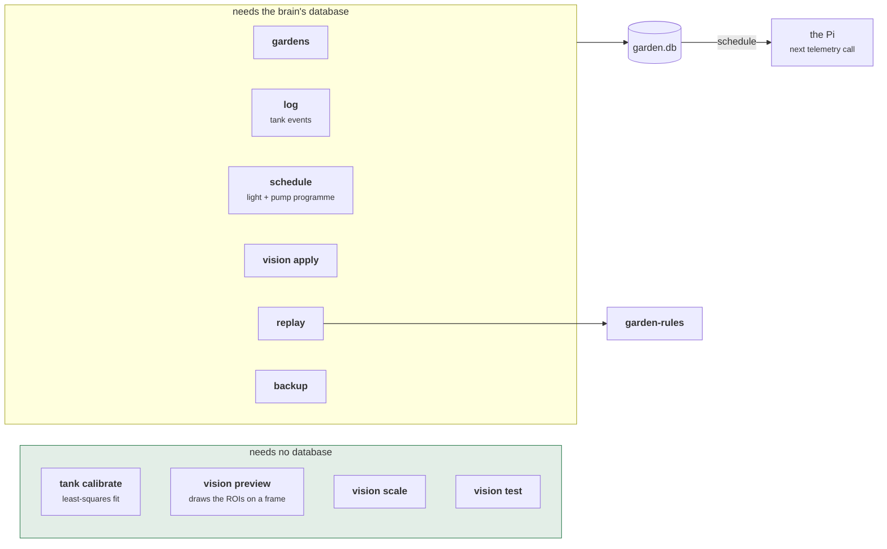

# garden-cli

The operator's tool: calibration, event logging, and replaying history against the
rules.

```sh
cargo run -p garden-cli -- gardens
cargo test -p garden-cli    # 41 tests, 16 of them running the built binary
```

Talks to the database directly rather than through the web API, so it runs on the
brain's own VM. That is what makes replay possible at all — rebuilding a past
`GardenState` needs the whole history, not the handful of endpoints a browser needs.
SQLite in WAL mode allows a second process, so it is safe to run against a live server.

---

## Architecture



The split is deliberate: you work out your tank constants standing next to the device
with a jug, which may well not be where the server is.

---

## Calibrating the tank

`TankGeometry::STUDIO_2` ships with **placeholder** distances, so water level reads
wrong until this is done. Fill and drain, recording the sensor's own reading — you are
calibrating what this sensor reports, offset included, not what a tape measure says.

```sh
garden-cli tank calibrate --capacity 15.5 330:0 240:5 150:10 60:15
```

```
Fitted from 4 measurements:

    capacity_l:        15.50
    full_distance_mm:  51.0
    empty_distance_mm: 330.0

    worst residual:    0.00 L
```

Two points would do the arithmetic and permanently record both of your measurement
errors. An ultrasonic sensor reading a rippling surface is noisy by nature, so this
fits a line through as many as you took and reports the **worst residual** — a bad
reading shows up instead of being averaged in.

Two mistakes are refused rather than fitted: a sensor wired backwards (distance rising
with volume) and a dead one reading a constant. Both would otherwise produce a tank
that confidently reports full when it is empty.

## Calibrating the camera

There is no GUI and there should not be one — this runs over SSH. The substitute is an
annotated PNG: adjust numbers, re-render, look.

```sh
garden-cli vision init --garden $ID --width 1920 --height 1080
garden-cli vision preview --frame frame.jpg      # writes rois-preview.png
#   ...edit rois.json, repeat until the boxes sit over the yPods...
garden-cli vision scale --cm 7 --px 70           # a yPod you measured with a ruler
garden-cli vision test --frame frame.jpg         # what it would measure
garden-cli vision apply --garden $ID             # switches vision on
```

`init` produces an even grid and says plainly that it will not be right — a real tower
is not axis-aligned in the frame. The point is that calibration becomes *adjusting
sixteen nearly-right rectangles* rather than inventing sixty-four numbers. Each
rectangle carries tick marks counting its slot number, so a box that has drifted onto
its neighbour is obvious rather than merely plausible.

`apply` is what turns vision on. There is no separate switch, because without knowing
which pixels are slot 7 there is nothing to measure.

## Logging what you did

```sh
garden-cli log feed --garden $ID
garden-cli log top-off --garden $ID --litres 2
garden-cli log clean --garden $ID --days-ago 3
garden-cli log show --garden $ID
garden-cli log undo --garden $ID <event-id>
```

The rule engine is stateless: it re-derives "overdue for a refresh" from the last
recorded action every time it runs. **An action you did not record did not happen**, and
the task comes straight back.

`--days-ago` exists because you feed the tank on Saturday and record it on Monday, and
the rules care about Saturday. Negative values are clamped — logging work that has not
happened yet would silence a task before it was done.

`undo` deletes rather than compensating. The log is folded forward on every read, so
removing the row makes the state exactly as if it never happened; a compensating entry
would leave two wrong timestamps instead of none.

## Setting the schedule

```sh
garden-cli schedule set --garden $ID --hours 14 --duty 0.85 --ramp 30
garden-cli schedule preview --garden $ID     # the whole day, hour by hour
```

Changing one reports the change in **daily duty-hours**, not just the hours: fewer hours
at a higher duty can deliver the same light, and comparing hours alone would hide that.

A schedule the supply should not be asked to run is refused here, where a person can
see the error, rather than accepted and then silently ignored by every Pi that receives
it. `clear` stops sending one — the agent keeps running whatever it last received, and
never reads it as "stop".

The Pi picks it up on its next telemetry call, and only acts on it if it was started
with `--own-actuators`.

## Planning what goes in next

```sh
garden-cli plan --garden $ID
```

```
already coming:
    day   29   Arugula
    day   42   Lacinato Kale
    day   56   Basil

slot 4  (high light)
    Lavender                 harvest ~day 108   108 days out, 52 days clear of your next one
    Lemongrass               harvest ~day 106   106 days out, 50 days clear of your next one

slot 5  (medium light)
    Chives                   harvest ~day  82   82 days out, 26 days clear of your next one
```

Each slot is planned knowing the ones above it, so the answer is a staggered tower
rather than thirteen of whatever matures slowest. What is already coming is printed
first, from the same function the planner reasons over — a display that computed it
separately could disagree with the advice underneath and make it look wrong.

## Replay

```sh
garden-cli replay --garden $ID --days 90
garden-cli replay --garden $ID --days 90 --capability conductivity --verbose
```

Rebuilds `GardenState` as it stood on each past day and asks the rules what they would
have said. This is the only honest way to evaluate a threshold change — adjusting a
constant and waiting a month is not a test.

```
first raised
    harvest                day 64
    add plant food         day 6

times raised
    harvest                3
    add plant food         5

    8 tasks over 91 days

44 of 91 days had no sensor reading. Rules needing telemetry could not run on
those days, so this replay mostly measures the gap.
```

Three things it is careful about:

- **A germination recorded later does not leak backwards.** Using today's date at every
  step makes the plant look older than it was and fires harvest days early — exactly
  the error a replay exists to catch, not commit.
- **Readings are windowed at both ends.** A reading taken after the moment being
  reconstructed had not happened yet, and letting one through is how a replay starts
  predicting the future.
- **Blind days are reported.** A replay over a telemetry gap is mostly measuring the
  gap, and saying so is more useful than a confident summary of nothing.

`--capability` forces hardware on so you can ask what a probe would change. Note that a
probe which actually *reports* derives its capability from the reading — the flag is
for asking about hardware you do not have. And declaring a probe you have not wired up
does not silence dosing: the measured rule keeps the estimate's logic for exactly that
case.

---

## Reference

| Command | Database? | |
|---|---|---|
| `gardens` | yes | ids, models, whether vision is on |
| `tank calibrate` | **no** | fit distance-to-volume |
| `tank show` | yes | the tank as the rules see it |
| `vision init` | yes | starting grid for a garden |
| `vision preview` / `scale` / `test` | **no** | check, measure, dry-run |
| `vision apply` / `clear` | yes | turn vision on and off |
| `log …` | yes | tank events |
| `schedule …` | yes | the light and pump programme |
| `plan` | yes | what to put in each empty slot |
| `replay` | yes | history against the current rules |
| `backup` | yes | `VACUUM INTO` a consistent copy |

`--database` defaults to `sqlite://garden.db` and reads `GARDEN_DB`, so it picks up the
server's own setting from the environment file.
