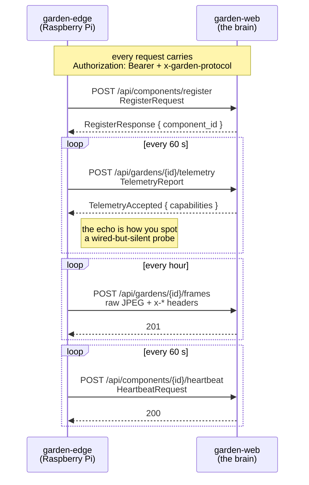

# garden-proto

The wire contract between the Pi agent and the brain. Types only — no I/O, no HTTP
client, no server.

Both sides depend on this crate so they cannot drift apart. The agent cross-compiles
for ARM and the brain runs on x86; without a shared definition, a field renamed on one
side shows up as a silent parse failure at three in the morning, on a device you have
to walk across the house to read the logs of.

```sh
cargo test -p garden-proto    # 12 tests
```

---

## Architecture



---

## The payloads

### `TelemetryReport` → `TelemetryAccepted`

```rust
use garden_proto::{TelemetryReport, PROTOCOL_VERSION};

let report = TelemetryReport::new(snapshot, env!("CARGO_PKG_VERSION"));
assert_eq!(report.protocol, PROTOCOL_VERSION);
```

The response echoes back **the capabilities the brain inferred from what you just
sent**:

```json
{ "capabilities": ["air temperature", "air humidity", "PCB temperature", "pump current"] }
```

That echo is the single most useful thing in this protocol. If you have just fitted a
DS18B20 and "water temperature" is not in that list, the probe is not being read — and
you find out in one command instead of after a week of collecting data without it.

### Frame upload

Raw image bytes in the body, metadata in headers. No multipart, because assembling one
on a Pi Zero is work the device does not need to do:

| Header | |
|---|---|
| `x-captured-at` | RFC 3339 |
| `x-width` / `x-height` | pixels |
| `x-light-duty-milli` | light level at capture, ‰ |
| `x-photo-mode` | `true` when the light was pinned to the reference level |

`x-photo-mode` is what lets the brain separate photometrically comparable frames from
ambient ones. Mixing the two into a colour trend measures the time of day.

### Heartbeat

```rust
use garden_proto::HeartbeatRequest;

HeartbeatRequest::ok(env!("CARGO_PKG_VERSION"));
HeartbeatRequest::degraded(env!("CARGO_PKG_VERSION"), "camera unavailable");
```

Degraded is a real state, not an error. An agent whose camera has failed but whose
sensors are fine should still be reporting, and the fleet page should show *why* it is
amber rather than making you go and look.

---

## Versioning

```rust
pub const PROTOCOL_VERSION: u32 = 1;
pub const VERSION_HEADER: &str = "x-garden-protocol";
```

Sent on every request. It lets the brain distinguish "an old Pi nobody has updated"
from "a corrupt request", which look identical otherwise and need opposite responses.
Bump it when a payload changes shape incompatibly.

---

## `recon` — the Phase 0 report

`ReconReport` is what `garden-edge probe` writes, and it is the only record of what the
device looked like before you touched it. It carries the expected peripheral map as
constants so the agent can say *which* device is missing rather than just how many:

```rust
use garden_proto::recon::expected;

assert_eq!(expected::AM2320, 0x38);
assert_eq!(expected::INA219, 0x40);
assert_eq!(expected::PCT2075, 0x48);
assert_eq!(expected::ADS1115_STRAPPED, 0x49);   // 0x48 collides with the PCT2075
assert_eq!(expected::GPIO_LIGHT, 18);
assert_eq!(expected::GPIO_PUMP, 24);
```

Commit the report next to DESIGN.md. It is what you diff against after a vendor
firmware update.

---

## MQTT topics

Declared in `topics`, and **nothing publishes on them.**

```rust
use garden_proto::topics;

assert_eq!(
    topics::for_garden(topics::TELEMETRY, "abc-123"),
    "garden/abc-123/telemetry"
);
```

The transport is HTTP. An earlier design routed telemetry through a mosquitto broker;
for a device sending one sample a minute that was a container, a protocol and a set of
delivery-semantics questions in exchange for nothing. The strings live here so that if
the traffic ever justifies a broker, they are beside the payloads that would travel on
them rather than invented twice.
