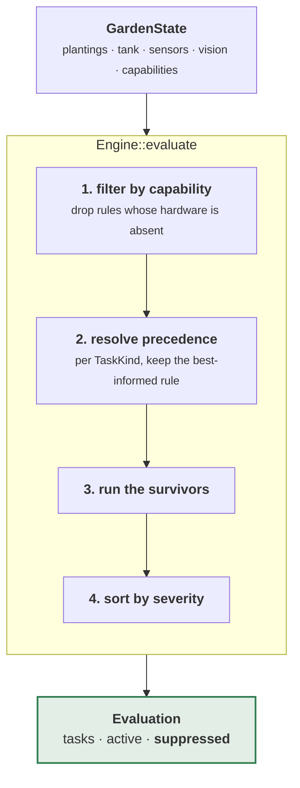

# garden-rules

Twenty-one rules and the engine that decides which of them get to speak.

A rule is a pure function `&GardenState -> Vec<Task>`. That makes each one testable in
isolation, and it means months of recorded history can be replayed against a modified
rule to see what it *would* have said.

```sh
cargo test -p garden-rules    # 116 tests
```

---

## Architecture



`suppressed` is not debug output. It backs the "why is this rule inactive?" view, so
the answer to *"why didn't it tell me to feed?"* is a sentence rather than an
investigation:

```rust
suppression.explain();
// "plant-food-by-ec needs EC probe"
// "harvest-by-calendar superseded by harvest-by-canopy for 'harvest'"
```

---

## The precedence rule

Every rule declares what it needs and how well-informed it is:

```rust
pub trait Rule: Send + Sync {
    fn id(&self) -> RuleId;
    fn requires(&self) -> &'static [Capability] { &[] }
    fn produces(&self) -> &'static [TaskKind];
    fn precedence(&self) -> u8 { PRECEDENCE_FALLBACK }   // 10; measured is 20
    fn evaluate(&self, state: &GardenState) -> Vec<Task>;
}
```

For each `TaskKind`, only the **highest-precedence surviving rule** runs. Fit an EC
probe and `plant-food-by-volume` stands down in favour of `plant-food-by-ec` — no code
change, no config migration. Lose the probe and the fallback resumes on the next tick,
which is exactly why capabilities are runtime state rather than Cargo features.

Two details that took a bug each to get right:

**Only strictly higher precedence displaces.** Two rules at the same level both run.
Equal-precedence rules that suppressed each other silently dropped tasks depending on
registration order.

**A winning rule must be a superset of the one it displaces.** Taking over a task kind
means taking over *all* of it. Every measured rule here keeps the calendar logic and
uses its sensor to fire earlier or escalate harder, rather than replacing it. The test
`adding_a_capability_never_leaves_a_task_kind_uncovered` enforces this: it walks every
subset of capabilities and asserts no task kind ever loses coverage by *gaining*
hardware.

---

## Using it

```rust
use garden_rules::default_engine;

let engine = default_engine();
let evaluation = engine.evaluate(&state);

for task in &evaluation.tasks {          // already sorted, most severe first
    println!("[{}] {} — {}", task.severity, task.summary(), task.rationale);
}
// [urgent] add water — garden — tank at 22%, using 0.5 L/day,
//          reserve reached in 1.8 days
```

Every task carries a `rationale`. "Why am I being told this?" always has an answer, and
it is the difference between a system you trust and one you start ignoring.

### Writing a rule

```rust
use garden_core::{Capability, GardenState, Task, TaskKind};
use garden_rules::{PRECEDENCE_MEASURED, Rule, RuleId};

// Hypothetical: an algae rule driven by a turbidity sensor nobody has fitted.
struct AlgaeByTurbidityRule;

impl Rule for AlgaeByTurbidityRule {
    fn id(&self) -> RuleId { RuleId::from_static("algae-by-turbidity") }
    fn requires(&self) -> &'static [Capability] { &[Capability::CanopyMetrics] }
    fn produces(&self) -> &'static [TaskKind] { &[TaskKind::AddConditioner] }
    fn precedence(&self) -> u8 { PRECEDENCE_MEASURED }

    fn evaluate(&self, state: &GardenState) -> Vec<Task> {
        // Emit what should be outstanding *now*. Never look at what you emitted
        // last time — the brain owns lifecycle, this function does not.
        vec![]
    }
}
```

The one hard constraint: **rules are stateless**. They re-emit continuously, keyed by
`TaskKey`, and completion, snoozing and escalation live in the brain. That is what
makes replay possible and what keeps a rule from having to reason about whether it
already told you.

---

## The rule set

| Task kind | Fallback (calendar + variety book) | Measured, and what it needs |
|---|---|---|
| `AddWater` | `water-level` | — *(the level sensor is stock)* |
| `AddPlantFood` | `plant-food-by-volume` — dose ∝ litres added | `plant-food-by-ec` — dose from measured EC |
| `AddConditioner` | `conditioner-cadence` — fixed cadence | `conditioner-by-algae` — algae index |
| `PruneRoots` | `root-prune-cadence` — every 2–4 weeks | `root-prune-by-flow` — pump-current restriction |
| `Harvest` | `harvest-by-calendar` — days from the variety book | `harvest-by-canopy` — canopy area vs threshold |
| `Thin` | `thin-by-calendar` | `thin-by-segmentation` — seedling count |
| `PrunePlant` | `prune-plant-cadence` | `prune-plant-by-canopy` |
| `DeepClean` | `deep-clean-by-calendar` — annual backstop only | `deep-clean-by-fouling` — pump baseline drift |
| `TankRefresh` | `tank-refresh` — every 4 weeks, 7 days' notice | `tank-refresh-by-chlorosis` — widespread measured yellowing |
| `Replant` | `replant` — end of productive life | — |
| `Inspect` | `germination-check`, `pollinate` | `root-zone-temperature`, `solution-ph` |

Grouped by module: `water`, `nutrients`, `roots`, `harvest`, `plants`, `maintenance`,
`rootzone`.

---

## The succession planner

Not a rule — it emits no tasks and changes nothing. It answers a question the rules
cannot, because by the time they say "harvest this", the decision that mattered was made
six weeks earlier: **what should go in this slot, so the harvests do not all arrive at
once.**

```rust
use garden_rules::succession;

for suggestion in succession::suggest(&state, slot, 3) {
    println!("{} — {}", suggestion.name, suggestion.reason);
}
```

Two hard filters, both reusing logic that already existed. The slot must be able to
light the plant (`LightZone::satisfied_by`), and the variety's EC band must overlap what
is already growing — a tank is one solution, so suggesting a tomato into a tank of
lettuce proposes a compromise that starves both. Then it maximises the gap between the
candidate's first harvest and the nearest one already expected.

**`plan_tower` is not `suggest` in a loop**, and the difference is the whole feature.
Scoring each empty slot independently gives every one of them the same answer — the
longest-maturing variety is furthest from what is already growing, for all of them at
once — so a whole-tower plan would read "plant thirteen lemongrass" and produce exactly
the pile-up it was meant to prevent. Each choice is therefore made knowing the ones
before it.

The single-slot form is what the UI uses on an empty card, deliberately: someone reading
one card is filling one slot, and a suggestion that assumed they would also fill the
other twelve today would be planning a day that is not happening.

Not in scope for this first cut: joint optimisation over the whole season, seasonal
preference, seed inventory.

## Two findings from the simulator

**A starved garden never runs dry.** Drought is a symptom of a *thriving* garden — a
full canopy transpires, a stalled one does not. So the water alarm is not the safety
net it looks like; a garden quietly failing produces fewer alarms, not more. That is
why `germination-check` and the stalled-growth signals exist at all.

**The pump is a sensor.** INA219 current draw against a clean baseline detects flow
restriction, which turns "prune roots" and "clean the tank" from monthly calendar
entries into measured triggers. `PumpBaseline::restriction_ratio` is the input to both.
