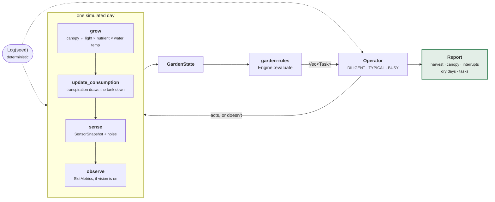

# garden-sim

A simulated Gardyn, so the brain can be built and tuned without the hardware.

This is why the whole system is trait-based. Rules, notification policy, escalation and
the dashboard are the bulk of the work and none of them need a Raspberry Pi. Here a
season runs in milliseconds, deterministically, and a threshold change can be evaluated
against months of behaviour rather than against one hand-written snapshot.

```sh
cargo run -p garden-sim          # 120-day season
cargo run -p garden-sim 365      # a year
cargo test -p garden-sim         # 32 tests
```

---

## Architecture



The loop closes. The operator model reads the tasks the engine emits and acts on some
of them, which changes the state the engine sees tomorrow — so a rule that nags too
often produces an operator who ignores it, and the report shows the consequence.

---

## Using it

```rust
use garden_core::{Capability, SlotId, Timestamp};
use garden_sim::{Simulation, scenario::{Operator, run}};

// A fixed start instant, because wall-clock time would make runs irreproducible.
let start = Timestamp::from_second(1_700_000_000).unwrap();
let mut sim = Simulation::new(2026, start);

sim.plant(SlotId(0), "kale-lacinato");
sim.plant(SlotId(11), "red-cherry-tomato");
sim.enable(Capability::CanopyMetrics);

let report = run(&mut sim, Operator::TYPICAL, 120, 2026);
println!("{} cm² harvested, {} dry days", report.harvested_cm2, report.dry_days);
```

### Operators

| | Responds to | Misses |
|---|---|---|
| `DILIGENT` | almost everything, promptly | little |
| `TYPICAL` | most things, with a lag | some low-severity work |
| `BUSY` | urgent things only | routine maintenance |

Testing a rule set against `DILIGENT` alone tells you very little. The interesting
question is what happens to someone who is away for a fortnight.

---

## The physics

Deliberately simple. It is not a plant growth model — it is a model of the *signals* a
plant growth process produces, which is what the rules consume.

| Function | Models |
|---|---|
| `grow` | canopy expansion, gated by light zone, nutrient strength, water temperature |
| `transpiration_lpd` | water drawn per day, proportional to canopy and driven by the environment |
| `nutrient_factor` | growth penalty away from full strength |
| `water_temp_factor` | the dissolved-oxygen curve — warm water starves roots |
| `Fouling` | biofilm accumulating, restricting flow, cleared by conditioner |
| `sense` | turns true state into a noisy `SensorSnapshot` |
| `observe` | turns true state into `SlotMetrics`, when vision is enabled |

`Lcg` is a 64-bit linear congruential generator rather than a real RNG, because a seed
has to reproduce a run exactly across machines and Rust versions.

Growth coefficients are **estimates**, marked in the source. They are calibrated well
enough for comparing rule sets against each other, and not well enough to predict a
real harvest date.

---

## What the season runner is for

`cargo run -p garden-sim` prints the capability report, an operator comparison, and the
hardware comparison:

| Configuration | Harvest | Canopy | Interrupts/wk | Dry days | Tasks |
|---|---:|---:|---:|---:|---:|
| stock | 6285 | 2458 | 1.2 | 0 | 340 |
| + water temp | 6285 | 2458 | 1.2 | 0 | 340 |
| + canopy vision | **8327** | 2371 | 1.4 | 0 | 336 |
| + EC probe | **9172** | 2303 | 2.8 | 0 | 326 |

This is how the hardware questions get answered before spending money. Canopy vision is
worth about a third more harvest for a negligible increase in interruptions; the EC
probe adds another 10% but more than doubles how often you are pinged.

The water temperature probe shows **no yield change at all**, and it is still worth
fitting: it buys reasoning the simulator cannot represent. Root rot and
dissolved-oxygen collapse are failure modes, not growth-rate adjustments, and a model
that never fails them cannot show what avoiding them is worth.

### The finding that changed the rule set

**A starved garden never runs dry.** Drought is a symptom of a *thriving* garden — a
full canopy transpires, a stalled one does not. So `dry_days` stays at zero in the
failure cases, and the water alarm is not the safety net it looks like. That is why
`germination-check` and the stalled-growth signals exist: the quiet failures needed
their own detection, because the loud one never fires for them.
