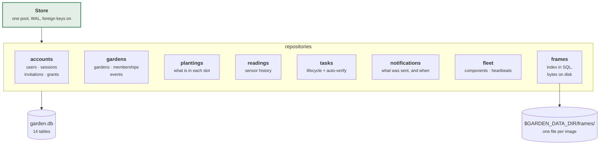
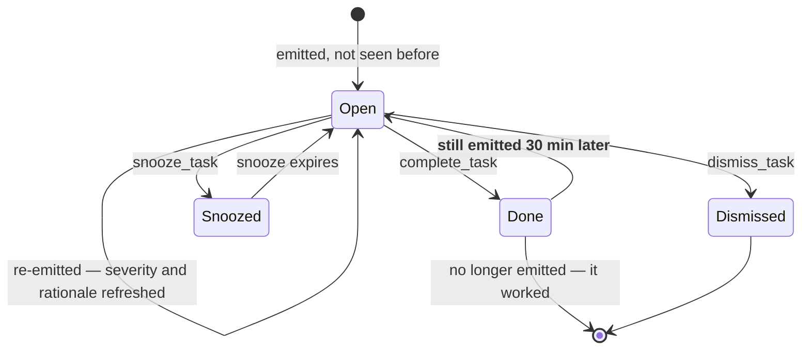

# garden-store

SQLite persistence, plus the task lifecycle that the stateless rule engine deliberately
does not own.

```sh
cargo test -p garden-store    # 133 tests, 65 of them against a real database
```

Queries are **runtime-checked**, not `sqlx::query!`-macro-checked. That means no
`DATABASE_URL` at compile time, which matters because this workspace also
cross-compiles for a Raspberry Pi and requiring a live database to build is a bad trade
for a single self-hosted binary.

---

## Architecture



```rust
use garden_store::Store;

let store = Store::open("sqlite://garden.db").await?;   // migrates on open
```

`open` creates the file if missing, enables WAL and foreign keys, sets a 5-second busy
timeout, and runs the migrations. There is no separate migrate step to forget.

---

## The task lifecycle

This is the crate's real subject. Rules are stateless: every evaluation re-emits *what
should be outstanding now*. Something has to turn that into "you were already told about
this on Tuesday, and you said you did it".

```rust
use garden_store::tasks::SyncOutcome;

let outcome = store.sync_tasks(garden, &evaluation.tasks, now).await?;
```



**The arrow from Done back to Open is the point.** You tap "added water"; if the rule is
still emitting `AddWater` after `VERIFY_WINDOW_MINUTES` (30), the level never moved and
the task quietly reopens. Without it, "done" means "I pressed a button" and the whole
system becomes something you have to double-check — which is what it exists to avoid.

Only sensor-verifiable kinds reopen. `TaskKind::is_sensor_verifiable()` decides; there
is no measurement that can contradict "I pruned the leaves", so claiming that one is
believed.

Completing a task also **writes back to the plant**:

```rust
store.complete_task(&key, actor.id(), now).await?;   // moves last_root_check
```

The engine re-derives everything from stored state, so marking "prune roots" done
without moving `last_root_check` would produce the identical task on the next tick. It
would look like it worked, then silently undo itself.

---

## Two constraints enforced in SQL, not in Rust

### One live planting per slot

```sql
CREATE UNIQUE INDEX plantings_one_live_per_slot
  ON plantings (garden_id, slot) WHERE removed_at IS NULL;
```

A partial unique index rather than a check-then-insert. Two people tending a shared
garden can submit "plant slot 3" in the same second, and a read followed by a write
loses that race. Removed plantings keep their row for yield history and stop
participating in the constraint.

### Frame lookups are scoped in the query

```sql
SELECT ... FROM frames WHERE id = ?1 AND garden_id = ?2
```

Not "fetch, then check". A frame id from one garden cannot be fetched through another
garden's URL, even by someone who legitimately belongs to that other garden. Filtering
afterwards is the same logic with one forgotten `if` between it and a leak.

---

## Frames: index in SQL, bytes on disk

```rust
let id = store.put_frame(garden, &meta, &bytes).await?;
let bytes = store.frame_bytes(id).await?;
```

One frame an hour is ~8,700 images a year per garden. As blobs they would bloat the
database, every backup, and every `VACUUM INTO`. On disk they cost the filesystem
nothing and the backup script can decide separately whether they are worth keeping.

The bytes are the database's blind spot, so deletion has to be explicit:
`delete_garden` calls `FrameStore::remove_garden_directory`. Foreign keys cascade the
rows; leaving photographs of someone's home on disk after they deleted the garden is
not acceptable, and it is exactly the sort of thing `ON DELETE CASCADE` lulls you into
assuming was handled.

---

## Backups

```rust
store.backup_to("/var/lib/garden/backups/garden-2026-07-26.db").await?;   // VACUUM INTO
```

The database runs in WAL mode, so its real state at any instant is spread across
`garden.db`, `-wal` and `-shm`. Copying just the first gives a torn database that
restores without complaint and is missing recent writes. `VACUUM INTO` asks SQLite for a
consistent single-file snapshot while the server keeps serving.

The same applies to Proxmox snapshots of a running VM — snapshot the backup, not the
live file. [`deploy/garden-backup`](../../deploy/garden-backup) does this nightly.

Retention helpers exist for the tables that grow without bound: `prune_readings`,
`prune_frames`, `prune_notifications`.

---

## Schema

Fourteen tables in [`src/schema.rs`](src/schema.rs), applied on open.

| | |
|---|---|
| `users`, `sessions`, `invitations`, `action_grants` | who, and how they proved it |
| `gardens`, `memberships`, `events` | what they own and share |
| `plantings` | what is in each slot, live and historical |
| `readings` | sensor history — the input to consumption forecasting |
| `frames` | camera index; bytes live on disk |
| `tasks` | lifecycle state keyed by `TaskKey` |
| `notifications`, `notification_prefs` | what was sent, to whom, when |
| `components` | Pi agents and their heartbeats |
| `tank_events` | what was done to the reservoir, folded forward on read |
| `vision_config`, `slot_metrics`, `algae_readings` | where the slots are, and what the camera measured |
| `garden_schedule` | the light and pump programme the Pi should run |

### Timestamps are fixed-width, and that is not cosmetic

Every timestamp column is RFC 3339 text with **exactly nine fractional digits**.
`jiff`'s `Display` prints the fewest it can — 0, 1, 3, 6 or 9 — and SQLite compares
text, so `"…:20Z"` sorts *after* `"…:20.5Z"` because `'Z' > '.'`. That silently drops
rows out of every `BETWEEN`, every `at <= ?`, and every `ORDER BY at`.

It fails by omitting rows rather than by erroring, which is why it survived six hundred
tests. `ts::PRECISION` pins the width, `NORMALISE_TIMESTAMPS` repairs databases written
before it, and a test asserts lexical order matches chronological order across each
precision boundary.

### The tank is an event log

Sensors say how much water is in the tank. They cannot say when it was last fed,
conditioned or scrubbed — and four rules ask exactly that. Those answers exist only
because someone recorded the action, so `tank_events` is folded forward on every read
rather than kept as a mutable row.

Two things follow from that. A mis-logged dose can be deleted and the state recomputes
correctly, and `garden-cli replay` can rebuild the tank as it stood on any past day.

Consumption rate is fitted from level history counting **only downward movement**. An
early version averaged all deltas, so every refill dragged the fitted rate toward zero
and the garden looked like it was using no water at all.

---

## Tests

| File | Proves |
|---|---|
| `tests/tenancy.rs` | the `garden-auth` policy actually holds against real queries |
| `tests/task_lifecycle.rs` | sync, completion, snooze, and auto-verification reopening |
| `tests/plantings.rs` | the one-live-per-slot index, history, write-back |
| `tests/frames.rs` | garden scoping, content sniffing, deletion reaching the disk |

`Store::in_memory()` gives an ephemeral database with a throwaway frame directory, so
these run in parallel with no fixtures and no cleanup.
