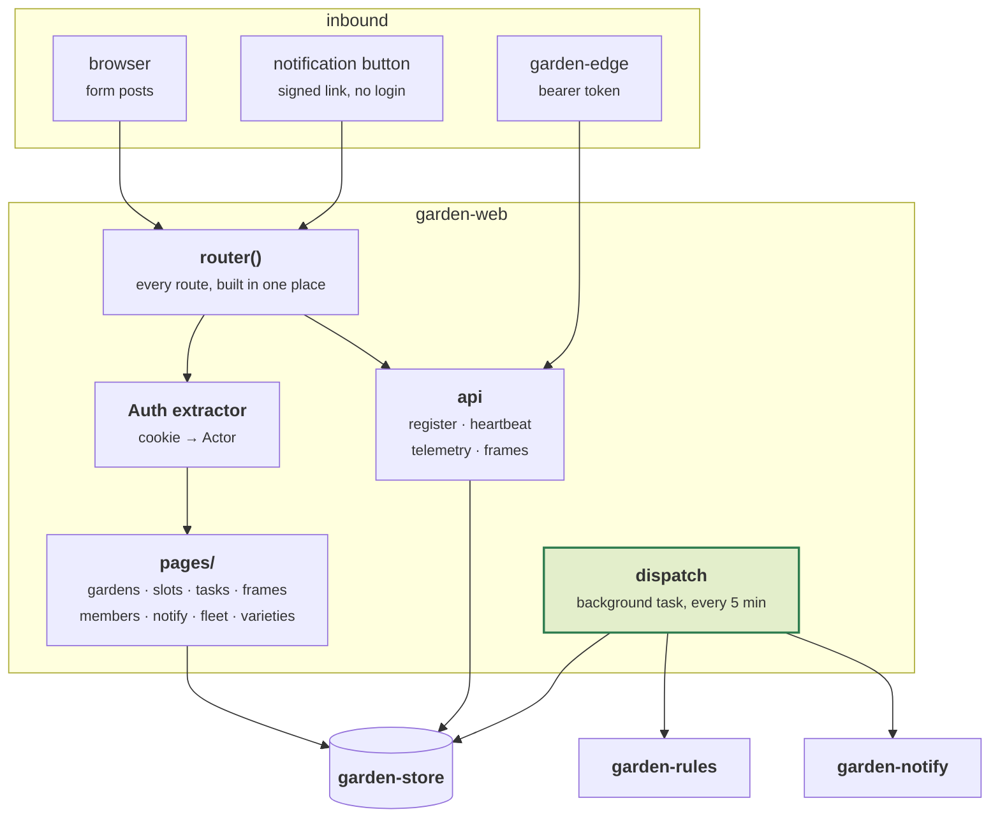

# garden-web

The brain. One binary: web UI, agent API, rule evaluation, and the notification
dispatcher.

Server-rendered HTML with [maud](https://maud.lambda.xyz/). **No JavaScript at all** —
no build step, no bundler, no `node_modules`, and nothing fetched from a CDN, which
would put a third party in the runtime path of a self-hosted system. Every interaction
is a form post. The whole front end ships inside the binary and still works after six
months of neglect.

```sh
cargo test -p garden-web      # 58 tests

GARDEN_INSECURE_COOKIES=1 \
GARDEN_AGENT_TOKEN=$(openssl rand -hex 32) \
cargo run -p garden-web
```

Then <http://localhost:8080>. The first account to register becomes the server
administrator; after that, registration closes and people join by invitation. Add a
garden with model **Simulated** to see the whole system work with no hardware.

Deployment is [DEPLOYMENT.md](../../DEPLOYMENT.md).

---

## Architecture



---

## The dispatcher

The one part that is not request-driven. A background task, every `TICK` (300 s), for
every garden on the server:

1. Build `GardenState` from stored plantings, tank state and the latest readings.
2. `Engine::evaluate` → `Vec<Task>`.
3. `Store::sync_tasks` → new, reopened, resolved.
4. For each task, `garden-notify::decide`, then deliver.

Three constants shape the experience more than any of the code around them:

| | | |
|---|---|---|
| `TICK` | 300 s | how often the world is re-evaluated |
| `MAX_BURST` | **3** | interrupting notifications per garden per sweep |
| `BRIEF_HOUR` | 8 | local hour the daily digest goes out |

`MAX_BURST` exists because a neglected garden's first sweep produced **seventeen**
notifications in testing. Nobody reads seventeen — they mute the app, and then the one
that mattered is lost too. The three most severe go out; the rest wait for the next
sweep or the morning brief.

The brief is keyed `__daily_brief`, and task keys are filtered with
`substr(task_key, 1, 2) <> '__'` so internal bookkeeping never appears as a task
someone can be asked to complete.

---

## Routes

### Pages

| | |
|---|---|
| `/` | your gardens |
| `/gardens/{id}` | dashboard: tank, sensors, outstanding tasks |
| `/gardens/{id}/slots` | **the plantings grid** — plant, log, harvest, pull |
| `/gardens/{id}/frames` | camera history, with an ambient/comparable badge |
| `/gardens/{id}/members` | sharing, roles, invitations, transfer |
| `/varieties`, `/varieties/{id}` | the plant book — Gardyn's own care text |
| `/account/notifications` | ntfy topic, UTC offset, quiet hours, calendar link |
| `/system` | fleet health. Administrators only, and **garden contents are not on it** |
| `/a/{token}` | one-tap Done / Snooze / N-A from a notification |
| `/calendar/{token}/feed.ics` | the iCal feed |

The calendar path is `{token}/feed.ics`, not `{token}.ics`. **axum cannot mix a path
parameter with literal text in one segment** — the pattern compiles, passes every unit
test, and panics when the router is built. That is why `router()` lives outside `main`
and a test builds it.

### Agent API

Bearer token, `GARDEN_AGENT_TOKEN`. Closed when unset, and it logs that at startup.

| | |
|---|---|
| `POST /api/components/register` | agent announces itself |
| `POST /api/components/{id}/heartbeat` | liveness, with a degraded reason |
| `POST /api/gardens/{id}/telemetry` | a sensor sample |
| `POST /api/gardens/{id}/frames` | raw image bytes, metadata in headers |
| `GET /healthz` | unauthenticated |

```sh
curl -X POST "$BASE/api/gardens/$GARDEN_ID/frames" \
  -H "Authorization: Bearer $GARDEN_AGENT_TOKEN" \
  -H 'X-Width: 1920' -H 'X-Height: 1080' \
  -H 'X-Light-Duty-Milli: 800' -H 'X-Photo-Mode: true' \
  --data-binary @frame.jpg
```

An unauthorized agent request returns **401, not a 303 to the login page**. A redirect
to HTML is a confusing thing for a Pi to receive and it turned a wrong-token
misconfiguration into a mystery once already.

The body limit is applied as a layer, so an oversized upload is rejected before it is
buffered rather than after — the size check in the handler is too late to stop a
runaway agent exhausting memory.

---

## Things worth knowing

**Uploaded frames are measured on the way in.** The bytes are already in memory, and
re-reading them from disk five minutes later to do the same work would be strictly
worse. A garden with no ROI map is not analysed, and that is the whole switch — see
[garden-vision](../garden-vision/). Every failure below that is logged and swallowed,
because the photograph is worth keeping even when the pipeline cannot read it, and an
agent that gets a 500 for an unanalysable frame retries it forever.

**Vision capabilities are derived from measurements, not from a setting.** Recent slot
metrics turn `CanopyMetrics` on; a camera that goes quiet turns it off two days later
and the canopy rules stand down by themselves. Two days rather than two hours, so one
dark night does not flap the harvest rule between measured and calendar.

**Completing a garden-level task writes back to the tank.** Feed, condition, refresh
and deep clean have no planting to record against, and until recently they recorded
against nothing at all — so they were marked done and re-emitted on the next tick,
forever. The same failure the plantings already fixed.

**Camera frames go through the same membership check as everything else.** A photograph
of someone's kitchen is at least as sensitive as the sensor readings beside it. Uploaded
bytes are sniffed rather than trusted — an agent claiming `image/jpeg` while sending
HTML would otherwise get it served back from our origin — and responses pin the content
type and set `nosniff`.

**A garden you are not a member of returns 404.** Garden ids are in URLs; a 403 would
confirm the id is real. `AccessDenied::conceals_existence()` decides, once.

**`error.rs` maps every failure to a response in one place.** `AppError::Unauthorized`
returns 401 for the API, `NotFound` returns the same page whether the thing is absent
or merely invisible to you.

**Simulated gardens render their own frames** — one blob per occupied slot, sized by
canopy area and tinted by chlorosis index. Not a photograph, and not pretending to be.
Its job is to make capture, storage, authorization and display real so that swapping in
`/dev/video0` changes one function.

---

## Configuration

| Variable | Default | |
|---|---|---|
| `GARDEN_DB` | `sqlite://garden.db` | |
| `GARDEN_DATA_DIR` | `garden-data` | frames land in `$GARDEN_DATA_DIR/frames` |
| `GARDEN_BIND` | `0.0.0.0:8080` | |
| `GARDEN_BASE_URL` | `http://$GARDEN_BIND` | **must be reachable from your phone** |
| `GARDEN_AGENT_TOKEN` | *unset* | agent API is closed when unset |
| `GARDEN_INSECURE_COOKIES` | *unset* | development only |
| `GARDEN_NTFY_URL` / `_TOKEN` | *unset* | no push when unset |
| `GARDEN_SMTP_*` | *unset* | no email when unset |
| `RUST_LOG` | `garden_web=info,tower_http=warn` | |

`GARDEN_BASE_URL` is the one people get wrong. Invite links and notification buttons are
built from it, so `localhost` means every button on your phone is dead.

## Layout

| | |
|---|---|
| `main.rs` | configuration, `router()`, and the test that builds it |
| `app.rs` | `AppState`, the `Auth` extractor |
| `error.rs` | one failure → response mapping |
| `dispatch.rs` | the 5-minute sweep and the daily brief |
| `state.rs` | stored rows → `GardenState` |
| `render.rs` | simulated camera frames |
| `demo.rs` | the Salad Lover kit, for seeding a demo garden |
| `ui.rs` | layout, CSS, the tower grid |
| `pages/` | one module per page |
| `api.rs` | the agent API |
