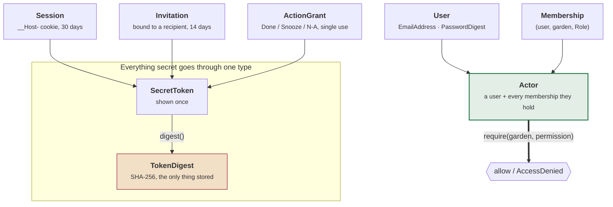

# gardyn-auth

Accounts, roles, garden sharing, sessions, and the signed one-tap links that make a
notification actionable.

Pure logic over types, with no I/O. That is deliberate: the entire authorization policy
is exhaustively testable without a database, which is the only way to be confident a
sharing bug is not quietly exposing one household's garden to another.

```sh
cargo test -p gardyn-auth     # 78 tests
```

---

## Architecture



---

## `Actor` is the only place a decision gets made

```rust
use gardyn_auth::{Actor, Permission};

let actor = Actor::new(user, memberships);

actor.require(garden, Permission::CompleteTask)?;   // the whole check
```

Handlers never compare roles. There is exactly one function to audit, and adding a
permission cannot leave a handler behind that forgot to check it.

| Role | Can |
|---|---|
| **Viewer** | see the garden and its history |
| **Caretaker** | + complete tasks, log actions, manage plantings |
| **Steward** | + configure the garden, control hardware, invite people |
| **Owner** | + delete and transfer |

---

## Five properties the tests enforce

### 1. A garden you cannot see returns 404, not 403

```rust
assert!(AccessDenied::NoSuchGarden.conceals_existence());
```

Garden ids appear in URLs. A "Forbidden" confirms the id is real, which turns guessing
into enumeration. `AccessDenied::conceals_existence()` is what the web layer consults to
decide which status to return, so the distinction is made once rather than remembered
per handler.

### 2. Nobody can grant their own role

```rust
assert!(!Role::Steward.can_grant(Role::Steward));
assert!(!Role::Steward.can_grant(Role::Owner));
assert!(Role::Steward.can_grant(Role::Caretaker));
```

Ownership never moves by invitation at all. Without this, a shared garden becomes an
unbounded privilege chain the owner never approved: a steward invites a steward, who
invites a steward.

### 3. Administration and garden access never consult each other

`require_admin` does not fall through to `require`. A server administrator can see that
a Pi is offline and how many accounts exist; they cannot see what you are growing.
Those are genuinely separate questions, and collapsing them is how "admin" silently
becomes "reads everyone's kitchen photographs".

### 4. An invitation is bound to its recipient

```rust
invitation.accept(&wrong_user, now);   // Err(InviteError::WrongRecipient)
```

A forwarded link does not work for whoever opens it first. This one was a real bug: an
earlier version created the account *before* checking the recipient, so a leaked invite
let a stranger register on a server with sign-ups closed. The check now happens before
anything is created.

### 5. Secrets are stored as digests, never as secrets

```rust
use gardyn_auth::SecretToken;

let token = SecretToken::generate();
let stored = token.digest();        // SHA-256 — this is what goes in the database

// Later, from a cookie or a URL:
let presented = SecretToken::from_client(raw)?;
if presented.digest() == stored { /* … */ }
```

Sessions, invitations and notification action links all go through this. A leaked
backup yields nothing usable, and a token can only ever be shown to a person once.

---

## One-tap notification links

The Done / Snooze / Not-Applicable buttons on a push notification have to work with no
login, from a lock screen, having travelled through a push relay.

```rust
use gardyn_auth::{ActionGrant, TaskAction};

let (grant, secret) = ActionGrant::issue(
    task_key.clone(), user.id, garden, TaskAction::Complete, now,
);
// Put `secret` in the URL. Store only `grant`, which holds the digest.

let action = grant.redeem(&task_key, now)?;   // consumes it
grant.redeem(&task_key, now);                 // Err(GrantError::AlreadyUsed)
```

Two properties matter here:

- **Single use.** These links sit on lock screens and pass through relays. A replayable
  one is a link that marks a task done every time a notification is re-delivered.
- **`redeem` takes the expected `TaskKey` from the request path** rather than trusting
  the one inside the grant. A valid link for a harmless task cannot be replayed against
  a different one.

Grants expire after three days; invitations after fourteen; sessions after thirty.

---

## Passwords

Argon2id, with a policy that is length-first:

```rust
use gardyn_auth::accept_new_password;

let digest = accept_new_password("correct horse battery staple")?;
```

`MIN_PASSWORD_LENGTH` is 12 and there are no composition rules. Character-class
requirements push people toward `Password1!` — long and memorable beats short and
mangled. `MAX_PASSWORD_LENGTH` is 1024 to bound the hashing work an unauthenticated
request can ask for.

Sessions use the `__Host-` cookie prefix, which browsers refuse to accept over plain
HTTP. That is the intended behaviour; the fix is TLS, and `INSECURE_SESSION_COOKIE`
exists only for local development.

---

## Layout

| Module | |
|---|---|
| `actor` | `Actor`, `AccessDenied` — the single decision point |
| `role` | `Role`, `Permission`, and the grant/manage matrix |
| `membership` | `(user, garden, role)` and the founding owner |
| `user` | `User`, `EmailAddress` with validation |
| `credential` | Argon2id hashing and the password policy |
| `session` | `Session`, cookie names, lifetime |
| `invite` | `Invitation` bound to a recipient |
| `action` | `ActionGrant` — single-use notification links |
| `token` | `SecretToken` / `TokenDigest` — the one way secrets are handled |

Isolation is exercised against a real database in
[`gardyn-store/tests/tenancy.rs`](../gardyn-store/tests/tenancy.rs); this crate proves
the policy, that one proves the queries honour it.
