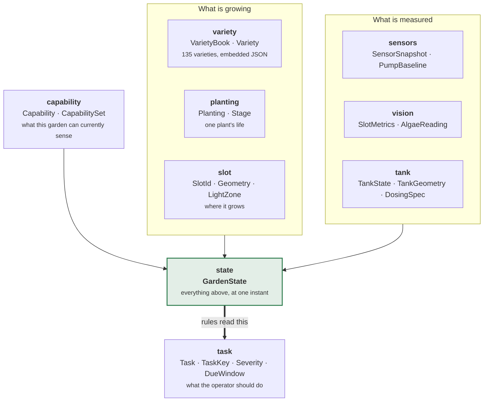

# gardyn-core

The domain model. Every other crate agrees on what a garden *is* by depending on this
one, and this one depends on nothing.

**Pure.** No I/O, no async, no hardware, no clock. Time arrives as a `Timestamp`
parameter rather than being read, which is what lets `gardyn-sim` run a 120-day season
in a few milliseconds and lets every rule be tested without a fixture.

```sh
cargo test -p gardyn-core     # 79 tests
```

---

## Architecture



`GardenState` is the whole input to the rule engine, and `Vec<Task>` is the whole
output. Nothing else crosses that boundary.

---

## The four ideas worth understanding

### 1. Capabilities are runtime state, not build features

```rust
use gardyn_core::{Capability, CapabilitySet};

let stock = CapabilitySet::stock();              // what a Studio 2 ships with
let mine  = stock.with(Capability::WaterTemperature);   // the $5 probe

assert!(mine.contains(Capability::PumpCurrent));
assert!(!mine.contains(Capability::Conductivity));      // not fitted
assert_eq!(mine.missing(&[Capability::Conductivity]),
           vec![Capability::Conductivity]);
```

An EC probe, each vision stage, and actuator ownership after firmware takeover are all
the same mechanism. Making this runtime state rather than a Cargo feature is deliberate:
**a probe that fails mid-season has to degrade the system, not fail to compile it.**
`SensorSnapshot::capabilities()` derives the set from what actually read back, so a dead
sensor removes its capability on the next tick and the fallback rules resume by
themselves.

### 2. A task is identified by what it *is*, not when it was made

```rust
use gardyn_core::{Target, TaskKey, TaskKind};

let a = TaskKey::new(TaskKind::AddWater, Target::Garden);
let b = TaskKey::new(TaskKind::AddWater, Target::Garden);
assert_eq!(a, b);   // the same task, not two tasks
```

Rules are stateless and re-emit continuously — every evaluation says "here is what
should be outstanding *now*". The key is what lets the brain recognise a re-emission as
the same job you were already told about, so you are not notified 288 times a day.

When one target legitimately needs two tasks of the same kind, tag them:

```rust
let roots = TaskKey::tagged(TaskKind::Inspect, Target::Garden, "roots");
let algae = TaskKey::tagged(TaskKind::Inspect, Target::Garden, "algae");
assert_ne!(roots, algae);
```

### 3. Severity decides whether you get interrupted

```rust
use gardyn_core::Severity;

assert!(!Severity::Advisory.interrupts());   // waits for the morning brief
assert!(Severity::Urgent.interrupts());
assert_eq!(Severity::Critical.ntfy_priority(), 5);   // bypasses Do Not Disturb
```

Priority 5 exists for exactly one situation — the tank runs dry in twelve hours — and
spending it on anything else is how a person learns to mute the app.

### 4. The variety book carries Gardyn's own words

135 varieties, embedded at compile time from
[`data/varieties.json`](data/varieties.json), with Gardyn's Qualities and Care & Harvest
prose from [`data/variety-details.json`](data/variety-details.json).

```rust
use gardyn_core::{VarietyBook, VarietyId};

let book = VarietyBook::gardyn();
let basil = book.get(&VarietyId::new("basil")).unwrap();

assert_eq!(basil.germination_days, 13);
assert!(basil.care.iter().any(|p| p.contains("bolting")));
```

Every example on this page is executed by
[`tests/readme.rs`](tests/readme.rs), so it fails the build rather than quietly
going stale.

One conversion matters. Gardyn publishes **days to maturity measured from sowing**;
every rule here measures from germination, because that is the date the operator can
actually observe. So:

```rust
days_to_first_harvest = maturity_min.saturating_sub(sprout_min).max(14)
```

Four of the 135 have no live article on Gardyn's side and carry figures without prose.
`Variety::has_description()` is how the UI tells the difference instead of rendering a
blank.

---

## Regenerating the plant data

Both JSON files are transcribed from Gardyn's help centre, whose pages are
server-rendered with a stable `data-link` anchor per heading. `variety-details.json` is
generated rather than hand-written — see the extraction script referenced in its
`_note` field. A variety missing from that file simply renders without prose; it is not
an error.

---

## Layout

| Module | Holds |
|---|---|
| `capability` | `Capability`, `CapabilitySet` — the spine of every optional feature |
| `garden` | `Garden`, `GardenId`, `DeviceModel` |
| `slot` | `SlotId`, `Geometry`, `LightZone`, and Gardyn's published zone map |
| `planting` | `Planting`, `Stage`, and the age/interval arithmetic rules read |
| `variety` | `Variety`, `VarietyBook` — the embedded catalogue |
| `tank` | `TankState`, `TankGeometry`, `DosingSpec`, consumption forecasting |
| `sensors` | `SensorSnapshot`, `PumpBaseline`, `ewma` |
| `vision` | `SlotMetrics`, `AlgaeReading`, `LensCalibration` |
| `task` | `Task`, `TaskKey`, `TaskKind`, `Severity`, `DueWindow` |
| `state` | `GardenState` — the rule engine's single input |
| `time` | day arithmetic over `jiff::Timestamp` |

### Slot geometry

Studio 2 is 2 columns × 8 rows. Light is **not** a smooth gradient — Gardyn publishes a
staggered zone map that no simple model reproduces, so `Geometry::zone_map()` returns
their published table rather than computing one:

```
column 1   column 2          slot 1 is top-left, numbering runs down
  med        low             each column in turn
  med        med
 HIGH        med
  med       HIGH
 HIGH        med
  med       HIGH
 HIGH        med
  low        med
```

`LightZone::satisfied_by` encodes that a high-light plant tolerates being in a high
slot and nothing less, while a low-light plant is happy anywhere.

### Placeholders

`TankGeometry::STUDIO_2` holds **unmeasured** calibration distances, and
`DosingSpec`'s EC-per-millilitre conversion is an estimate. Both are marked in the
source. They are data, so correcting them against the real device is a value change,
not a code change.
