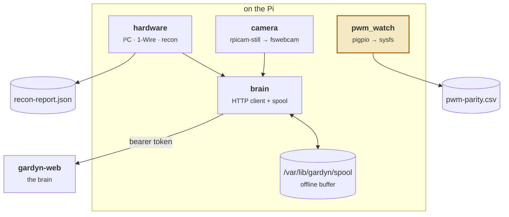
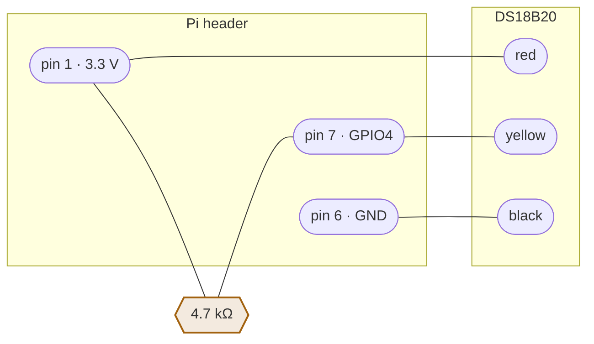

# gardyn-edge

The agent that runs on the Gardyn's Raspberry Pi. Recon, sensor telemetry, camera
capture, and the parity recording that has to happen before firmware takeover.

**Read-only.** Nothing in this crate writes to an actuator. Phase 1 runs alongside the
factory firmware, and two processes fighting over the same PWM pin is an excellent way
to cook a tray of seedlings.

```sh
cargo test -p gardyn-edge     # 22 tests, all runnable on a desktop
```

The full procedure — imaging the SD card, getting a shell, wiring the probe — is
[HARDWARE.md](../../HARDWARE.md). This is the crate reference.

---

## Architecture



`hardware.rs` has **two backends**. On ARM Linux it uses `rppal` for real I²C and GPIO;
everywhere else it compiles to a mock. The mock is not a stub that panics — it returns
plausible readings, because `probe` run on a laptop should show you what the output
looks like before you take a screwdriver to anything.

```toml
[target.'cfg(all(target_os = "linux", any(target_arch = "arm", target_arch = "aarch64")))'.dependencies]
rppal = "0.19"
```

---

## Commands

| Command | Needs brain? | Needs token? | |
|---|---|---|---|
| `probe` | no | no | Phase 0 recon → JSON |
| `read` | no | no | one sensor read, printed |
| `report` | yes | yes | one sensor read, sent |
| `capture` | yes | yes | one photo, uploaded |
| `watch-pwm` | no | no | parity capture → CSV |
| `run` | yes | yes | the daemon |

`probe`, `read` and `watch-pwm` deliberately need nothing but the binary. They are what
you run on a device you have just opened, possibly before the brain exists.

### `probe` — do this first

```sh
./gardyn-edge probe --out recon-report.json
```

```
Gardyn edge recon — agent 0.1.0

  board    Raspberry Pi Zero 2 W Rev 1.0
  arch     aarch64
  os       Debian GNU/Linux 12 (bookworm)

  I²C devices:
    0x38  AM2320 air temp/humidity
    0x40  INA219 pump current
    0x48  PCT2075 board temp
  cameras: 1
    /dev/video0
  water probe: none

  vendor services still running:
    gardyn-agent.service

  verdict: peripheral map matches DESIGN.md
```

**Commit the report.** It is the only record of what the device looked like before you
touched it, and it is what you diff against after a vendor firmware update.

### `report` — the fastest wiring check

```sh
export GARDYN_BRAIN_URL=http://brain.local:8080
export GARDYN_AGENT_TOKEN=...
export GARDYN_GARDEN_ID=...
./gardyn-edge report
```

```
accepted; brain sees: air temperature, air humidity, PCB temperature, pump current
```

The brain echoes back the capabilities it inferred. If you have just fitted a DS18B20
and "water temperature" is not in that list, the probe is not being read — and you know
in one command instead of after a week of collecting data without it.

### `watch-pwm` — the irreversible one

```sh
./gardyn-edge watch-pwm --out pwm-parity.csv --interval-seconds 1
```

The stock light curve, including the sunrise/sunset ramp, and the pump duty cycle exist
**only inside the vendor software**. The moment Phase 6 disables it, that record is
gone forever. Run this for one to two weeks and commit the CSV.

```csv
at,light_duty,light_source,pump_duty,pump_source
2026-07-26T06:00:00Z,0.0000,pigpio,0.2500,pigpio
2026-07-26T06:01:00Z,0.0420,pigpio,0.2500,pigpio
```

Two sources are tried in order: `pigs gdc <pin>` (the factory firmware is expected to
use pigpiod) then `/sys/class/pwm/pwmchip0/pwm<n>`. A row reading `unavailable` means
**the pin could not be read**, which is a very different thing from "the lights were
off" — hence the explicit source column rather than a bare zero.

Note that sysfs can only see GPIO18; the pump on GPIO24 has no hardware PWM channel, so
if pigpiod is not running you will need to jumper GPIO24 to a spare input.

### `run` — the daemon

```sh
./gardyn-edge run --sample-seconds 60 --frame-seconds 3600
```

Registers, then samples and photographs on a schedule. When the brain is unreachable,
samples buffer to `$GARDYN_SPOOL_DIR` and replay oldest-first on reconnect; the brain
upserts on `(garden, timestamp)`, so a double-send is harmless.

**Frames are not buffered.** They are large, and a missing hourly photo costs far less
than a full SD card.

---

## Sensor connections

| Peripheral | Bus | Address / pin | Provides |
|---|---|---|---|
| AM2320 | I²C-1 | `0x38` | air temperature, humidity |
| INA219 | I²C-1 | `0x40` | pump current — **the flow-restriction proxy** |
| PCT2075 | I²C-1 | `0x48` | board temperature |
| DS18B20 | 1-Wire | GPIO4 (header pin 7) | water temperature |
| ADS1115 *(deferred)* | I²C-1 | `0x49` — **strapped** | EC, pH |
| Light PWM | — | GPIO18 (pin 12) | read-only until Phase 6 |
| Pump PWM | — | GPIO24 (pin 18) | read-only until Phase 6 |
| Ultrasonic | — | GPIO19 trig / GPIO26 echo | water level |
| Camera | V4L2 | `/dev/video0` | frames |

**This map comes from community work on the Gardyn Home 3.0/4.0. Studio 2 internals are
unverified** — `probe` is what confirms them, and a mismatch is expected information
rather than a failure.

### DS18B20 water probe



```sh
echo "dtoverlay=w1-gpio,gpiopin=4" | sudo tee -a /boot/firmware/config.txt
sudo reboot
ls /sys/bus/w1/devices/     # expect a 28-xxxxxxxx entry
./gardyn-edge read          # water_temp_c should now be populated
```

The **4.7 kΩ pull-up between DATA and 3.3 V is required**. 1-Wire is open-drain; with no
pull-up the line never returns high and the kernel sees no device. This is the single
most common reason a DS18B20 "does not work", and it looks identical to a wiring
mistake.

The `ADS1115` defaults to `0x48`, colliding with the PCT2075. Strap `ADDR` to VDD for
`0x49` or neither reads correctly.

### Camera

Three capture tools are tried in order: `rpicam-still` (current Raspberry Pi OS),
`libcamera-still` (older), then `fswebcam` for a plain UVC device. Captures are
1920×1080.

```sh
sudo apt install -y rpicam-apps     # or fswebcam for a USB camera
```

---

## Building for the Pi

Check what `probe` reported for `arch`.

```sh
# aarch64 — Pi Zero 2 W, Pi 3/4/5. Tier 1.
cargo install cargo-zigbuild        # no cross toolchain needed
cargo zigbuild --release -p gardyn-edge --target aarch64-unknown-linux-gnu

# armv6 — Pi Zero v1, Pi 1. Tier 2, awkward.
CROSS_CONTAINER_ENGINE=podman cross build --release -p gardyn-edge \
  --target arm-unknown-linux-gnueabihf
```

**TLS is off by default**, and deliberately. `reqwest` with rustls drags in `ring`,
which needs a C cross-compiler — turning `rustup target add` into "install a
toolchain". The brain sits on the LAN or behind Tailscale, both already encrypted.
Enable `--features tls` only if you are reaching the brain over public HTTPS, and use
`cargo-zigbuild` when you do.

## Environment

| Variable | Default | |
|---|---|---|
| `GARDYN_BRAIN_URL` | `http://localhost:8080` | |
| `GARDYN_AGENT_TOKEN` | *empty* | must match the brain |
| `GARDYN_GARDEN_ID` | — | from the garden's URL |
| `GARDYN_SPOOL_DIR` | `/var/lib/gardyn/spool` | offline buffer |
| `GARDYN_SAMPLE_SECONDS` | `60` | |
| `GARDYN_FRAME_SECONDS` | `3600` | `0` disables the camera |
| `GARDYN_AGENT_NAME` | `gardyn-edge` | shown on `/system` |

Installation as a systemd service is [HARDWARE.md §1.3](../../HARDWARE.md).
