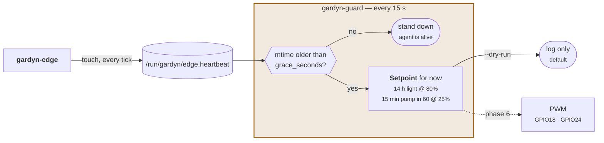

# gardyn-guard

The failsafe supervisor. Layer 3 of the four-layer safety model, and the smallest
program in the workspace on purpose.

`gardyn-edge` touches a heartbeat file. If it stops for long enough, guard seizes the
PWM lines and runs a conservative schedule until someone notices.

```sh
cargo test -p gardyn-guard    # 7 tests
```

> **Currently dry-run by default, and not wired to any pin.** Until Phase 6, the
> factory firmware owns the actuators and a fight over PWM is how you lose a crop.
> Guard runs, watches, and logs what it *would* do — which is exactly what you want
> while proving a watchdog before trusting it with plants.

---

## Architecture



---

## Why it is a separate process

It has no HTTP client, no database, no async runtime, no rule engine, and no serde. It
reads a file's mtime and computes two duty cycles.

That is the entire design rationale: **a panic in the complicated program must not take
out the simple one.** `gardyn-edge` does I²C, HTTP, JSON, image capture and disk
spooling — plenty of surface for a bug. Guard's job is to still be running when that
bug happens. Sharing a process, or a dependency tree, would defeat it.

It sits between two layers that do not need it and one that does:

| Layer | | Catches |
|---|---|---|
| 1 | physical rollback — the original SD card in a drawer | everything, in two minutes |
| 2 | `gardyn-failsafe.service` boot defaults | the agent never starting |
| **3** | **`gardyn-guard`** | **the agent starting, then dying or hanging** |
| 4 | `bcm2835_wdt` + `RuntimeWatchdogSec` | a hung kernel, by rebooting into layer 2 |

---

## The failsafe schedule

```rust
const FAILSAFE_LIGHT_HOURS: f64 = 14.0;
const FAILSAFE_LIGHT_DUTY: f32 = 0.80;
const FAILSAFE_PUMP_ON_MINUTES: f64 = 15.0;
const FAILSAFE_PUMP_CYCLE_MINUTES: f64 = 60.0;
const FAILSAFE_PUMP_DUTY: f32 = 0.25;      // well under Duty::PUMP_MAX
```

Chosen to be adequate for everything in Gardyn's catalogue rather than optimal for
anything. **A failsafe should keep plants alive until someone notices, not grow them
well.** Tuning these toward optimal would mean tuning them toward some particular
planting, and the whole point is that guard runs when nobody is paying attention to
what is planted.

The pump runs **through the dark hours too**. Roots do not stop needing water when the
lights go off, and a failsafe that only pumped during the day would be a slow failure
rather than a fast one.

The duty goes through `gardyn_hal::Duty::pump`, so even a wrong constant here cannot
exceed the 30% supply ceiling.

---

## Running it

```sh
gardyn-guard \
  --heartbeat /run/gardyn/edge.heartbeat \
  --grace-seconds 300 \
  --interval-seconds 15
```

| Flag | Env | Default | |
|---|---|---|---|
| `--heartbeat` | `GARDYN_HEARTBEAT` | `/run/gardyn/edge.heartbeat` | file the agent touches |
| `--grace-seconds` | `GARDYN_GRACE_SECONDS` | `300` | silence before the agent is presumed dead |
| `--interval-seconds` | — | `15` | how often to look |
| `--dry-run` | `GARDYN_GUARD_DRY_RUN` | **`true`** | log only; the default until Phase 6 |

**The grace period is generous on purpose.** A brief stall during a frame upload must
not cause guard to start fighting the agent for the pins. Five minutes of silence is a
dead process; five seconds is a busy one.

---

## Before you trust it

From the Phase 6 checklist in [HARDWARE.md](../../HARDWARE.md):

- [ ] Guard has run in dry-run for weeks and logged sensible setpoints across a full
      light cycle
- [ ] You have deliberately killed `gardyn-edge` and confirmed guard notices
- [ ] You have swapped back to the original SD card once, proving rollback works

Only then does turning off `--dry-run` make sense. A failsafe that has never been
observed failing over is not a failsafe; it is an assumption.
