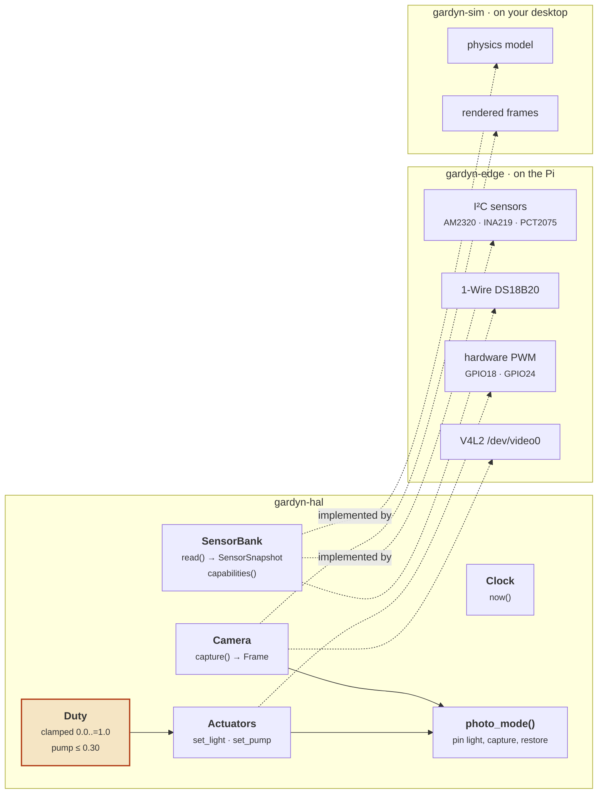

# gardyn-hal

Traits for everything the edge agent touches, plus the two safety invariants that are
enforced in the type system rather than left to calling code.

The obvious reason for a HAL is testability. The load-bearing reason is that it lets
the brain, the rule engine and the UI be developed against `gardyn-sim` on a desktop
with no Pi in the loop. Most of the work in this project is not hardware work and
should not be gated on hardware.

```sh
cargo test -p gardyn-hal      # 5 tests
```

---

## Architecture



---

## `Duty` — the invariant that matters most

```rust
use gardyn_hal::Duty;

assert_eq!(Duty::new(2.0).get(), 1.0);          // clamps
assert_eq!(Duty::new(f32::NAN).get(), 0.0);     // NaN fails safe to off
assert_eq!(Duty::pump(1.0).get(), Duty::PUMP_MAX);   // 0.30, always
```

**Pump duty is capped at 30% in the constructor.** Full-on is believed to exceed the
Studio's power supply budget. Once firmware takeover happens there is no vendor
firmware left to catch an over-current mistake, so the cap lives in a type that cannot
hold an illegal value rather than in a check somebody has to remember to write.

`NaN → 0.0` is the same reasoning. A NaN duty from a bad calculation would otherwise
propagate into a PWM register as whatever the cast produced; off is the only safe
interpretation of "no idea".

## `photo_mode` — why owning the firmware is worth it

```rust
use gardyn_hal::{Duty, photo_mode};

let frame = photo_mode(
    &mut actuators,
    &mut camera,
    Duty::new(0.80),              // the reference level, the same every time
    || std::thread::sleep(std::time::Duration::from_millis(400)),
)?;
```

Under the stock sunrise/sunset ramp, brightness varies with capture time. A chlorosis
index computed from two frames taken at different hours is measuring the clock, not the
plant. Pinning the light to a fixed reference for the duration of the capture is what
turns canopy colour into a usable signal.

The light is restored **even if the capture fails**, because the alternative is leaving
the garden at 80% overnight because a USB camera timed out.

`Frame::light_duty_milli` records the level each frame was taken at, so the brain can
badge non-comparable frames as *ambient* rather than silently mixing them into a trend.

---

## Traits

| Trait | Contract |
|---|---|
| `Clock` | `now()`. Injectable so a season runs in milliseconds and tests are not wall-clock dependent |
| `SensorBank` | `read()` returns one `SensorSnapshot` for all fitted sensors; `capabilities()` reports what actually read back |
| `Actuators` | `set_light`, `set_pump` — only meaningful after firmware takeover |
| `Camera` | `capture()` returns a `Frame` with opaque bytes; decoding is not this crate's job |

`SensorBank::capabilities()` is the hinge of the whole optional-hardware story. It is
derived from what read back, not from configuration, so a probe that dies mid-season
drops its capability on the next tick and the rule engine falls back automatically.
Nothing has to notice and nothing has to be reconfigured.

---

## Hardware behind the traits

Implemented in [`gardyn-edge`](../gardyn-edge/), which is where the pinouts and wiring
live. Summary:

| Peripheral | Bus | Address / pin | Capability |
|---|---|---|---|
| AM2320 | I²C-1 | `0x38` | `AirTemperature`, `AirHumidity` |
| INA219 | I²C-1 | `0x40` | `PumpCurrent` |
| PCT2075 | I²C-1 | `0x48` | `PcbTemperature` |
| DS18B20 | 1-Wire | GPIO4 | `WaterTemperature` |
| ADS1115 *(deferred)* | I²C-1 | `0x49` — **strapped** | `Conductivity`, `PotentialHydrogen` |
| Light PWM | — | GPIO18 | `LightControl` |
| Pump PWM | — | GPIO24 | `PumpControl` |
| Ultrasonic | — | GPIO19 trig / GPIO26 echo | `WaterLevel` |
| Camera | V4L2 | `/dev/video0` | vision stages |

The ADS1115 defaults to `0x48`, which collides with the PCT2075. Strap `ADDR` to VDD
for `0x49` or neither device reads correctly.

**This map comes from community work on the Gardyn Home 3.0/4.0. Studio 2 internals are
unverified** — `gardyn-edge probe` is what confirms them.
