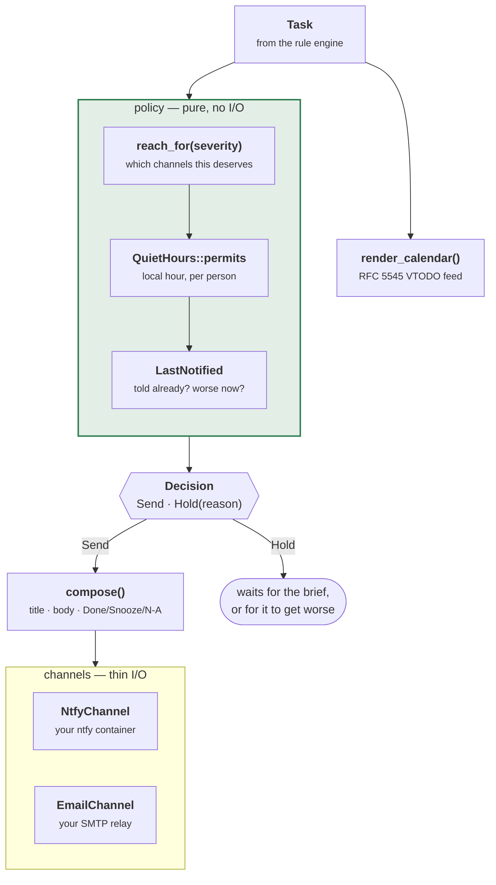

# gardyn-notify

Getting a task off the dashboard and onto your phone. Three channels, all self-hosted —
no third party sits between the garden and you.

```sh
cargo test -p gardyn-notify   # 44 tests
```

Setup for the server and the phone is [NOTIFICATIONS.md](../../NOTIFICATIONS.md); the
containers are [DEPLOYMENT.md](../../DEPLOYMENT.md).

---

## Architecture



**The split between `policy` and the channels is the design.** Deciding whether to
interrupt someone is pure logic with a lot of edge cases and gets 44 tests; sending an
HTTP request is thin and boring. Mixing them would make the interesting part untestable.

---

## The escalation ladder

```rust
use gardyn_core::Severity;
use gardyn_notify::reach_for;

assert!(!reach_for(Severity::Advisory).push);       // morning brief only
assert!(reach_for(Severity::Important).push);
assert!(!reach_for(Severity::Important).email);     // push is enough
assert!(reach_for(Severity::Urgent).email);
assert_eq!(reach_for(Severity::Critical).priority, 5);   // bypasses Do Not Disturb
```

| Severity | Push | Email | Interrupts |
|---|---|---|---|
| Info | — | — | daily brief only |
| Advisory | — | — | daily brief only |
| Important | priority 3 | — | yes |
| Urgent | priority 4 | yes | yes |
| **Critical** | **priority 5** | yes | **bypasses DND** |

Priority 5 is the top of the ladder because SMS was ruled out. On both iOS and Android
it breaks through a silenced phone. It exists for "the tank is dry in twelve hours" and
spending it on anything else is how a person learns to mute the app.

## Deciding whether to send

```rust
use gardyn_notify::{Decision, HoldReason, decide};

match decide(task.severity, last_notified, quiet_hours, local_hour, now) {
    Decision::First => { /* never mentioned before */ }
    Decision::Escalated => { /* worse than last time — say so again */ }
    Decision::Reminder => { /* still outstanding after 24 h */ }
    Decision::Hold(HoldReason::QuietHours) => { /* wait for the morning brief */ }
    Decision::Hold(HoldReason::AlreadySent) => { /* nothing has changed */ }
    Decision::Hold(HoldReason::NotInterrupting) => { /* brief only, by severity */ }
}
```

The three sending variants are distinct rather than one `Send`, because the dispatcher
words them differently — a reminder that opens "still outstanding" reads very
differently from the same sentence arriving for the fourth time as if it were new.

Three rules stop it becoming noise:

- **Quiet hours hold everything below Critical.** A root check does not wake you; a
  tank about to run dry does. The hour is *the recipient's* local hour — they might not
  live where the garden does — which is why the UTC offset is a per-person setting and
  why leaving it at 0 makes quiet hours fire in the wrong window.
- **Once per task.** Rules re-emit continuously. You are told once, again if it gets
  *worse*, and again after `REMINDER_INTERVAL_HOURS` (24) if you have not acted.
- **At most three interrupting notifications per garden per sweep**, most severe first.
  A neglected garden's first sweep produced seventeen in testing. Nobody reads
  seventeen — they mute the app, and then the one that mattered is lost too. (The cap
  itself lives in the dispatcher, in `gardyn-web`.)

## Composing and sending

```rust
use gardyn_notify::{Notifier, compose, reach_for};

let reach = reach_for(task.severity);
let note = compose(
    task.kind,
    &task.target.to_string(),
    &garden.name,
    &task.rationale,
    task.detail.as_ref().map(|d| d.to_string()).as_deref(),
    task.severity,
    reach.priority,
    Some(format!("{base_url}/gardens/{}", garden.id)),
    action_links,
);

let delivered = notifier
    .deliver(&note, reach, recipient.ntfy_topic.as_deref(), recipient.email.as_deref())
    .await;

if delivered.push { /* … */ }
```

`deliver` takes the topic and the address as `Option`, so a recipient who has set up
push but not mail is an ordinary case rather than a branch at the call site.
`Delivered` reports each channel separately, and a failure on one never stops the
other. Push working while mail is misconfigured is the expected self-hosted case, not a
degraded one — an unconfigured `Notifier` logs at startup and the settings page says so
plainly, rather than tasks silently going nowhere.

Every notification carries the rule's own `rationale`, so the answer to "why am I being
told this?" is on the lock screen:

> **Add water — Kitchen Gardyn**
> Tank at 22%, using 0.5 L/day, reserve reached in 1.8 days.
> `[Done]  [Snooze]  [N/A]`

The buttons are single-use signed links from `gardyn-auth::ActionGrant`, needing no
login. They are also the reason `GARDYN_BASE_URL` has to be a name your **phone** can
resolve: get it wrong and push arrives perfectly while every button is dead.

## Calendar feed

```rust
use gardyn_notify::{CalendarTask, render_calendar, calendar::CONTENT_TYPE};

let ics = render_calendar("Kitchen Gardyn", &tasks, now);
```

RFC 5545 `VTODO`s, served at a tokenised URL. Read-only, subscribe once, and it carries
the *whole* outstanding list including advisories that never push — the calendar is
where the predictable cadence work belongs, and it does not need to interrupt anyone to
be useful.

---

## Layout

| Module | |
|---|---|
| `policy` | `decide`, `reach_for`, `QuietHours`, `LastNotified` — all the judgement |
| `message` | `compose`, `compose_brief`, `Notification`, `NotificationAction` |
| `ntfy` | `NtfyChannel` — POST to your own ntfy server |
| `email` | `EmailChannel` — lettre over SMTP, rustls |
| `calendar` | `render` — an iCal `VTODO` feed |

## Why ntfy and not web push

Web push needs VAPID keys, a service worker, and a browser tab the user has granted
permission to — and on iOS it only works for an installed PWA. The ntfy app is one
install, works identically on both platforms, and priority 5 is a documented feature
rather than something to be negotiated with the OS. It is also self-hostable, which was
the constraint that ruled out everything else.
