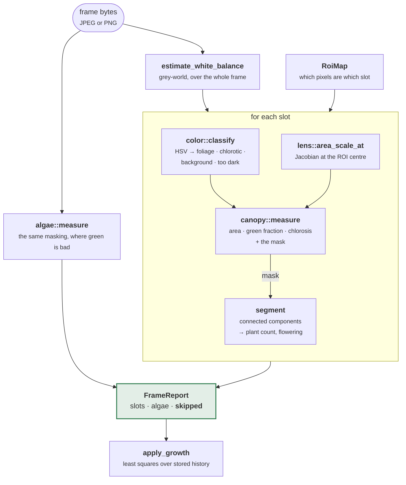

# gardyn-vision

One ultra-wide camera frame in, per-slot measurements out.

Frames were being captured, stored and displayed for months before this existed, and
nothing read them. This is what turns a photograph into a number the rule engine can
act on.

```sh
cargo test -p gardyn-vision                      # 68 tests
cargo test -p gardyn-vision --features diagnosis # + the Ollama backend
```

---

## Architecture



`skipped` is not an afterthought. Fifteen slots reporting and one missing is a fact
worth seeing, and "the frame was too dark" has to stay distinguishable from "the plant
died" all the way to the caller.

---

## Using it

```rust
use gardyn_core::Timestamp;
use gardyn_vision::{Analyzer, roi::RoiMap};

let map: RoiMap = serde_json::from_str(&std::fs::read_to_string("rois.json")?)?;
let analyzer = Analyzer::new(map);
let report = analyzer.analyse(&std::fs::read("frame.jpg")?, Timestamp::now())?;

for m in &report.slots {
    println!("{} — {:.0} cm², {:.0}% yellowing", m.slot, m.canopy_area_cm2,
             m.yellowing_index * 100.0);
}
for (slot, why) in &report.skipped {
    eprintln!("{slot} not measured: {why}");
}
```

Growth rate needs history, which a frame does not have, so it is a separate step. The
pipeline stays a pure function of one image and the caller supplies the past:

```rust
gardyn_vision::apply_growth(&mut report, &history, now);
```

Calibration is [`gardyn-cli vision`](../gardyn-cli/); running it against real uploads is
[`gardyn-web`](../gardyn-web/).

---

## The three stages

| Stage | Capability | Cost | Produces |
|---|---|---|---|
| **A** | `CanopyMetrics` | negligible | area, green fraction, chlorosis, growth rate |
| **B** | `PlantSegmentation` | small | seedling count, flowering |
| **C** | `VisualDiagnosis` | heavy | one sentence of plain language |

Stage A is roughly 80% of the value and is the default. **Stage B turned out not to
need a model**: it is a flood fill over the mask stage A already built, so it is nearly
free and always runs. `Segmenter` is a trait so an ONNX backend can slot in when one
earns its weight, but the design's assumption that segmentation required inference was
wrong for the question actually being asked — *how many seedlings are in this yPod*.

Stage C is behind the `diagnosis` feature, off by default, and talks to a local Ollama.
**It returns a `String` and there is no path from it to a `Task`.** That is the
guarantee, and it is structural rather than a policy: deterministic rules own anything
touching dosing, water, or an actuator, so a model that invents a nitrogen deficiency
cannot act on it.

---

## Five decisions worth the words

### Undistortion runs backwards from the coefficients

The Brown–Conrady model maps *ideal to distorted* — it says where a real-world point
lands on the sensor. Measuring an image needs the inverse, which has no closed form, so
`undistort_point` is the fixed-point iteration OpenCV uses.

Running the forward model instead compiles, looks reasonable, and produces an area
correction that **shrinks** edge plants — doubling the exact bias the correction exists
to remove. `undistort_inverts_the_distortion_model` is the test that pins the direction.

The whole image is never remapped. Two megapixels resampled to measure sixteen
rectangles is wasted work, and resampling invents pixels that then get counted. The
area of a region is corrected by the **Jacobian determinant of the undistortion at its
centre**, by central difference — one-sided differences are biased by half a step,
which shows up as mirror-image points disagreeing.

### Chlorotic pixels count as canopy

A yellowing plant has not shrunk. Excluding them would make "sick" and "harvested"
produce the same measurement, which is precisely backwards for the one signal that
should raise an alarm.

### A dark frame is skipped, not measured

Zero canopy across sixteen slots is indistinguishable from every plant dying. Any ROI
where more than 60% of pixels are unclassifiable is reported as skipped with a reason,
and never as a measurement.

### White balance before thresholds

Grow LEDs are not neutral. A magenta-leaning lamp shifts every leaf's hue toward blue,
and the green mask quietly loses its edges. Grey-world normalisation removes the tint
without needing to know what the lamp is — and it is clamped, because a tray of red
lettuce is not a tinted lamp and must not be "corrected" into looking green.

### Under-counting seedlings is the safe direction

Two plants whose leaves touch are one connected component and read as one plant. That
makes the thinning task fire *late* rather than telling you to pull a plant that is not
there. Four-connectivity, not eight, for the same reason: diagonal touching does not
merge blobs, and merging is the failure that causes under-thinning.

---

## Layout

| Module | |
|---|---|
| `lens` | Brown–Conrady, its numeric inverse, and the area Jacobian |
| `roi` | `RoiMap`, `SlotRoi` — where the slots are and how big a pixel is there |
| `color` | HSV conversion, grey-world white balance, pixel classification |
| `canopy` | Stage A: area, green fraction, chlorosis, and the mask |
| `growth` | Least-squares rate over a trailing window |
| `segment` | Stage B: connected components behind a `Segmenter` trait |
| `algae` | The same masking pointed at the tank |
| `diagnose` | Stage C: `DiagnosisBackend`, and Ollama behind a feature |

## Calibration is the on/off switch

There is no separate "enable vision" setting, and there should not be: without knowing
which pixels are slot 7 there is nothing to measure. **"Not calibrated" and "no canopy
metrics" are one fact**, not two settings that can disagree.

A map that has slots but no measured scale still works — areas are comparable over
time, which is enough for growth rate and stall detection — but `is_calibrated()`
returns false and the absolute figures must not be trusted against a harvest threshold.
That flag is explicit rather than inferred from the scale value, because a perfectly
ordinary calibration (a 7 cm yPod over 70 pixels) lands on exactly the placeholder
number. A sentinel a real measurement can collide with is not a sentinel.
